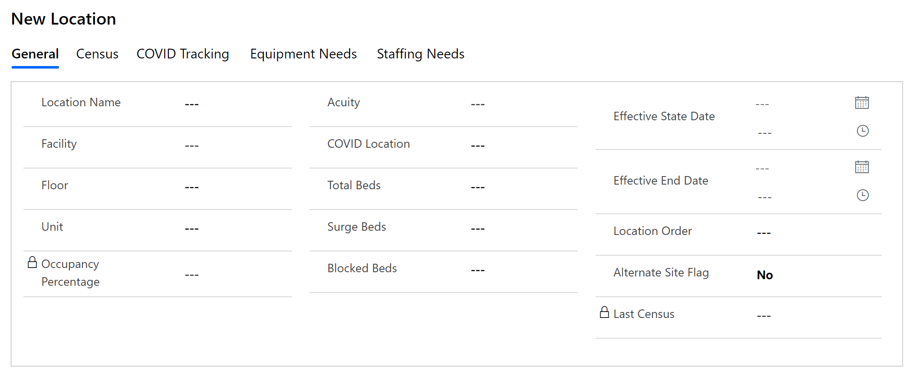
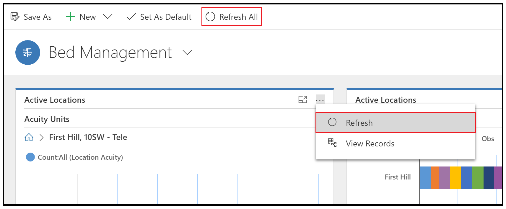
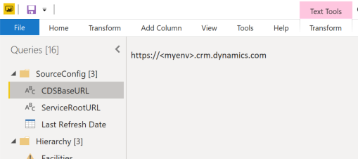
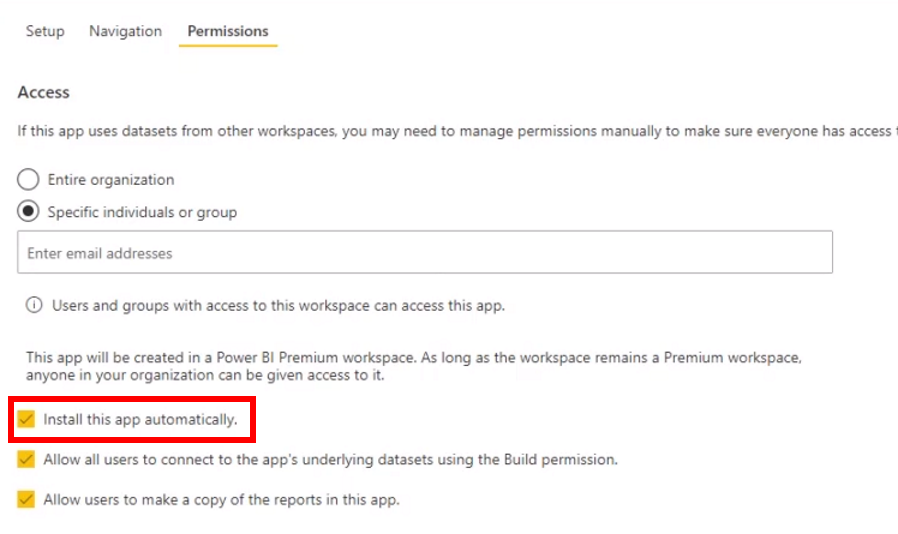

# Manually configure and manage master data for your organization

Admins can use the model-driven app in [Power Apps](https://make.powerapps.com) to create and manage master data for their organization. This data is required for the Emergency Response Solution to work.

> [!NOTE]
> You can also import your organization data into data files available in the deployment package and then import it to these entities. More information: [Step 2.2: Load configuration and master data for your organization](#step-2.2-load-configuration-and-master-data-for-your-organization)

To start, you must add master data in the following entities for your medical organization:

- Hospital systems

- Regions for each hospital system

- Facilities withing each region of a hospital system

- Locations within each facility

- Departments in your hospital system

The master data is managed from the **Locations** area in the left navigation in the admin app:

> [!div class="mx-imgBorder"]
> 

The entities under the **Hierarchy** area are listed in the order you should populate data.

## Systems data

The **Systems** entity lets you create and manage entries for Hospital Systems. This allows you to manage multiple hospital systems within the same organization.

To create a record:

1. Select **Systems** in the left pane, and select **New**:  
    > [!div class="mx-imgBorder"]
    > 

2. In the **New System** page, specify appropriate values:  
   > [!div class="mx-imgBorder"]
   > 

   | **Field**            | **Description**                                    |
   |----------------------|----------------------------------------------------|
   | System Name          | Type a name for your Hospital.                     |
   | Description          | Type an optional description.                      |
   | Effective Start Data | Type start date and time for this hospital system. |
   | Effective End Date   | Type end date and time for this hospital system.   |

3. Select **Save & Close.** The newly created record will be available in the **Systems** list.

To edit the record, select the record, update the values as required, and select **Save & Close.**

## Regions data

The **Regions** entity lets you manage the geographical regions for your hospital systems.

To create a record:

1. Select **Regions** in the left pane, and select **New**:

2. In the **New Region** page, specify appropriate values:  

    > [!div class="mx-imgBorder"]
    > 

    | **Field**            | **Description**                                                                                          |
    |----------------------|----------------------------------------------------------------------------------------------------------|
    | System               | Select a hospital system. This list is populated based on the **Systems** data you have created earlier. |
    | Region Name          | Type the region name. For example, Seattle.                                                              |
    | Description          | Type an optional description.                                                                            |
    | Effective Start Data | Type start date and time for this hospital system.                                                       |
    | Effective End Date   | Type end date and time for this hospital system.                                                         |

3. Select **Save & Close.** The newly created record will be available in the **Regions** list.

To edit the record, select the record, update the values as required, and select **Save & Close.**

## Facilities data

The **Facilities** entity lets you manage the hospital locations within each region. For example, **Redmond** and **Bellevue** facilities within the
**Seattle** region.

To create a record:

1. Select **Facilities** in the left pane, and select **New**:

2. In the **New Facility** page, specify appropriate values: 

    > [!div class="mx-imgBorder"] 
    > 

    | **Field**            | **Description**                                                                                 |
    |----------------------|-------------------------------------------------------------------------------------------------|
    | Region               | Select a region. This list is populated based on the **Regions** data you have created earlier. |
    | Facility Name        | Type the facility name. For example, Bellevue.                                                  |
    | Description          | Type an optional description.                                                                   |
    | Total Vents          | Type the total number of ventilators available in the facility                                  |
    | Effective Start Data | Type start date and time for this facility.                                                     |
    | Effective End Date   | Type end date and time for this facility.                                                       |

3. Select **Save & Close.** The newly created record will be available in the **Facilities** list.

To edit the record, select the record, update the values as required, and select **Save & Close.**

## Locations data

The **Locations** entity lets you manage specific locations within each hospital facility.

To create a record:

1. Select **Locations** in the left pane, and select **New**:

2. In the **New Location** page, specify appropriate values:  
 
    > [!div class="mx-imgBorder"]
    > 

    | **Field**            | **Description**                                                                                      |
    |----------------------|------------------------------------------------------------------------------------------------------|
    | Location Name        | Type the name of the location.                                                                       |
    | Facility             | Select a facility. This list is populated based on the **Facilities** data you have created earlier. |
    | Floor                | Type the floor information for the facility.                                                         |
    | Unit                 | Type the unit information for the facility                                                           |
    | Location Acuity      |                                                                                                      |
    | Total Beds           | Type the total number of beds in the facility.                                                       |
    | Blocked beds         | Type the number of beds blocked in the facility.                                                     |
    | Last Census          | Populates based on the last census record being created.                                             |
    | Occupancy Percentage | Automatically calculated based on last census and total beds                                         |
    | Effective Start Data | Type start date and time for this hospital system.                                                   |
    | Effective End Date   | Type end date and time for this hospital system.                                                     |
    | Location Order       | Type a number that sorts the location in the location drop-down lists.                               |
    | Alternate Site Flag  | For internal use                                                                                     |

3. Select **Save & Close.** The newly created record will be available in the **Locations** list.

To edit the record, select the record, update the values as required, and select **Save & Close.**

## Departments data

The **Departments** entity lets you manage departments information for a hospital.

To create a record:

1. Select **Departments** in the left pane, and select **New**:

2. In the **New Department** page, specify appropriate values:    

    > [!div class="mx-imgBorder"]
    > 

    | **Field**            | **Description**                                    |
    |----------------------|----------------------------------------------------|
    | Department Name      | Type a department name.                            |
    | Description          | Type an optional description.                      |
    | Effective Start Data | Type start date and time for this hospital system. |
    | Effective End Date   | Type end date and time for this hospital system.   |

3. Select **Save & Close.** The newly created record will be available in the **Departments** list.

To edit the record, select the record, update the values as required, and select
**Save & Close.**

# Get insights using Common Data Service dashboards

Following dashboards are available by default in the Emergency Response Solution model-driven app:

- **Bed Management**

   Shows availability of beds, occupancy percentage and total number of beds across different facilities.

- **Equipment and Supply**

  Shows critical equipment in use and supplies available across different facilities.

- **Staff Management**

  Shows number of requested, assigned and available staff members across different facilities.

- **COVID Patients**

  Shows number of patients under investigation and found positive with COVID-19 across different facilities.

- **Discharges**

  Shows number of patients anticipated for discharge and actual discharge.

You can also create your own dashboards in addition to the dashboards available by default.

## Manage dashboards

To manage dashboards:

1. Sign into [Power Apps](https://make.powerapps.com) and browse to your admin app.

2. In the left navigation pane, select **Dashboards** from the area picker:

    > [!div class="mx-imgBorder"]
    > 

3. Select a dashboard name in the left navigation to view the charts:

    > [!div class="mx-imgBorder"]
    > 

    > [!NOTE]
    > You can filter data at the bottom of the screen and the charts on top are automatically updated with filtered values.

4. Select the **Expand** option to view a chart in full-screen mode:

    > [!div class="mx-imgBorder"]
    > 

## Additional analysis

- **Drill down**: You can select chart area to drill down further with additional attributes (fields) for an entity:

    > [!div class="mx-imgBorder"]
    > 

- **Refresh**: You can refresh the dashboards to reflect updated data. You can either refresh all charts on a specific dashboard with **Refresh All**, or a selected chart with **Refresh**:

    > [!div class="mx-imgBorder"]
    > 

- **View records**: Select **More Commands** (**…**) and then **View Records** to view all records associated to a given chart:

    > [!div class="mx-imgBorder"]
    > 

    > [!NOTE] 
    > When you select **View records**, you'll see the view of the entity split between chart and the records. Any change to filters for records on the right-side reflects with automatic updates to the chart on left-side of the screen.

For more information about editing an existing dashboard and updating properties
of charts, read [edit an existing dashboard](https://docs.microsoft.com/powerapps/maker/model-driven-apps/create-edit-dashboards#edit-an-existing-dashboard).

## Create new dashboards

You can also create your own dashboards and customize to suite your needs. To create a new dashboard, select **New** and then select **Dynamics 365 Dashboard**:

> [!div class="mx-imgBorder"]
> 

For more information about creating a new dashboard, read [create new dashboard](https://docs.microsoft.com/powerapps/maker/model-driven-apps/create-edit-dashboards#create-a-new-dashboard).

# Get insights using Power BI dashboards

Before you can view the Power BI dashboard, you must publish it within your organization.

## Prerequisites

1. Power BI Premium Capacity or Power BI Pro licenses assigned to users accessing the report. 

2. Create a workspace in Power BI where you publish the report. Sign into Power BI and create a workspace. More information: [Create the new workspaces in Power BI](https://docs.microsoft.com/power-bi/service-create-the-new-workspaces)

3. Install Power BI Desktop from the Windows app store: <https://aka.ms/pbidesktop>

   > [!NOTE] 
   > If you have installed Power BI by downloading directly from the Power BI site as an executable in the past, remove it use the one from the app store. The app store version will be updated automatically as new releases are available.

4. After installing Power BI Desktop from app store, run it, sign in using an account that has permission to publish Power BI apps in your organization.

## Publish the Power BI dashboard

1. Navigate to the location where you extracted the deployment package. You will find the **Emergency Response App.pbit** file under the **Power BI Template** folder.

2. Open the **Emergency Response App.pbit** file in Power BI Desktop. When this file opens in Power BI Desktop, you will see a **Refresh** dialog box stating that the data refresh failed. This is because we haven't yet specified the connection details to your Common Data Service environment.

3. Select **Transform Data** to specify connection to your Common Data Service environment.  
    
    > [!div class="mx-imgBorder"]
    > 

4. In the query editor, update the **CDSBaseURL** parameter with the URL of your Common Data Service environment. Right-click **CDSBaseURL**, select **Advanced Editor**, and then specify appropriate value.  

    > [!div class="mx-imgBorder"]
    > 

5. Save your changes. A message displays asking you to apply pending changes to your query. Select **Apply**.

6. You will be prompted to enter credentials to connect to your Common Data Service environment. Select **Organizational account** > **Sign in** to specify your Common Data Service credentials.  

    > [!div class="mx-imgBorder"]
    > 

7. Select **Connect** to establish a connection.

8. On successful connection, you will be prompted to save the file as a .pbix file along with your Common Data Service environment information. Provide a name and save it on your computer.

9. In the **Home** tab, select **Close & Apply**.

10. Select **Refresh** to refresh the data from your Common Data Service environment. Select **Publish** to publish data to your Power BI workspace.  
    
    > [!div class="mx-imgBorder"]
    > 

11. In the **Publish to Power BI** page, select the workspace where you want to
    publish.

12. The report becomes available in your workspace. Now, we will configure the data refresh for the dataset. Select the dataset in your workspace and select the **Schedule refresh** icon.  
    
    > [!div class="mx-imgBorder"]
    > 

13. On the setting page for your dataset, expand **Data source credentials**, and select **Edit credentials** to ensure the connection details to connect to your data source are correct  

    > [!div class="mx-imgBorder"]
    > 

14. Expand **Scheduled refresh** and specify the required details for refreshing data based on a schedule.

    > [!NOTE] 
    > There are limits to how many times data can refresh. Power BI limits datasets on shared capacity to eight daily refreshes. If the dataset resides on a Premium capacity, you can schedule up to 48 refreshes per day in the dataset settings. More information: <https://docs.microsoft.com/power-bi/refresh-data#data-refresh>

15. Select your workspace name in the left pane, and then select **Create app** in the top-right corner.  

    > [!div class="mx-imgBorder"]
    > 

16. On the app publishing page:

    1. On the **Setup** tab, specify the name and description of your app.

    2. On the **Navigation** tab, specify the location of the dashboard where you will publish it.

    3. On the **Permissions** tab, specify users or group who will be able to view this app. Make sure you select the **Install this app automatically** check box to install this app automatically for end users. More information: [Automatically install apps for end users](https://docs.microsoft.com/power-bi/service-create-distribute-apps#automatically-install-apps-for-end-users)  

        > [!div class="mx-imgBorder"]
        > 

17. Select **Publish app.** For detailed information on publishing apps in Power BI, see [Publish your app](https://docs.microsoft.com/power-bi/service-create-distribute-apps#publish-your-app).

## View the Power BI dashboard

Sign in to [Power BI](https://apps.powerbi.com) to access and view the Power BI dashboard.

> [!div class="mx-imgBorder"]
> 

## View and manage app feedback

All the feedback provided by frontline staff using canvas apps on their mobile devices is stored in the **App Feedback** entity, and admins can view and manage this using the **Administration** area on the left navigation pane in Power Apps.

To view and manage app feedback:

1. Sign into [Power Apps](https://make.powerapps.com) and browse to your admin app.

2. In the left navigation pane, select **Administration** from the area picker.

3. Select **App Feedback** to view a list of app feedback submitted by users. You can click a record to view details and mark them as reviewed or not.  

    > [!div class="mx-imgBorder"]
    > 

## Disclaimer

This app is a sample and may be used with Microsoft Power Apps for dissemination of reference information only. This app is not intended or made available for use as a medical device, clinical support, diagnostic tool, or other technology intended to be used in the diagnosis, cure, mitigation, treatment, or prevention of disease or other conditions, and no license or right is granted by Microsoft to use this app for such purposes. This app is not designed or intended to be a substitute for professional medical advice, diagnosis, treatment, or judgement and should not be used as such. Customer bears the sole risk and responsibility for any use of this app. Microsoft does not warrant that the app or any materials provided in connection therewith will be sufficient for any medical purposes or meet the health or medical
requirements of any person.
