# Configure master data and view dashboards

This article provides information on how you can use the admin app (model-driven app) to add and manage master data for your solution and use the Power BI dashboard to view key insights and metrics.

These tasks are typically performed by business admins in your organization.

## Configure and manage master data for your organization

Use the admin app to create and manage master data for your organization. This data is required for the Hospital Emergency Response app to work.

> [!IMPORTANT]
> - Ensure that your IT Admin has deployed the solution in your organization and has granted appropriate permissions for business admins to use the admin app. More information: [Deploy the Hospital Emergency Response app](deploy-configure.md#deploy-the-hospital-emergency-response-app)
> 
> - You can also import your data from the data files available in the deployment package. More information: [Step 4: Load configuration and master data for your organization](deploy-configure.md#step-4-load-configuration-and-master-data-for-your-organization)

You must add master data in these entities in the following sequence:

1. [Systems](#systems-data)

1. [Regions](#regions-data)

1. [Facilities](#facilities-data)

1. [Locations](#locations-data)

1. [Departments](#departments-data)

The master data is managed from the **Locations** area in the left navigation in the admin app:

> [!div class="mx-imgBorder"]
> 

The entities under the **Hierarchy** area are listed in the order you should populate data.

> [!NOTE]
> Acuities data is imported during the deployment of the solution. More information: [Step 4: Load configuration and master data for your organization](deploy-configure.md#step-4-load-configuration-and-master-data-for-your-organization)

### Systems data

The **Systems** entity lets you create and manage entries for Hospital Systems. This allows you to manage multiple hospital systems within the same organization.

To create a record:

1. Sign into the admin app (model-driven app) using the URL provided by your IT admin.

1. Select **Systems** in the left pane, and select **New**:  
    > [!div class="mx-imgBorder"]
    > 

1. In the **New System** page, specify appropriate values:  
   > [!div class="mx-imgBorder"]
   > 

   | **Field**            | **Description**                                    |
   |----------------------|----------------------------------------------------|
   | System Name          | Type a name for your Hospital.                     |
   | Description          | Type an optional description.                      |
   | Effective Start Data | Type start date and time for this hospital system. |
   | Effective End Date   | Type end date and time for this hospital system.   |

1. Select **Save & Close**. The newly created record will be available in the **Systems** list.

To edit the record, select the record, update the values as required, and select **Save & Close**.

### Regions data

The **Regions** entity lets you manage the geographical regions for your hospital systems.

To create a record:

1. Sign into the admin app (model-driven app) using the URL provided by your IT admin.

1. Select **Regions** in the left pane, and select **New**.

1. In the **New Region** page, specify appropriate values:  

    > [!div class="mx-imgBorder"]
    > 

    | **Field**            | **Description**                                                                                          |
    |----------------------|----------------------------------------------------------------------------------------------------------|
    | System               | Select a hospital system. This list is populated based on the **Systems** data you have created earlier. |
    | Region Name          | Type the region name. For example, Seattle.                                                              |
    | Description          | Type an optional description.                                                                            |
    | Effective Start Data | Type start date and time for this region.                                                       |
    | Effective End Date   | Type end date and time for this region.                                                         |

1. Select **Save & Close**. The newly created record will be available in the **Regions** list.

To edit the record, select the record, update the values as required, and select **Save & Close**.

### Facilities data

The **Facilities** entity lets you manage the hospital locations within each region. For example, **Redmond** and **Bellevue** facilities within the
**Seattle** region.

To create a record:

1. Sign into the admin app (model-driven app) using the URL provided by your IT admin.

1. Select **Facilities** in the left pane, and select **New**.

1. In the **New Facility** page, specify appropriate values: 

    > [!div class="mx-imgBorder"] 
    > 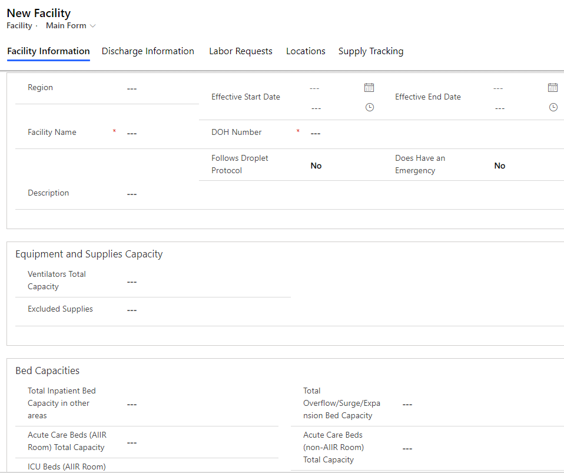

    | **Field**            | **Description**                                                                                 |
    |----------------------|-------------------------------------------------------------------------------------------------|
    | Region               | Select a region this facility is associated with. This list is populated based on the **Regions** data you have created earlier. |
    | Facility Name        | Type the facility name. For example, Bellevue.                                                  |
    | Total Vents          | Type the total number of ventilators available in the facility.                                  |
    | Description          | Type an optional description.                                                                   |
    | Effective Start Data | Type start date and time for this facility.                                                     |
    | Effective End Date   | Type end date and time for this facility.                                                       |
    |Total Beds      | Automatically calculated.|
    |Total Occupied      | Automatically calculated.|
    |Facility Address      | Type the Street, City, County, State, Zip code, Latitude, and Longitude for the facility.|

    If required, enter facility address.

1. Select **Save & Close**. The newly created record will be available in the **Facilities** list.

To edit the record, select the record, update the values as required, and select **Save & Close**.

### Locations data

The **Locations** entity lets you manage specific locations within each hospital facility.

> [!NOTE]
> Before creating a **Locations** record, ensure that you have imported the acuity data using the **00 - Acuities Import.xlsx** file as explained earlier in [Step 4: Load configuration and master data for your organization](deploy-configure.md#step-4-load-configuration-and-master-data-for-your-organization). This is because acuity information is required to create a **Location** record.

To create a record:

1. Sign into the admin app (model-driven app) using the URL provided by your IT admin.

1. Select **Locations** in the left pane, and select **New**.

1. In the **New Location** page, specify appropriate values:  
 
    > [!div class="mx-imgBorder"]
    > 

    | **Field**            | **Description**                                                                                      |
    |----------------------|------------------------------------------------------------------------------------------------------|
    | Location Name        | Type the name of the location.                                                                       |
    | Facility             | Select a facility. This list is populated based on the **Facilities** data you have created earlier. |
    | Floor                | Type the floor information for the facility.                                                         |
    | Unit                 | Type the unit information for the facility.                                                           |
    | Occupancy Percentage | Automatically calculated based on last census and total beds values.                                         |
    | Acuity      | Select acuity record associated with this location.                                                                                                     |
    | COVID Location      | Select whether this location is used to treat COVID patients (**Yes** or **No**).                                                                                                      |
    | Total Beds           | Type the total number of beds in the facility.                                                       |
    | Surge Beds           | Type the number of surge beds in the facility. Surge beds are those that can be staffed above and beyond licensed bed capacity if patients need to be admitted.                                                      |
    | Blocked beds         | Type the number of beds blocked in the facility.                                                     |
    | Last Census          | Populates based on the last census record being created.                                             |
    | Effective Start Data | Type start date and time for this location.                                                   |
    | Effective End Date   | Type end date and time for this location.                                                     |
    | Location Order       | Type a number that sorts the location in the location drop-down lists.                               |
    | Alternate Site Flag  | For internal use.                                                                                     |

1. Select **Save & Close**. The newly created record will be available in the **Locations** list.

To edit the record, select the record, update the values as required, and select **Save & Close**.

You can view the associated data for a location, such as **Census**, **COVID Tracking**, **Equipment Needs**, by opening an existing location record and selecting the respective tabs. The associated data is entered by frontline staff using the [mobile apps](use.md).

> [!div class="mx-imgBorder"]
> 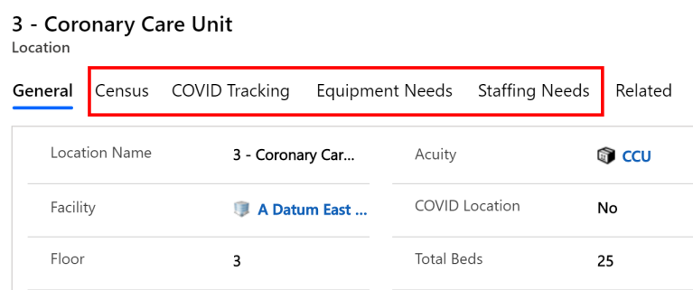

### Departments data

The **Departments** entity lets you manage departments information for a hospital.

To create a record:

1. Sign into the admin app (model-driven app) using the URL provided by your IT admin.

1. Select **Departments** in the left pane, and select **New**.

1. In the **New Department** page, specify appropriate values:

    > [!div class="mx-imgBorder"]
    > 

    | **Field**            | **Description**                                    |
    |----------------------|----------------------------------------------------|
    | Department Name      | Type a department name.                            |
    | Description          | Type an optional description.                      |
    | Effective Start Data | Type start date and time for this department. |
    | Effective End Date   | Type end date and time for this department.   |

1. Select **Save & Close**. The newly created record will be available in the **Departments** list.

To edit the record, select the record, update the values as required, and select **Save & Close**.

## Manage tracking level for mobile apps

Frontline workers can track information by *location* or *facility* using the mobile apps (canvas apps). Here is the default tracking level for each mobile app: 

|App  |Default tracking level  |
|--|--|
|COVID tracking|Location|
|Staff|Location|
|Equipment|Location|
|Bed capacity|Facility|
|Supplies|Facility|
|Staffing needs|Facility|
|Discharge tracking|Facility|

As an admin, you can change the default tracking level of mobile apps.

1. Sign into the admin app (model-driven app) using the URL provided by your IT admin.

1. In the left navigation, select the **Administration** area, and then select **Apps**. 

    > [!div class="mx-imgBorder"]
    > 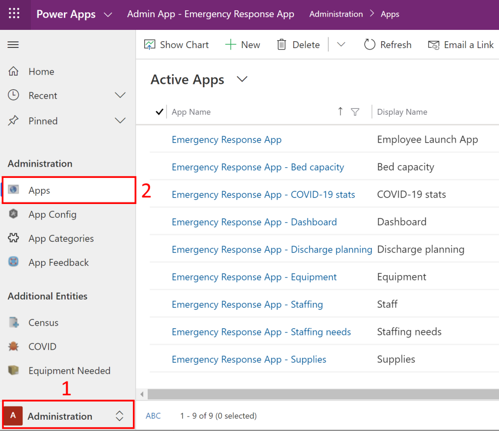

1. Select one of the canvas apps to open the record.

1. In the app record, select an appropriate value in the **Tracking Level** field.

    > [!div class="mx-imgBorder"]
    > 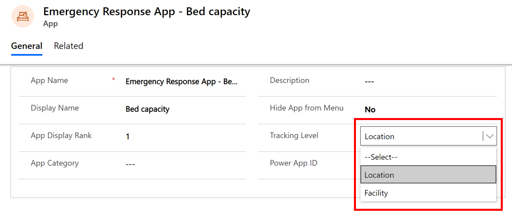

    - If **Location** is selected for an app, records created using the mobile app will contain location and facility information along with other data. Additionally, a **Location** drop-down will be available in the mobile app for users to select a location to track the data.

    - If **Facility** is selected for an app, records created using the mobile app will contain only the facility information along with other data.

    - If you don't select any value for the **Tracking Level** field, the *default* tracking level as explained earlier is applied to the mobile apps.

1. Select **Save** in the lower-right corner to save your changes.

## View Common Data Service dashboards

Following dashboards are available by default in the Hospital Emergency Response admin (model-driven) app:

- **Bed Management**

   Shows availability of beds, occupancy percentage and total number of beds across different facilities.

- **Equipment and Supply**

  Shows critical equipment in use and supplies available across different facilities.

- **Staff Management**

  Shows number of requested, assigned, and available staff members across different facilities.

- **COVID Patients**

  Shows number of patients under investigation and found positive with COVID-19 across different facilities.

- **Discharges**

  Shows number of patients anticipated for discharge and actual discharge.

You can also create your own dashboards in addition to the dashboards available by default.

### Manage dashboards

To manage dashboards:

1. Sign into [Power Apps](https://make.powerapps.com) and browse to your admin app.

2. In the left navigation pane, select **Dashboards** from the area picker:

    > [!div class="mx-imgBorder"]
    > 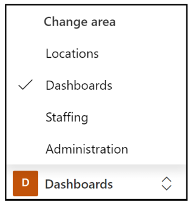

3. Select a dashboard name in the left navigation to view the charts:

    > [!div class="mx-imgBorder"]
    > 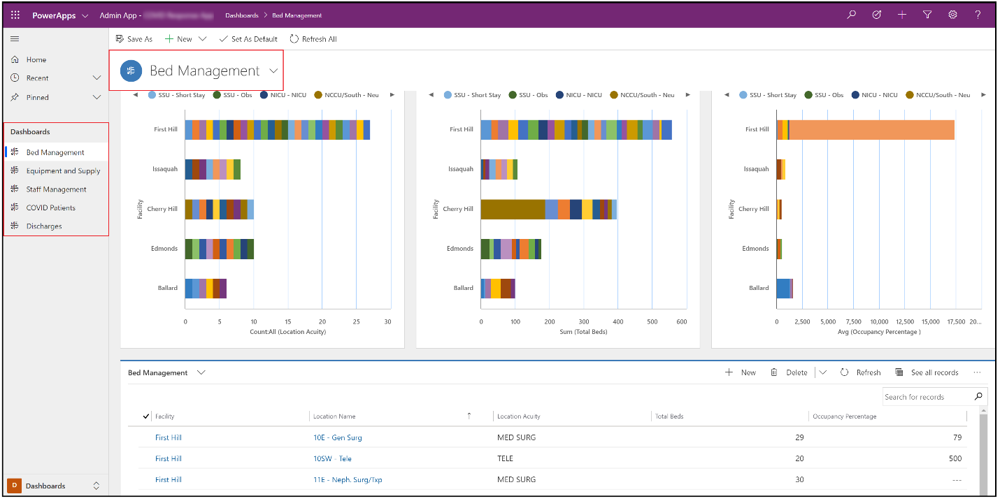

    > [!NOTE]
    > You can filter data at the bottom of the screen and the charts on top are automatically updated with filtered values.

4. Select the **Expand** option to view a chart in full-screen mode:

    > [!div class="mx-imgBorder"]
    > 

### Additional analysis

- **Drill down**: You can select chart area to drill down further with additional attributes (fields) for an entity:

    > [!div class="mx-imgBorder"]
    > 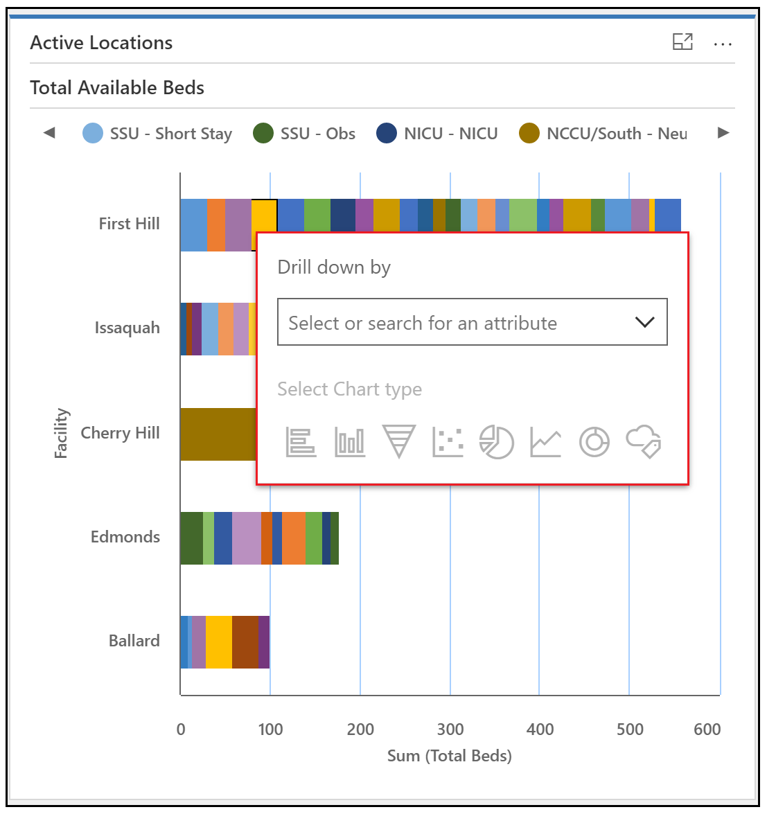

- **Refresh**: You can refresh the dashboards to reflect updated data. You can either refresh all charts on a specific dashboard with **Refresh All**, or a selected chart with **Refresh**:

    > [!div class="mx-imgBorder"]
    > 

- **View records**: Select **More Commands** (**…**) and then **View Records** to view all records associated to a given chart:

    > [!div class="mx-imgBorder"]
    > 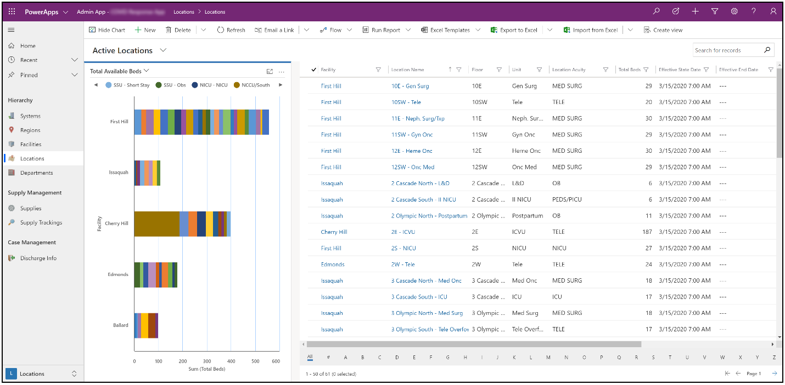

    > [!NOTE] 
    > When you select **View records**, you'll see the view of the entity split between chart and the records. Any change to filters for records on the right-side reflects with automatic updates to the chart on left-side of the screen.

For more information about editing an existing dashboard and updating properties
of charts, read [edit an existing dashboard](https://docs.microsoft.com/powerapps/maker/model-driven-apps/create-edit-dashboards#edit-an-existing-dashboard).

### Create new dashboards

You can also create your own dashboards and customize to suite your needs. To create a new dashboard, select **New** and then select **Dynamics 365 Dashboard**:

> [!div class="mx-imgBorder"]
> 

For more information about creating a new dashboard, read [create new dashboard](https://docs.microsoft.com/powerapps/maker/model-driven-apps/create-edit-dashboards#create-a-new-dashboard).

## View Power BI dashboard

View the Power BI dashboards for insights and decision making.

### Prerequisites

- Power BI Premium Capacity or Power BI Pro licenses assigned to users accessing the report. 

- Your IT admin must have published the Power BI report and granted you permissions to access it. More information: [Publish the Power BI dashboard](deploy-configure.md#publish-the-power-bi-dashboard) 

### View the dashboard

Sign in to [Power BI](https://apps.powerbi.com) to access and view the Power BI dashboard.

> [!div class="mx-imgBorder"]
> 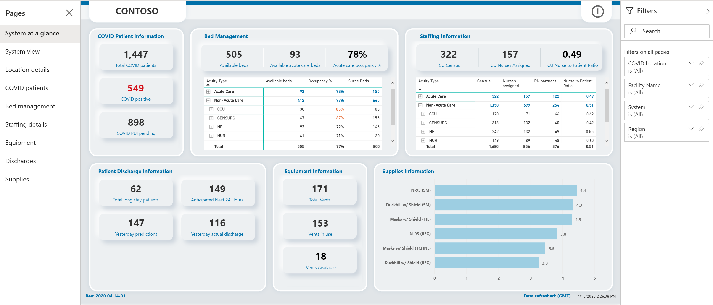

You can use the filters on the right side to filter data for COVID locations, facilities, regions and hospital systems.

#### System at a glance page 

The **Systems at a glance page** is the default or the top-level page that provides an overall view.  

The page displays a summarized view of the following: 

- **COVID Patient Information**: Shows total number of COVID patients, number of patients found positive with COVID-19, and number of patients under investigation (PUI).

- **Bed Management**: Shows availability of beds, occupancy percentage, number of surge beds, and total number of beds. You can also use the grid below to view the numbers by acute units.

- **Staffing Information**: Shows number of patients in ICU, nurses assigned, and nurse to patient ratio.  

- **Patient Discharge Information**: Shows the number of total long stay patients, number of patients anticipated for discharge, and actual discharge.

- **Equipment Information**: Shows total number of vents, number of vents in use, and available vents. 

- **Supplies Information**: Shows number of supplies on hand by days.

> [!NOTE]
> - Selecting the title in any of the summarized area takes you to the respective details page for the area. 
> - You can also perform other actions on reports such as filter and sort data, export the report to PDF and PowerPoint, add a spotlight, and so on. For detailed information about report features in Power BI, see [Reports in Power BI](https://docs.microsoft.com/power-bi/consumer/end-user-reports)
> - The most recent or last updated columns in some of these reports show the date and time when the data was last refreshed. It's also easy to identify the freshness by viewing the color of the date and time values in these columns:
>    - Black: Data is refreshed less than 20 hours ago
>    - Gray: Data is refreshed 20 - 24 hours ago
>    - Red: Data is refreshed more than 24 hours ago 
 
#### System view page

The **System View** page displays charts with the following information for a hospital system:
- Vents in use and vents available
- Availability of beds and acute care beds and occupancy percentage
- Total staff requested, number of patients (census), and nurse to patient ratio
- Supplies on hand over a period of time

> [!div class="mx-imgBorder"]
> 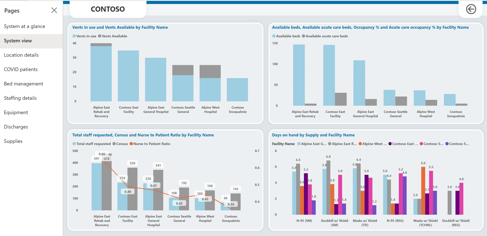

#### Location details page 

From the **System at a glance** page, select **i** on the top-right corner. The **Location details** page displays data by location such as total number of beds, available beds, surge beds, COVID patients, and so on. 

> [!div class="mx-imgBorder"]
> 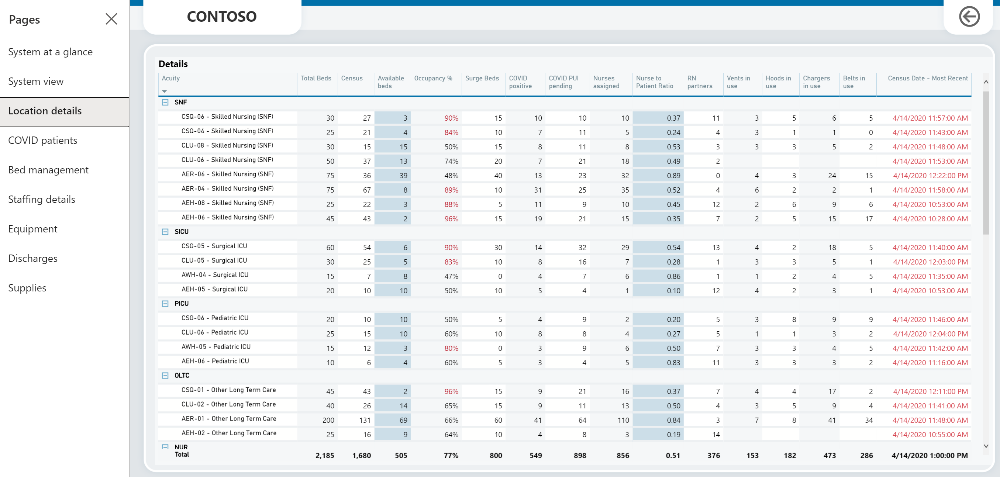 

#### COVID patients page 

The page provides drill-down information about the COVID patients such as patients at each location, patient trend over time that shows peaks and valleys of number of patients under investigation (PUI), and number of patients found positive, and get a sense of where the patients are located within the hospital.

> [!div class="mx-imgBorder"]
> 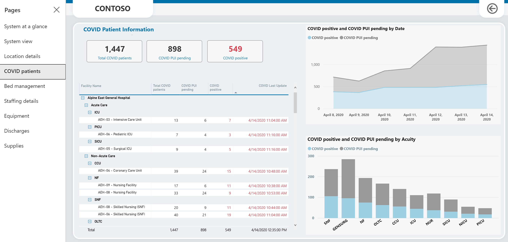

#### Bed management page 

The page provides drill-down information by location such as total available beds, acute care beds available, and occupancy percentage.

> [!div class="mx-imgBorder"]
> 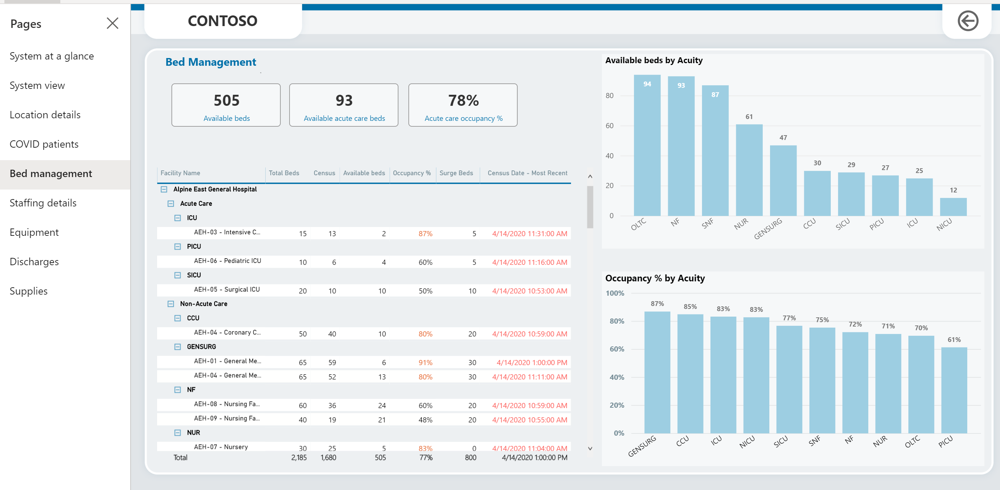

#### Staffing details page  

The page provides details about the staff by location, number of nurses assigned, total number of patients and number of COVID patients. It also displays nurse to patient ratio and ICU nurse to patient ratio over a period of time.

> [!div class="mx-imgBorder"]
> 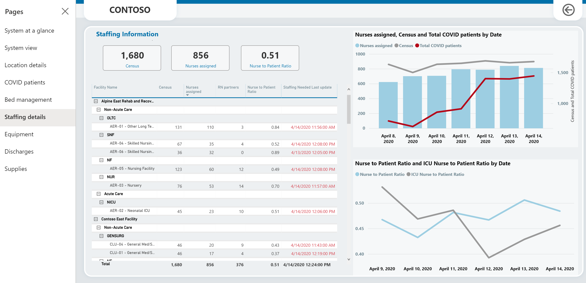

#### Equipment page 

The page provides details about the equipment by location, the total number of vents in use, overlaid by number of COVID patients, and other pieces of equipment, such as belts, chargers, and hoods in use.

> [!div class="mx-imgBorder"]
> 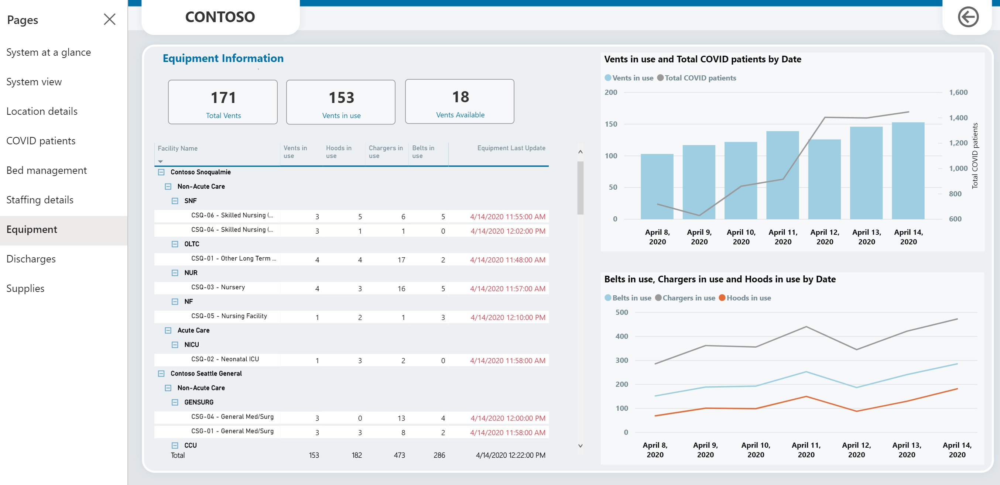

#### Discharges page 

The page provides details about the long-term patients, discharge barriers over a period, and variance in terms of actual and anticipated discharges.

> [!div class="mx-imgBorder"]
> 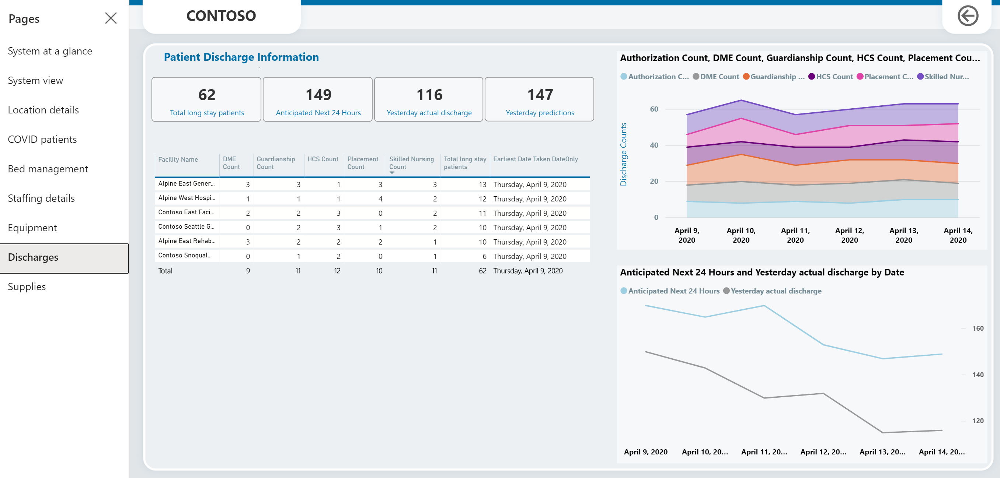

#### Supplies page 

The page provides details about the supplies by location. It also provides a chart about days on hand by supply and facility, and the supply available on hand over a period of time.

> [!div class="mx-imgBorder"]
> 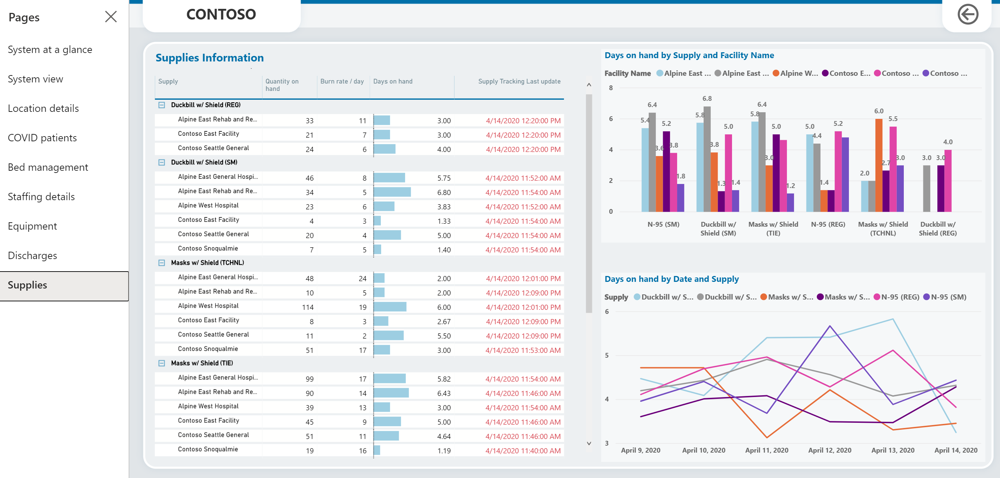

## View and manage app feedback

All the feedback provided by frontline staff using canvas apps on their mobile devices is stored in the **App Feedback** entity, and admins can view and manage this using the **Administration** area on the left navigation pane in the admin app.

To view and manage app feedback:

1. Sign into [Power Apps](https://make.powerapps.com) and browse to your admin app.

2. In the left navigation pane, select **Administration** from the area picker.

3. Select **App Feedback** to view a list of app feedback submitted by users. You can click a record to view details and mark them as reviewed or not.  

    > [!div class="mx-imgBorder"]
    > 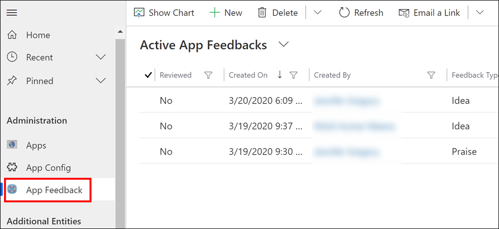

## Issues and feedback

- To report an issue with the Hospital Emergency Response sample app, visit <https://aka.ms/emergency-response-issues>.

- For feedback about the Hospital Emergency Response sample app, visit <https://aka.ms/emergency-response-feedback>.

## Next step

[Use the Hospital Emergency Response mobile app](use.md)
