# Deploy the Hospital Emergency Response app

The Hospital Emergency Response app requires a small amount of setup to adapt to your needs. This article provides step-by-step instructions for hospital IT admins to deploy and configure the application for their organization.

Estimated time to complete these steps: **35–40 minutes**.

## Demo: Deploy the Hospital Emergency Response app

Watch how you can deploy and configure the Hospital Emergency Response app.

<br/>

> [!VIDEO https://www.youtube.com/embed/-1g44wNiuWI]


## Service URLs for US Government customers

The Hospital Emergency Response solution is also available for US Government customers. There is a different set of URLs to access Power Apps US Government environments and Power BI than the commercial version.

The commercial version of the service URL is used throughout this article. If you are a US Government customer, use the respective US Government URL for your deployment as mentioned here:


| **Commercial version URL**                | **US Government version URL**  |
|-------------------------------------------|--------------------------------|
| https://make.powerapps.com                | https://make.gov.powerapps.us (GCC)<br/><br/>https://make.high.powerapps.us (GCC High)                |
| https://admin.powerplatform.microsoft.com | https://gcc.admin.powerplatform.microsoft.us (GCC)<br/><br/>https://high.admin.powerplatform.microsoft.us (GCC High) |
| https://app.powerbi.com/                  | <https://app.powerbigov.us> (GCC)<br/><br/>https://app.high.powerbigov.us (GCC High)                  |

For detailed information about the US Government plans for Power Apps and Power BI, see:
- [Power Apps for US Government](https://docs.microsoft.com/power-platform/admin/powerapps-us-government)
- [Power BI for US Government](https://docs.microsoft.com/power-bi/service-govus-overview)


## Deploy the Hospital Emergency Response app

Perform the following steps to deploy the Hospital Emergency Response sample app for your organization.

- [Step 1: Sign up for Power Apps and create an environment](#step-1-sign-up-for-power-apps-and-create-an-environment)
- [Step 2: Download the deployment package](#step-2-download-the-deployment-package)
- [Step 3: Import the solution file into your environment](#step-3-import-the-solution-file-into-your-environment)
- [Step 4: Load configuration and master data for your organization](#step-4-load-configuration-and-master-data-for-your-organization)
    - [Step 4.1: Load mandatory configuration data](#step-41-load-mandatory-configuration-data)
    - [Step 4.2: Load master data](#step-42-load-master-data)
- [Step 5: Update the mobile app branding](#step-5-update-the-mobile-app-branding)
- [Step 6: Bypass consent for mobile apps](#step-6-bypass-consent-for-mobile-apps)
- [Step 7: Add Azure Application Insights key to mobile apps for telemetry (optional)](#step-7-add-azure-application-insights-key-to-mobile-apps-for-telemetry-optional)
- [Step 8: Share canvas apps with users in your organization](#step-8-share-canvas-apps-with-users-in-your-organization)
- [Step 9: Set your mobile app as hero and featured app](#step-9-set-your-mobile-app-as-hero-and-featured-app)
- [Step 10: Share model-driven app with admins in your organization](#step-10-share-model-driven-app-with-admins-in-your-organization)

### Step 1: Sign up for Power Apps and create an environment

If you don't already have Power Apps, sign up for Power Apps and purchase an appropriate license.

More information:

-   [Power Apps Pricing](https://powerapps.microsoft.com/pricing/)
-   [Purchase Power Apps](https://docs.microsoft.com/power-platform/admin/signup-for-powerapps-admin)

After you have purchased Power Apps, create an environment with a Common Data Service database.

1.  Sign in to [Power Platform admin center](https://aka.ms/ppac).

2.  Create a Common Data Service environment with the database. More information: [Create and manage environments](https://docs.microsoft.com/power-platform/admin/create-environment)

    > [!IMPORTANT]
    > While creating the database, if you select a security group for the database, the apps can be shared *only* with users that are members of the security group.

3.  Create appropriate users in your environment. More information: [Create users and assign security roles](https://docs.microsoft.com/power-platform/admin/create-users-assign-online-security-roles)

### Step 2: Download the deployment package

Get the latest deployment package (.zip) from <https://aka.ms/emergency-response-solution> that contains the solution file, images, and data files to set up the apps and business logic for the Hospital Emergency Response app.

> [!IMPORTANT]
> Before extracting the deployment package (.zip file), ensure that you unblock the file. To unblock:
> 1. Right-click the .zip file and select **Properties**.
> 2. In the properties dialog box, select **Unblock**, and then select **Apply** followed by **OK**.

<br/>

After unblocking the deployment file (.zip file), extract the file to a location on your computer. The extracted folder will contain the following folders:

| **Folder/File**       | **Description**  |
|-----------------------|------------------|
| **App Icons**         | Contains the default app icons for the mobile apps (canvas apps)|
| **Data Files**        | Contains the master and sample data files (.xlsx) for the solution/app to work. You can import data from these files to start working on the app. More information: see [Step 4: Load configuration and master data for your organization](#step-4-load-configuration-and-master-data-for-your-organization) |
| **Power BI Template** | Contains the Power BI Report template file (.pbit) that you will use to configure reporting for your organization. More Information: [Get insights using Power BI dashboards](#get-insights-using-power-bi-dashboards)|
| **PowerShell**        | Contains scripts that you'll use to configure your mobile apps (canvas apps). |
| **Solution File**     | Contains the Common Data Service solution file that creates the apps and metadata required for the Hospital Emergency Response app.  |

### Step 3: Import the solution file into your environment

1.  Navigate to the location where you extracted the deployment file (.zip); you'll find a **Solution File** folder. We will import the managed solution
    (.zip) file under the **Solution File** folder to our environment.

2.  Sign in to [Power Apps](https://make.powerapps.com).

3.  Select your environment from the top-right corner.

4.  In the left pane, select **Solutions** and then select **Import.**

    > [!div class="mx-imgBorder"] 
    > 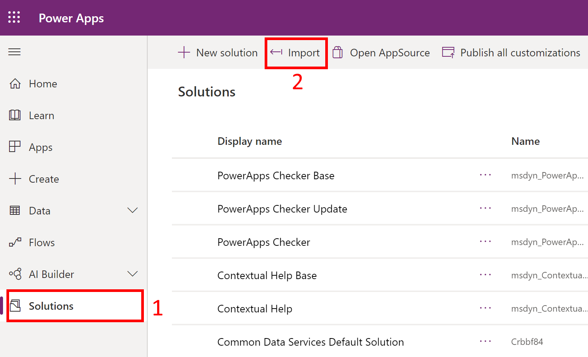

5.  In the **Import Solution** dialog box, select the solution file mentioned in step 1, and then follow the steps in the wizard to import the solution.

6.  After the solution is imported successfully, select **Close** in the import dialog box.

Now, you will see new apps under **Apps**:

> [!div class="mx-imgBorder"] 
> 

Select the **Admin App** to open the model-driven app that lets you configure the rest of the deployment settings. More information: [What are model-driven apps?](https://docs.microsoft.com/powerapps/maker/model-driven-apps/model-driven-app-overview)

> [!div class="mx-imgBorder"] 
> 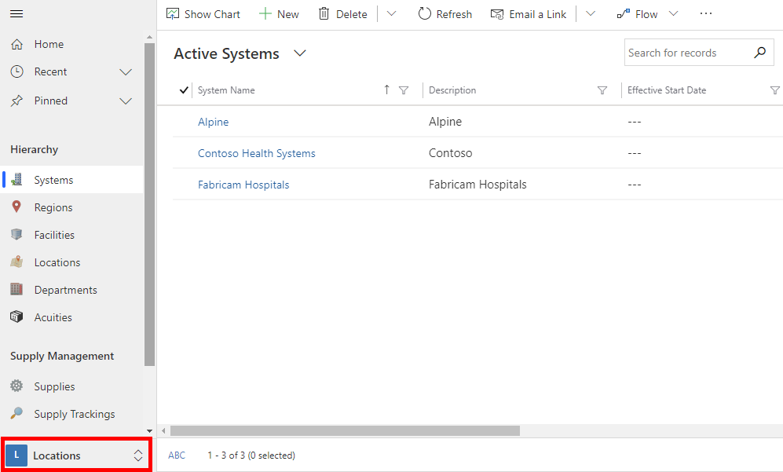

The admin app has a number of entities where you can add and manage data for your hospital system. You can use the area picker in the lower part of the left navigation pane to select a different area.

### Step 4: Load configuration and master data for your organization

All the data required for the Hospital Emergency Response app is available under the **Data Files** folder under your extracted deployment folder.

The **Data Files** folder has the following files and folders:

<table style="width:100%">
<tr>
<th>Name</th>
<th>Description</th>
</tr>
<tr>
<td>At the root; following files are available:
<ul>
<li>00 - Acuities Import.xlsx</li>
<li>00 - App Config Import.xlsx</li>
<li>00 - App Import.xlsx</li>
<li>00 - Request Roles Import.xlsx</li>
<li>00 - Supplies Import.xlsx</li>
</ul>
</td>
<td>These are the configuration data files that must be imported to the following entities using the admin app:
<ul>
<li>Acuities</li>
<li>App Config</li>
<li>Apps</li>
<li>Request Roles</li>
<li>Supplies Import</li>
</ul>
<br/>Importing data to these entities will create records for these entities that are required for the Hospital Emergency Response app to work.
<br/>
<br/>
<strong>Caution</strong>: Ensure that you don't update the configuration values in these entities, except for the <strong>Apps</strong> and <strong>App Config</strong> entities as explained later.</td>
</tr>
<tr>
<td><strong>Sample Data</strong> folder</td>
<td><p>The folder contains the sample data files (.xlsx) that you can import to populate the sample data in your application. The files are named to denote the sequence in which the data should be imported into your app. </p>
<p>Import data for the following entities that contain the master sample data for the Hospital Emergency Response app:
<ul>
<li>Systems</li>
<li>Regions</li>
<li>Facilities</li>
<li>Locations</li>
<li>Departments</li>
</ul>
<p>If you want to import your organization data instead of the sample data, you can replace the sample data in these Excel files with your organization data, and then import the data in the app.</p>
<p>You can also manually enter data for these entities. For information about each of these entities and fields in these entities, see <a href="#manually-configure-and-manage-master-data-for-your-organization">Manually configure and manage master data for your organization</a></p></td>
</tr>
<tr>
<td><strong>Data Template File for Master Data</strong> folder</td>
<td><p>The folder contains "empty" data files (.xlsx) for master entities that you can use to populate your organization data, and then import it to the app.</p>
<p>The files are named to denote the sequence in which the data should be imported into your app. It's the same list of entities that is mentioned earlier for the <strong>Sample Data</strong> folder.</p>
<p>You can also manually enter data for these entities. For information about each of these entities and fields in these entities, see <a href="#manually-configure-and-manage-master-data-for-your-organization">Manually configure and manage master data for your organization</a></p>
</td>
</tr>
</table>

#### Step 4.1: Load mandatory configuration data

Importing the configuration data under the following entities in the admin app is **mandatory** before you move to the next step:

| Area name | Entity name| File name
|-|-|-
| Locations | Acuities | 00 - Acuities Import.xlsx
| Administration | Apps Config | 00 - App Config Import.xlsx
| Administration | Apps | 00 - App Import.xlsx
| Staffing | Request Roles | 00 - Request Roles Import.xlsx
| Locations | Supplies | 00 - Supplies Import.xlsx

##### How to load data from data files?

To import data from one of the data files to an entity:

1.  In the left navigation pane of the admin app, select an entity for which you want to load the data. For example, select **Administration** from the area picker and then select **Acuities**.

2.  Select **Import from Excel** and select the **00 - Acuities Import.xlsx** file from the **Data Files** folder.

    > [!div class="mx-imgBorder"]
    > 

3.  Proceed with the import wizard steps to import the data.

4.  After the data is imported, you will see the imported record in the entity:

    > [!div class="mx-imgBorder"] 
    > 

Repeat the above steps with other configuration data entities.

Alternatively, if you want to enter the master data manually, see [Manually configure and manage master data for your organization](#manually-configure-and-manage-master-data-for-your-organization).

#### Step 4.2: Load master data

As explained earlier:
- You can use the sample data files for master data entities under the **Data Files/Sample Data** folder to import the sample data in the required entities. 

- You can use the "empty" data files for master entities under the **Data Files/Data Template File for Master Data** folder that you can use to populate your organization data, and then import the data in the required entities.

You can also manually add master data later. More information: [Manually configure and manage master data for your organization](#manually-configure-and-manage-master-data-for-your-organization)

### Step 5: Update the mobile app branding

You can change the app icon, color scheme, or display name of the mobile apps to match the branding of your organization.

You do this using the **App** and **App Config** entities in the **Administration** area by importing app and app config data from the Excel files available in the **Data Files** folder and icon files under **App Icons** folder under the deployment package as explained in [Step 2: Download the deployment package](#step-2-download-the-deployment-package).

> [!div class="mx-imgBorder"] 
> 

1.  Make sure you have imported the configuration data for **Apps** and **App Config** entities using the **App Import.xlsx** and **App Config Import.xlsx** files respectively.

1.  Now, we will copy the app IDs of canvas apps so that we can populate it in the **Apps** records we imported. Sign in to [Power Apps](https://make.powerapps.com).

1.  Select your environment from the top-right corner.

1.  In the left pane, select **Apps**, and then select the ellipsis (…) for a canvas app followed by **Details**.

    > [!div class="mx-imgBorder"] 
    > 

1.  The app ID appears at the bottom of the **Details** pane for the app. Copy the App ID along with its name in a Notepad file.

    > [!div class="mx-imgBorder"] 
    > 

1.  Repeat steps 4 and 5 for each canvas app.

1.  Open the Admin App, and in the left navigation pane of the admin app, select **Administration** from the area picker, and then select **Apps**. This will show all the canvas app records you imported from the **App Import.xlsx** file.

    > [!div class="mx-imgBorder"] 
    > 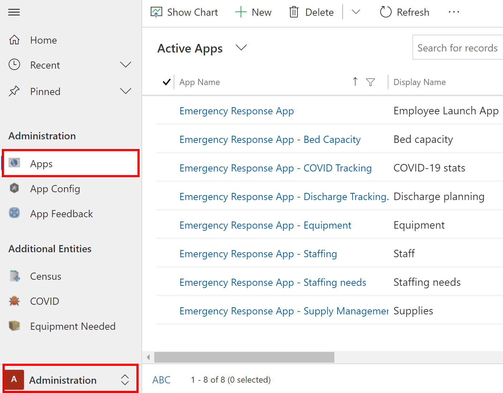

1.  Open one of the app records by selecting it. Note that the **Power App ID** field is blank.

    > [!div class="mx-imgBorder"] 
    > 

1.  In the app details page:

    1. Copy the app ID from the notepad (where you copied earlier) to the **Power App ID** field.

    2. Double-click the app icon, and select an icon file for the app from the **App Icons** folder. The image files are named intuitively so that you can easily select the correct icon. For example, select the "Emergency Response App.png" file for **Emergency Response App**. You can also select a custom image as per your organization branding.

    3. If necessary, update the **Description** or **Display Name** of the app.

    4. If necessary, update the **Hide App from Menu** value to set if the app should be displayed in the app list. As **Emergency Response App** is a container app, the value is set to **No** by default.

    5. If necessary, update the **App Display Rank** value to set the display position of app in the app list.

    6. Select **Save**.

1.  Repeat steps 8 and 9 for each canvas app record under **Apps**.

1.  In the left pane, select **App Config**.

1.  Select the **Emergency Response App** record to open it for editing.

    1.  If necessary, update the colors for your app.

    2.  Select **Yes** or **No** in the **Device Sharing Enabled** field to specify whether a **Sign Out** option will be available in mobile apps or not. Selecting **Yes** will make the **Sign Out** option available. More information: [End shift - sign out](use.md#end-shift---sign-out) in the user guide.

    > [!div class="mx-imgBorder"] 
    > 

1.  Select **Save** in the lower-right corner to save your changes.

### Step 6: Bypass consent for mobile apps

You must be a Tenant Admin to complete this step. Also, before you perform this step, you will need app ID of each mobile app (canvas app).

To get the app ID for your app, in the left navigation pane of the admin app, select **Administration** from the area picker and then select **Apps**. This displays all the mobile apps (canvas apps). Select a mobile app to view its app ID. Copy the app Id for each app to a notepad file.

> [!div class="mx-imgBorder"] 
> 

Next do the following:

1.  Open Notepad, and copy this PowerShell script:

    ```powershell
    # MUST BE A TENANT ADMIN TO RUN THIS
    Install-Module -Name Microsoft.PowerApps.Administration.PowerShell
    Install-Module -Name Microsoft.PowerApps.PowerShell -AllowClobber
    Import-Module -Name Microsoft.PowerApps.Administration.PowerShell
    Import-Module -Name Microsoft.PowerApps.PowerShell
    
    # This call opens prompt to collect credentials 
    # (Azure Active Directory account and password) 
    # used by the commands
    Add-PowerAppsAccount
    
    # Change the App ID for each new app (APPGUIDHERE)
    Set-AdminPowerAppApisToBypassConsent -AppName APPGUIDHERE
    ```

2.  Replace the `APPGUIDHERE` value with the actual app ID of a canvas app.

3.  Save the file as .ps file.

4.  Run PowerShell as an administrator and execute the .ps file you just created.

5.  Repeat steps 2 - 4 for each canvas app.

### Step 7: Add Azure Application Insights key to mobile apps for telemetry (optional)

Optionally, you can use Azure Application Insights to collect detailed telemetry for your mobile apps (canvas apps) to get insights on the app usage. For detailed information about this, see [Analyze app telemetry using Application Insights](https://docs.microsoft.com/powerapps/maker/canvas-apps/application-insights)

### Step 8: Share canvas apps with users in your organization

For your frontline users to use and consume data using the canvas apps in their
mobile devices, the apps must be shared with them. It's easier to use Azure AD
groups to easily share apps with groups of users.

> [!IMPORTANT]
> Make sure the user or group you plan to share the apps with *already* have access to your environment. Typically, you would have already added users or group while [setting up your environment](#step-1-sign-up-for-power-apps-and-create-an-environment). Alternatively, you can follow the steps here to add users to your environment and provide appropriate access before sharing apps with them: [Create users and assign security roles](https://docs.microsoft.com/power-platform/admin/create-users-assign-online-security-roles).

1.  Sign in to [Power Apps](https://make.powerapps.com)

2.  In the left navigation pane, select **Apps** to view a list of all your
    apps.

3.  Select a mobile app (canvas app) and select **Share** in the banner.

    > [!div class="mx-imgBorder"] 
    > 

4.  Specify the Azure AD group or users that you want to share this app with. As the app connects to Common Data Service data, you will also need to provide permissions to the entities. The sharing panel prompts you to manage security for the entities. Assign the **Emergency Response User** and **Common Data Service User** security roles to the entities used by this app and select **Share**.

    > [!div class="mx-imgBorder"] 
    > 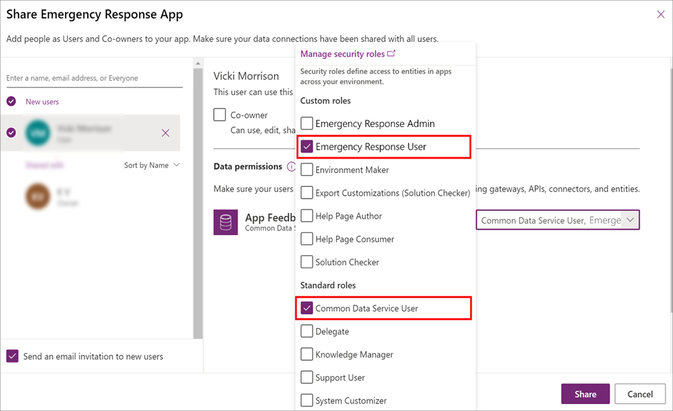

5.  Repeat steps 3 and 4 for each mobile app.

Detailed information about sharing your apps: [Share a canvas app](https://docs.microsoft.com/powerapps/maker/canvas-apps/share-app)

### Step 9: Set your mobile app as hero and featured app

This step lets you set your mobile app as the hero and featured app within the **Power Apps** mobile app. You must be a Tenant Admin to complete this step.

Before you perform this step, you will need app ID of each mobile app (canvas app) that you want to set as hero and featured app. For info about getting app ID for a canvas app, see [Step 6: Bypass consent for mobile apps](#step-6-bypass-consent-for-mobile-apps)

Next, do the following:

1.  Open Notepad, and copy this PowerShell script:


    ```powershell
    # MUST BE A TENANT ADMIN TO RUN THIS
    Install-Module -Name Microsoft.PowerApps.Administration.PowerShell
    Install-Module -Name Microsoft.PowerApps.PowerShell -AllowClobber
    Import-Module -Name Microsoft.PowerApps.Administration.PowerShell
    Import-Module -Name Microsoft.PowerApps.PowerShell

    # This call opens prompt to collect credentials 
    # (Azure Active Directory account and password) 
    # used by the commands
    Add-PowerAppsAccount

    # Use the "Emergency Response App" App ID
    # To clear a featured app use Clear-AdminPowerAppAsFeatured

    #Change the App ID for each new app (APPGUIDHERE)
    Set-AdminPowerAppAsFeatured -AppName APPGUIDHERE

    # To clear a hero app use Clear-AdminPowerAppAsHero
    # Change the App ID for each new app (APPGUIDHERE)
    Set-AdminPowerAppAsHero -AppName APPGUIDHERE
    ```

2.  Replace the `APPGUIDHERE` value in the script with the actual app ID for the app you want to set as featured and hero respectively.

3.  Save the file as .ps file.

4.  Run PowerShell as an administrator and execute the .ps file you just created.
 

### Step 10: Share model-driven app with admins in your organization

For your admin users to use the admin app (model-driven app), it must be shared with them. It's easier to use Azure AD groups to easily share apps with a group of admin users.

> [!IMPORTANT]
> Make sure the user or group you plan to share the app with *already* have access to your environment. Typically, you would have already added users or group while [setting up your environment](#step-1-sign-up-for-power-apps-and-create-an-environment). Alternatively, you can follow the steps here to add users to your environment and provide appropriate access before sharing app with them: [Create users and assign security roles](https://docs.microsoft.com/power-platform/admin/create-users-assign-online-security-roles).

1. Sign in to [Power Apps](https://make.powerapps.com).

2. In the left navigation pane, select Apps to view a list of all your apps.

3. Select the model-driven app (**Admin App – Emergency Response App**) and select **Share** in the banner.

4. Specify the Azure AD group or admin users that you want to share this app with, assign the **Emergency Response Admin** security role, and select **Share**.

## Publish the Power BI dashboard

Publish the Power BI dashboard and share it with users in your organization so that they can use the dashboard for insights and decision making.

You can publish Power BI dashboard in two ways: using the template app from the AppSource or using the **.pbit** file available in the deployment package.

### Publish using the template app

Detailed instructions about using the template app from teh app store is available here: [Connect to the Hospital Emergency Response Decision Support Dashboard](https://docs.microsoft.com/power-bi/connect-data/service-connect-to-health-emergency-response)

### Publish using the .pbit file

This section provides information on how you can use the **Emergency Response App.pbit** available in the deployment package.

#### Prerequisites

- Power BI Premium Capacity or Power BI Pro licenses assigned to users accessing the report. 

- Create a workspace in Power BI where you publish the report. Sign into Power BI and create a workspace. More information: [Create the new workspaces in Power BI](https://docs.microsoft.com/power-bi/service-create-the-new-workspaces)

- Install Power BI Desktop from the Windows app store: <https://aka.ms/pbidesktop>

   > [!NOTE] 
   > If you have installed Power BI Desktop by downloading directly from the Download Center page as an executable in the past, remove it and use the one from the Microsoft Store. The Microsoft Store version will be updated automatically as new releases are available.
   >
   > If you can't install from Microsoft Store, install the latest non-Microsoft Store version from the [Download Center page](https://www.microsoft.com/download/details.aspx?id=58494).

- After installing Power BI Desktop from app store, run it, sign in using an account that has permission to publish Power BI apps in your organization.

#### Publish the dashboard

1. Navigate to the location where you extracted the deployment package. You will find the **Emergency Response App.pbit** file under the **Power BI Template** folder.

2. Open the **Emergency Response App.pbit** file in Power BI Desktop. You'll will be prompted to type the following values:

    - **Organization_name**: Type your organization name that will be populated on the top-left corner of each report page.
    - **CDS_base_solution_URL**: Type the URL of your Common Data Service environment instance. For example: https://*[myenv]*.crm.dynamics.com

    > [!div class="mx-imgBorder"]
    > 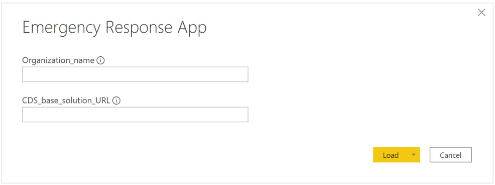

    Select **Load**.

3. You will be prompted to enter credentials to connect to your Common Data Service environment. Select **Organizational account** > **Sign in** to specify your Common Data Service credentials.  

    > [!div class="mx-imgBorder"]
    > 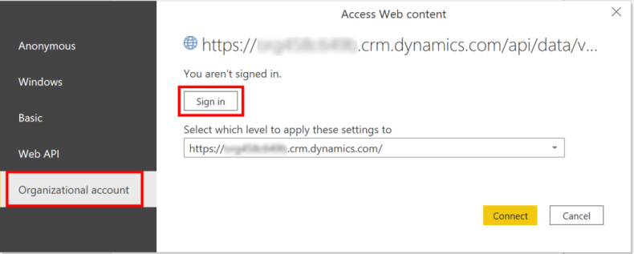

4. After signing in, select **Connect** to connect to your data in Common Data Service.

5. On successful connection, your data will be displayed in the Power BI report. You'll be prompted to apply pending changes to your query; select **Apply changes**.

6. Select **Publish** to publish data to your Power BI workspace. You'll be prompted to save your changes; select **Save**.

    > [!div class="mx-imgBorder"]
    > 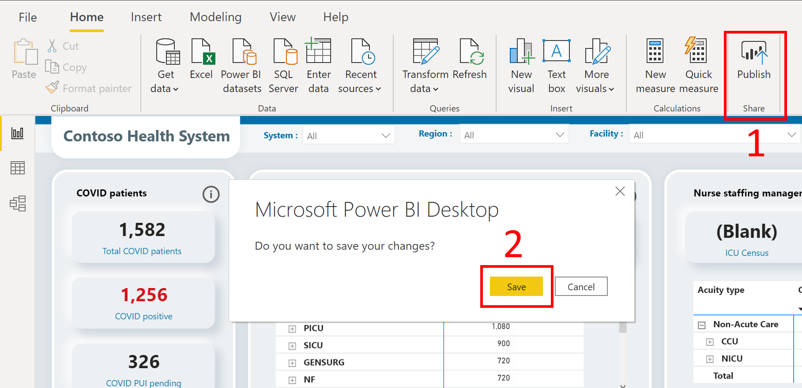

7. You'll be prompted to save the file as a .pbix file along with your Common Data Service environment information. Provide a name and save it on your computer.

8. After saving the .pbix file, you'll be prompted to publish the report. In the **Publish to Power BI** page, select the workspace where you want to publish, and then click **Select**.

12. The report becomes available in your workspace. Now, we will configure the data refresh settings for the dataset. Select the dataset in your workspace and select the **Schedule refresh** icon.  
    
    > [!div class="mx-imgBorder"]
    > 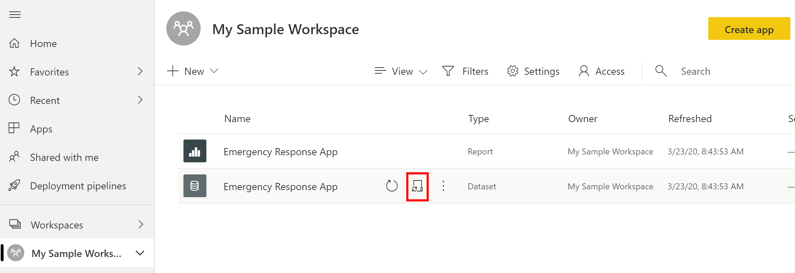

13. The first time you try to set the data refresh setting, you'll see the **Settings** page with a message stating that your credentials aren't valid. Under **Data source credentials**, select **Edit credentials** to specify your credentials.  

    > [!div class="mx-imgBorder"]
    > 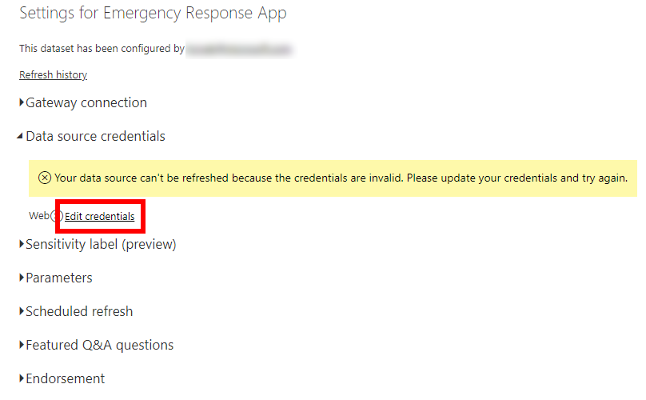

14. In the next screen:
    - Select **Authentication method** as **OAuth2**.
    - Select **Privacy level setting for this data source** as **Organizational**.
    - Select **Sign in**.

    You'll be prompted to specify your credentials and sign in. Upon successful sign in, you'll return to the **Settings** page.

15. In the **Settings** page, expand **Scheduled refresh** and specify the required details for refreshing data based on a schedule. Select **Apply**.

    > [!div class="mx-imgBorder"]
    > 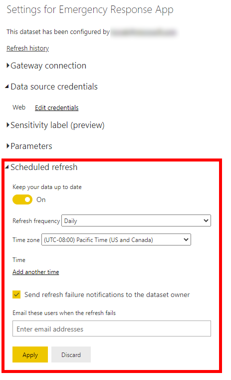

    > [!NOTE] 
    > There are limits to how many times data can refresh. Power BI limits datasets on shared capacity to eight daily refreshes. If the dataset resides on a Premium capacity, you can schedule up to 48 refreshes per day in the dataset settings. More information: [Refresh data](https://docs.microsoft.com/power-bi/refresh-data#data-refresh)

16. Select your workspace name in the left pane, and then select **Create app** in the top-right corner.  

    > [!div class="mx-imgBorder"]
    > 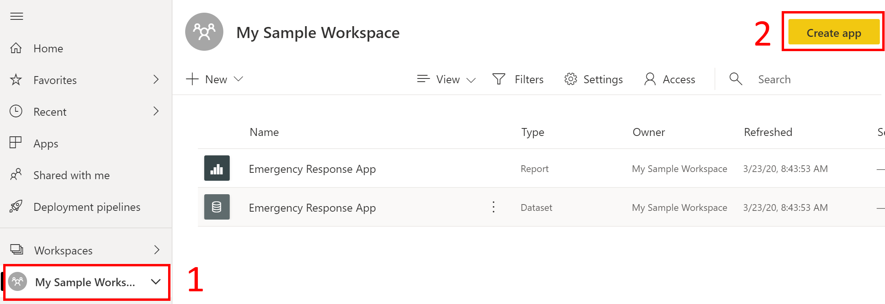

17. On the app publishing page:

    1. On the **Setup** tab, specify the name and description of your app.

    2. On the **Navigation** tab, specify the location of the dashboard where you will publish it.

    3. On the **Permissions** tab, specify users or group who will be able to view this app. Make sure you select the **Install this app automatically** check box to install this app automatically for end users. More information: [Automatically install apps for end users](https://docs.microsoft.com/power-bi/service-create-distribute-apps#automatically-install-apps-for-end-users)  

        > [!div class="mx-imgBorder"]
        > 

18. Select **Publish app.** For detailed information on publishing apps in Power BI, see [Publish your app](https://docs.microsoft.com/power-bi/service-create-distribute-apps#publish-your-app).

#### Next step

To view the published Power BI dashboard, see [View Power BI dashboard](configure-data-reporting.md#view-power-bi-dashboard)

## Issues and feedback

- To report an issue with the Hospital Emergency Response sample app, visit <https://aka.ms/emergency-response-issues>.

- For feedback about the Hospital Emergency Response sample app, visit <https://aka.ms/emergency-response-feedback>.

## Next step

[Use the Hospital Emergency Response app](use.md)
