# Use the Regional Emergency Response Portal

## Overview

Hospital staff are challenged to meet an increase in number of patients while managing supply chain during emergency. By using the Regional Emergency Response portal, frontline workers can quickly view and add data for ventilators, staffing, pending discharges, and COVID-19 related patients.

## Portal at a glance

Browse to the Power Apps portal to work with staffing, equipment, supplies, patient and other areas. The following section walks you through what you can access, submit or update as the frontline user of the portal.

> [!div class="mx-imgBorder"]
> 

You can use latest mobile devices and web browsers when using Regional Emergency Response portal except Apple iPad.

## Portal components

The Regional Emergency Response sample solution app consists of multiple apps for enhanced user experience.

- **Bed capacity**  
  Collect details regarding bed licenses, capacity, acuteness, staffed and surge data.

- **Staff**  
  Collect status of the RNs by location in that facility.

- **Equipment**  
  Collect equipment details such as ventilators, PAPR belts/chargers/hoods.

- **Supplies**  
  Collect key supplies to track, manage, and forecast inventory more effectively. ​

- **COVID-19 stats**  
  Collect status on how many patients are under investigation for COVID-19 and how many tested positive.

## Getting started with the portal

When you visit the portal, you have an option to log in, or for the first time, redeem an invitation:

> [!div class="mx-imgBorder"]
> 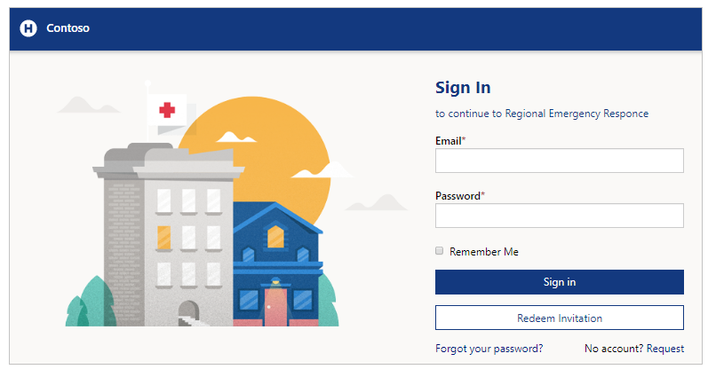

### Redeem invitation

Select **Redeem invitation** if you received an email invitation with an invitation code:

> [!div class="mx-imgBorder"]
> 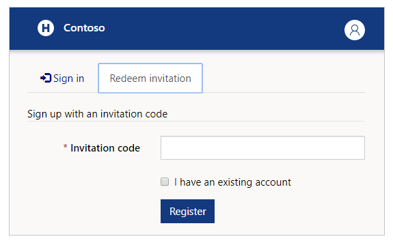

You can select the checkbox *I have an existing account* if you are aware of your account already being present in the solution.

Select **Register** to start registration process and provide your details to save in your account.

### Sign in

If you already have email address and password available, enter your details and then select **Sign in**. You can save your credentials with **Remember me** check box if the device you use is not shared.

If you forget your password, you can use the **Forgot your password?** option to receive password reset email:

> [!div class="mx-imgBorder"]
> 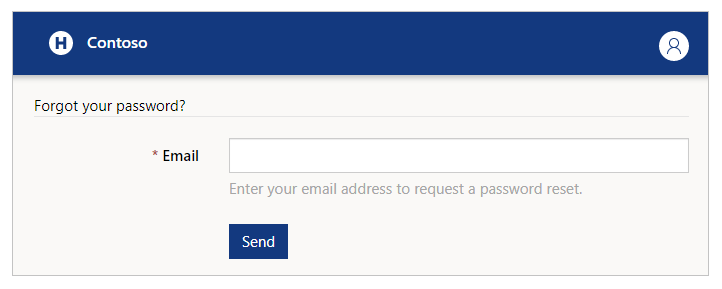

After you sign in the portal, you’ll see **Hospital System, Region** and **Facility** selector before you can begin to submit data:

> [!div class="mx-imgBorder"]
> 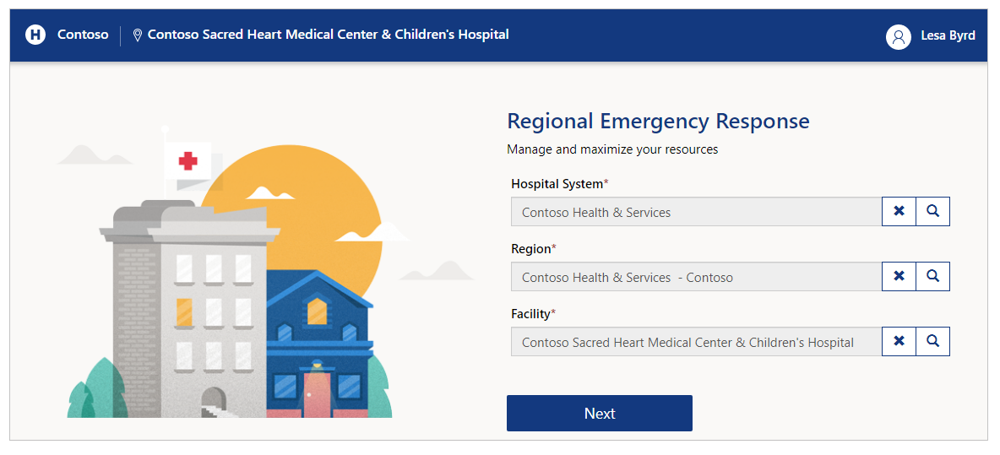

Enter your choices before you proceed to the next step. You can use the search button to lookup records and search for your desired hospital, region or facility:

> [!div class="mx-imgBorder"]
> 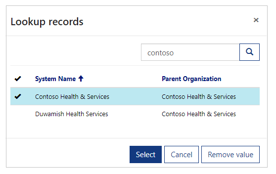

### Bed capacity

Select **Bed capacity** to update patient information, beds and staffing capacity for the selected location:

> [!div class="mx-imgBorder"]
> 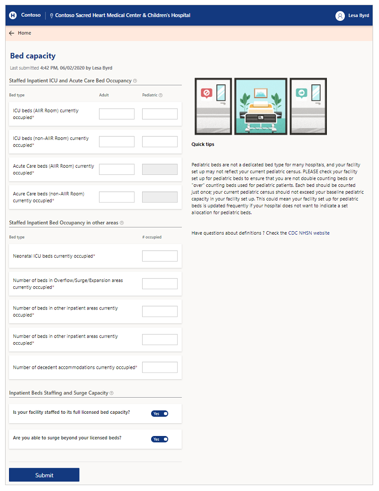

#### Options and description

| **Option name**                                               | **Description**                                                                       |
|---------------------------------------------------------------|---------------------------------------------------------------------------------------|
| How many licensed beds are currently in use in this facility? | Number of licensed beds currently in use at this facility.                            |
| Number of ICU Beds (AIIR Room) currently in use               | Number of ICU Beds (AIIR Room) currently in use.                                      |
| Number of ICU Beds (non-AIIR Room) currently in use           | Number of ICU Beds (non-AIIR Room) currently in use.                                  |
| Number of Acute Care Beds (AIIR Room) currently in use        | Number of Acute Care Beds (AIIR Room) currently in use.                               |
| Number of Acute Care Beds (non-AIIR Room) currently in use    | Number of Acute Care Beds (non-AIIR Room) currently in use.                           |
| Is your facility staffed to its full license bed capacity?    | Yes/No If the answer is No, you have the option to select all the reasons that apply: |
| Are you able to surge beyond your licensed beds?              | Yes/No If the answer is No, you have the option to select all the reasons that apply: |
| Number of surge beds currently in use                         | Number of surge beds currently in use.                                                |

- Staff

- Space

- PPE

- Equipment

- Low Patient Volume

- Staff

- Space

- PPE

- Equipment

- Low Patient Volume

### Staff

Submit staff specific details such as absenteeism, and registered nurse related details such as requested, assigned, unassigned and partners with **Staff**
form:

> [!div class="mx-imgBorder"]
> 

#### Options and description

| **Option name**                               | **Description**                                                                |
|-----------------------------------------------|--------------------------------------------------------------------------------|
| Percentage of essential care personnel absent | Absenteeism of essential care personnel in percentage format.                  |
| **Registered nurses on duty**                 |                                                                                |
| *Partners*                                    | Number of Registered Nurse partners present at the selected location.          |
| *Requested*                                   | Number of Registered Nurses requested for the selected location.               |
| *Assigned*                                    | Number of Registered Nurses assigned to the selected location.                 |
| *Unassigned*                                  | Number of Registered Nurses not assigned to any task at the selected location. |

### Equipment

Submit the equipment details such as ventilators, PAPR belts/chargers/hoods:

> [!div class="mx-imgBorder"]
> 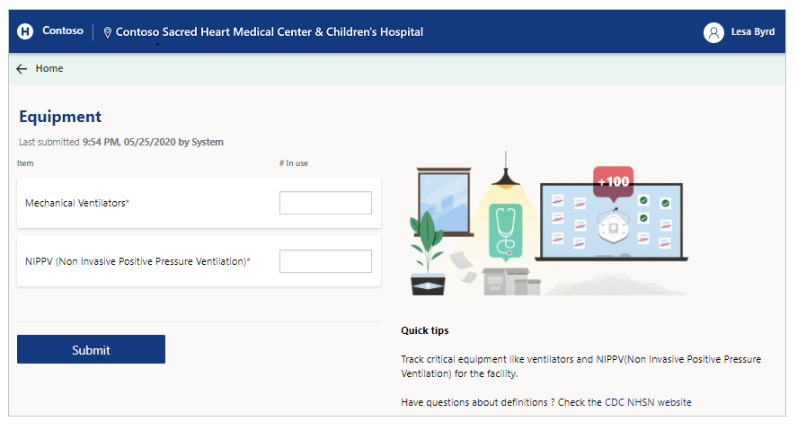

#### Options and description

| **Option name** | **Description**                 |
|-----------------|---------------------------------|
| Ventilators     | Number of ventilators in use.   |
| NIPPV           | Number of NIPPV devices in use. |
| PAPR belts      | Number of PAPR belts in use.    |
| PAPR chargers   | Number of PAPR chargers in use. |
| PAPR hoods      | Number of PAPR hoods in use.    |

### Supplies

Submit the supplies inventory in stock and used in last 24 hours:

> [!div class="mx-imgBorder"]
> 

#### Options and description

The supplies app items list may be different depending on your organization requirements. Refer to your organization resources for descriptions of supply
names.

> [!NOTE]
> The supply inventory item values must be in number format. The supply number is for **individual component**. For example, N-95 masks are counted by each individual mask instead of counting the number of boxes containing masks.

### COVID-19 stats

Submit COVID-19 specific details using the **COVID-19 stats** form:

> [!div class="mx-imgBorder"]
> 

#### Options and description

| **Option name**                                                   | **Description**                                                    |
|-------------------------------------------------------------------|--------------------------------------------------------------------|
| Number of patients under investigation (PUIs)                     | Number of patients under investigation.                            |
| Number of patients with confirmed COVID-19                        | Number of patients with confirmed COVID-19.                        |
| Number of intubated patients                                      | Number of patients intubated.                                      |
| Number of patients with COVID-19 discharged in the prior 24 hours | Number of patients with COVID-19 discharged in the prior 24 hours. |

## Other portal options

Explain any other options, including end of shift/sign out, feedback, switch facility or any new.

### Submit form

After you submit any form, you’ll receive an acknowledgement for the submission and have an option to either go to the home page, or submit another record for the selected component:

> [!div class="mx-imgBorder"]
> 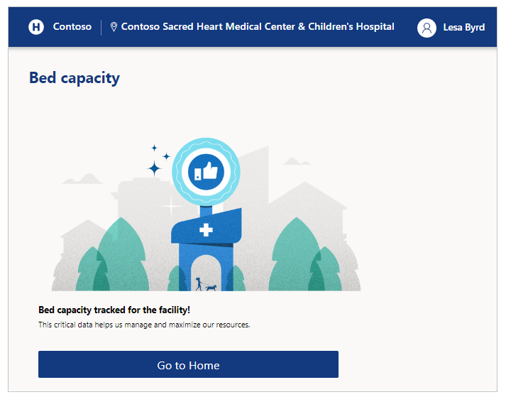

### Sign out

You can sign out from the app using the profile icon on the upper-right side of the screen.  

> [!div class="mx-imgBorder"]
> 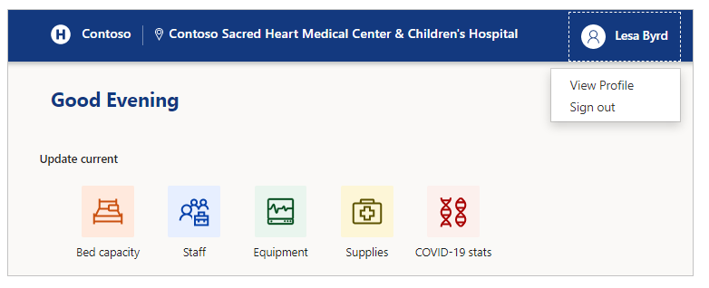

> [!NOTE]
> Sign-out may not be available if your IT administrator has disabled device sharing.

### Switch facility

Switch facility anytime by selecting the facility name on the top-right side of the screen.

> [!div class="mx-imgBorder"]
> 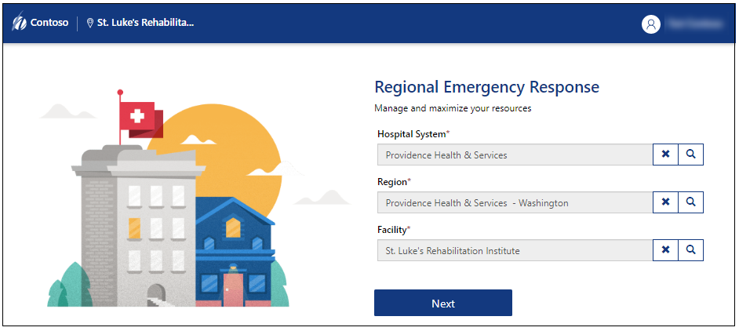

If you use a mobile device, use the top right button and then select the name of the facility to switch:

> [!div class="mx-imgBorder"]
> 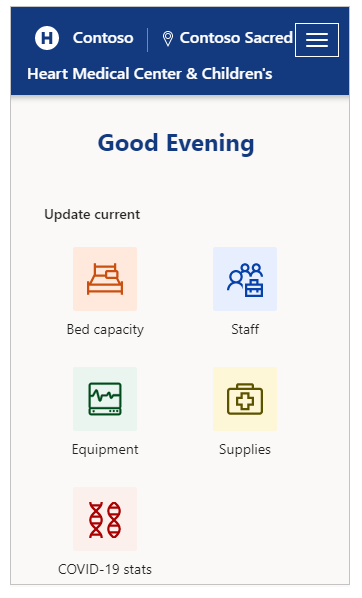

### Navigation

From any page, you can always go back to the home page by selecting the state department on top left of the screen:

> [!div class="mx-imgBorder"]
> 

You can also go back to the previous page, such as to **Bed Capacity** in the
following example with link to **Bed Capacity:**

> [!div class="mx-imgBorder"]
> 

## Version history

| **Version** | **Release date** | **Comments**                                               |
|-------------|------------------|------------------------------------------------------------|
| Version 0.5 | April 14, 2020   | Based on rer6 environment.                                 |
| Version 0.4 | April 10, 2020   | Based on updated regional dev portal.                      |
| Version 0.3 | April 3, 2020    | Based on regional dev portal.                              |
| Version 0.2 | March 31, 2020   | Based on Power Point presentation with reduced components. |
| Version 0.1 | March 31, 2020   | Initial version – prior to portal or figma availability.   |

## Disclaimer

*This app is a sample and may be used with Microsoft Power Platform for dissemination of reference information only. This app is not intended or made available for use as a medical device, clinical support, diagnostic tool, or other technology intended to be used in the diagnosis, cure, mitigation, treatment, or prevention of disease or other conditions, and no license or right is granted by Microsoft to use this app for such purposes. This app is not designed or intended to be a substitute for professional medical advice,
diagnosis, treatment, or judgement and should not be used as such. Customer bears the sole risk and responsibility for any use of this app. Microsoft does
not warrant that the app or any materials provided in connection therewith will be sufficient for any medical purposes or meet the health or medical requirements of any person.*

*Sample data included in this app are for illustration only and are fictitious.  No real association is intended or inferred.*

