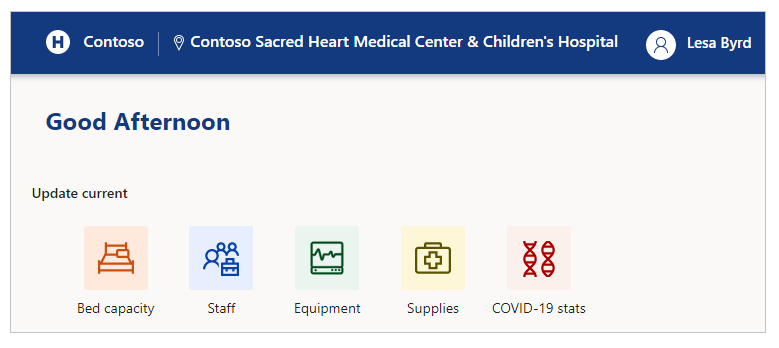
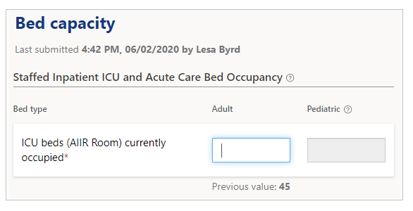
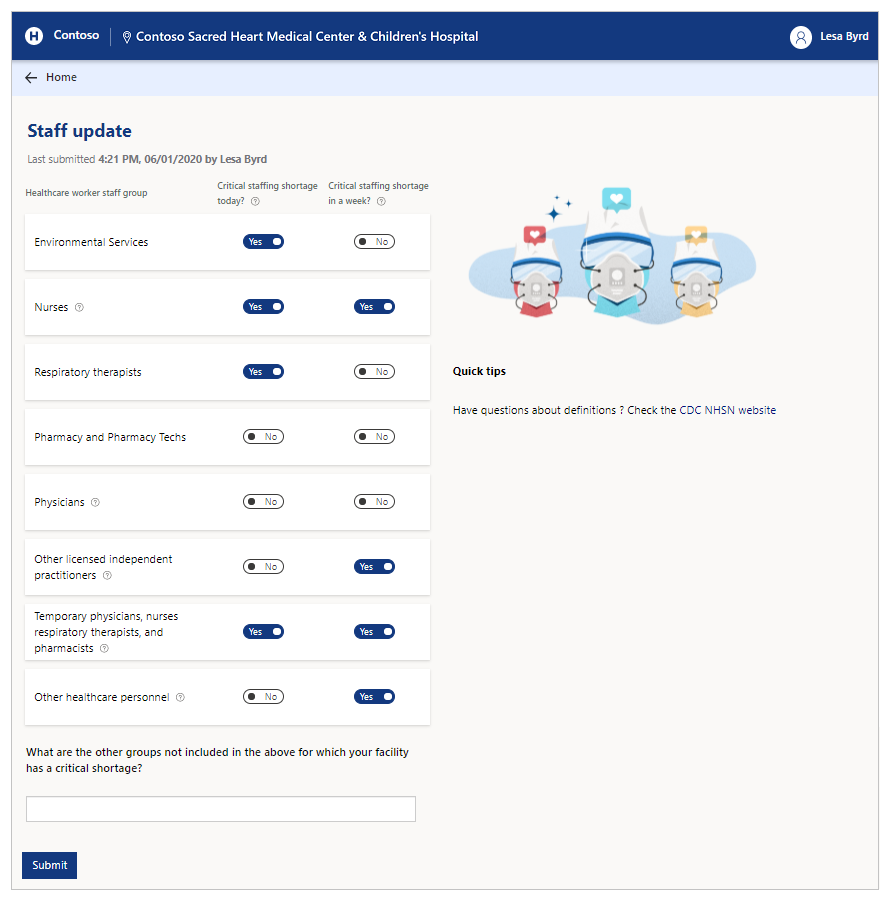
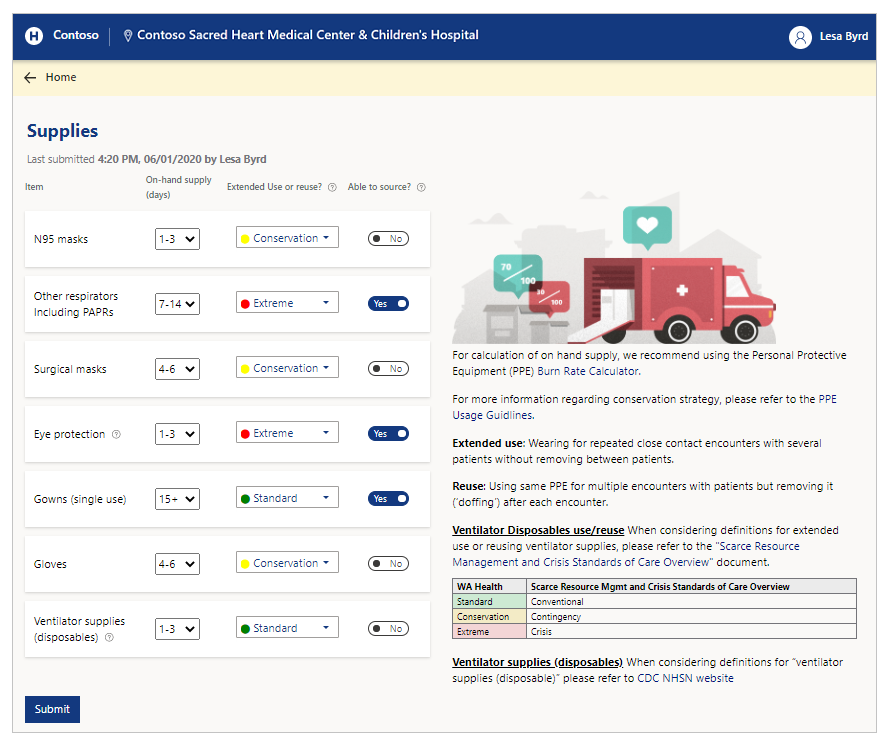
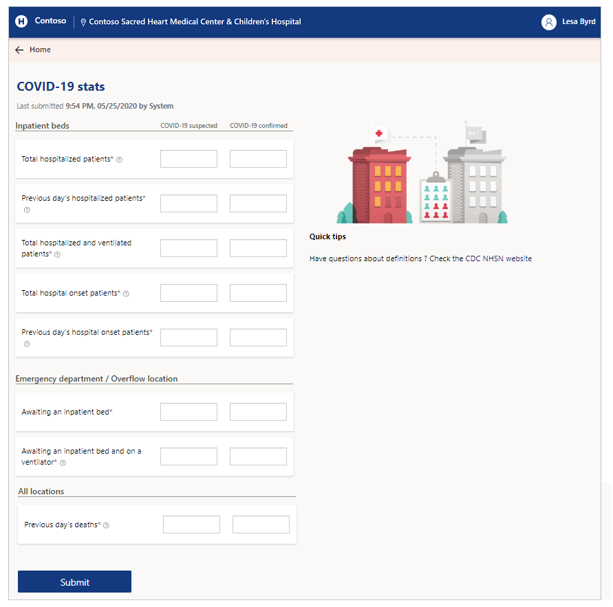

# Use the Regional Hospital Emergency Response portal

## Overview

Hospital staff are challenged to meet an increase in number of patients while managing supply chain during emergency. By using the Regional Hospital Emergency Response portal, health care workers can quickly view and add data for ventilators, staffing, pending discharges, and COVID-19 related patients.

## Portal at a glance

Browse to the Power Apps portal to work with staffing, equipment, supplies, patient, and other areas. The following section walks you through what you can access, submit, or update as the health care user of the portal.

You can use latest mobile devices and web browsers when using Regional Hospital Emergency Response portal except Apple iPad.

[!include[cc-getting-started](includes/cc-getting-started.md)]

[!include[cc-manage-user-profile](includes/cc-manage-user-profile.md)]

## Portal components

The Regional Hospital Emergency Response portal consists of the following components:

- **Bed capacity**  
  Collect details regarding bed licenses, capacity, acuteness, staffed beds, and surge data.

- **Staff**  
  Collect status of the RNs by location in that facility.

- **Equipment**  
  Collect equipment details such as ventilators and NIPPV devices.

- **Supplies**  
  Collect key supplies to track, manage, and forecast inventory more effectively. ​

- **COVID-19 stats**  
  Collect status on how many patients are under investigation for COVID-19 and how many tested positive.

## Bed capacity

Select **Bed capacity** to update patient information, beds, and staffing capacity for the selected location:

### Options and description

| **Option name**                                               | **Description**                                                                       |
|---------------------------------------------------------------|---------------------------------------------------------------------------------------|
| Number of licensed beds currently in use  | Number of licensed beds currently in use at this facility.                            |
| Number of ICU beds (AIIR Room) currently in use               | Number of ICU beds in Airborne Infection Isolation Rooms (AIIR) currently in use at this facility.                                      |
| Number of ICU beds (non-AIIR Room) currently in use           | Number of ICU beds (non-AIIR) currently in use at this facility.                                  |
| Number of Acute Care beds (AIIR Room) currently in use        | Number of Acute Care beds (AIIR)) currently in use at this facility.                               |
| Number of Acute Care beds (non-AIIR Room) currently in use    | Number of Acute Care beds (non-AIIR) currently in use at this facility.                           |
| Is your facility staffed to its full licensed bed capacity?    | Yes/No. If the answer is No, can select one or more reasons from the following:   - Staff   - Space   - PPE   - Equipment   - Low Patient Volume  |
| Are you able to surge beyond your licensed beds?              | Yes/No. If the answer is No, can select one or more reasons from the following:   - Staff   - Space   - PPE   - Equipment   - Low Patient Volume  |
| Number of surge beds currently in use                         | Number of surge beds currently in use at this facility. 
| Number of decedent accommodations currently in use                                            | Number of decedent accommodations currently in use at this facility.   **Note**: Only visible if the *Total Mortuary Capacity* for the selected facility is at least 1.

### Previous submissions

When you open **Bed capacity**, or any other components such as **Staff**, **Equipment**, **Supplies**, or **COVID-19 stats**, you can see last submission date, time, and submitter.

If you select individual field, such as *Number of licensed beds currently in use* for **Bed capacity**, you can also see the previous value submitted for the field:

## Staff

Submit staff-specific details such as absenteeism, and registered nurse-related details such as *on duty* and *currently needed* with **Staff**
form:

### Options and description

| **Option name**                               | **Description**                                                                |
|-----------------------------------------------|--------------------------------------------------------------------------------|
| Percentage of essential care personnel absent | Absenteeism of essential care personnel in percentage format.                  |
| Number of RNs currently on duty                                    | Number of Registered Nurses currently on duty for the selected facility.                 |
| Number of RNs currently needed                                  | Number of Registered Nurses currently needed for the selected facility. |

## Equipment

Submit the equipment details such as ventilators and NIPPV devices:

### Options and description

| **Option name** | **Description**                 |
|-----------------|---------------------------------|
| Ventilators     | Number of ventilators in use.   |
| NIPPV (Non-Invasive Positive Pressure Ventilation)          | Number of NIPPV (Non-Invasive Positive Pressure Ventilation) devices in use. |

## Supplies

Submit the supplies inventory in stock and used in last 24 hours:

### Options and description

The supplies app items list may be different depending on your organization requirements. Refer to your organization resources for descriptions of supply
names.

> [!NOTE]
> The supply inventory item values must be in number format. The supply number is for **individual component**. For example, N-95 masks are counted by each individual mask instead of counting the number of boxes containing masks.

## COVID-19 stats

Submit COVID-19 specific details using the **COVID-19 stats** form:

### Options and description

| **Option name**                                                   | **Description**                                                    |
|-------------------------------------------------------------------|--------------------------------------------------------------------|
| Number of patients under investigation (PUIs)                     | Number of patients under investigation at this facility.                            |
| Number of patients with confirmed COVID-19                        | Number of patients with confirmed COVID-19  at this facility.                        |
| Number of intubated patients                                      | Number of patients intubated  at this facility.                                      |
| Number of patients with COVID-19 discharged in the prior 24 hours | Number of patients with COVID-19 discharged in the prior 24 hours at this facility. |

## General portal options

[!include[cc-general-options](includes/cc-general-options.md)]

## Report issues

To report an issue with the Regional Emergency Response sample app, visit <https://aka.ms/rer-issues>.
