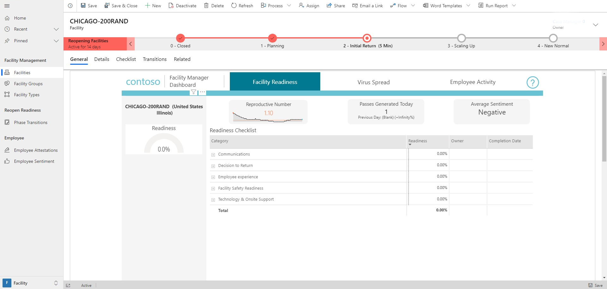
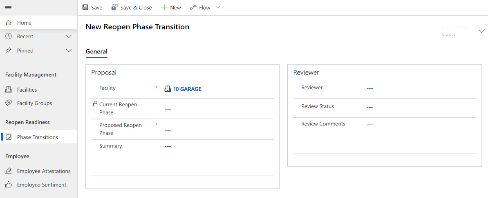
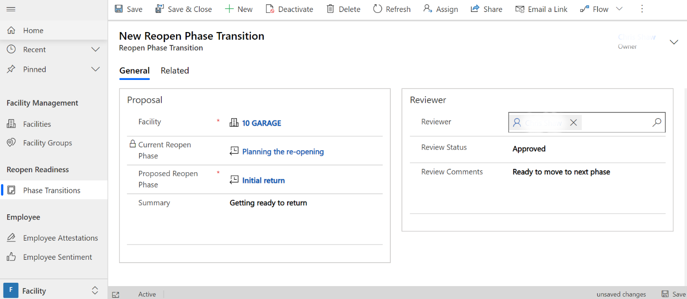
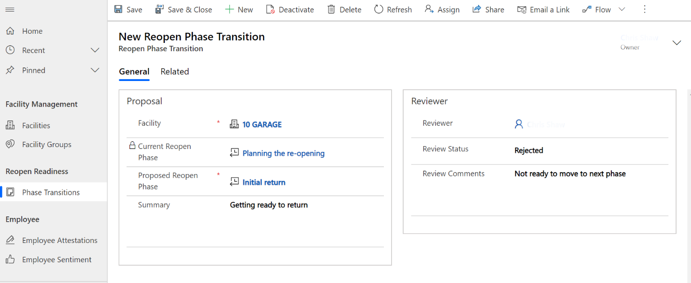
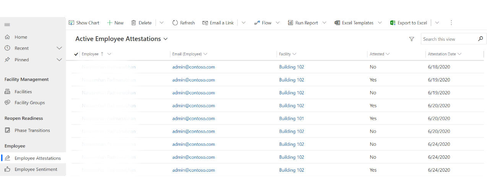
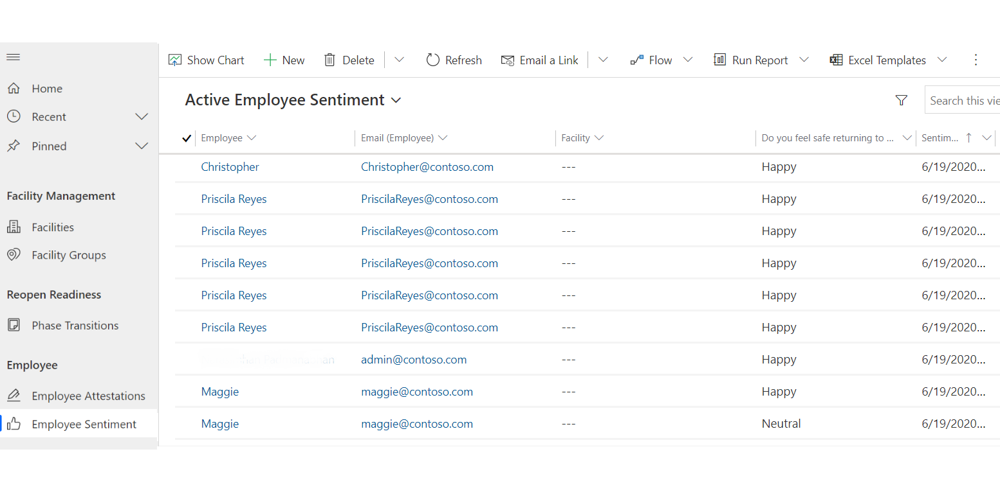

# Use the Facility Safety Management app

The Facility Safety Management app provides step-by-step instructions to facility managers in the organization for using the app to manage the reopening and readiness of the facilities. 

This helps the organizations ensure that they can provide a safe working environment for employees to return to the workplace using the Return to the Workplace solution.

## App at a glance

The left pane lists all the components available in the **Facility Management** area.

> [!div class="mx-imgBorder"]
> 

## App components

The Facility Safety Management app has the following components:

**Facility Management**

-  **Facilities**- List of the facilities (for example, buildings and plants) that require monitoring to reopen.

-  **Facility Groups** - Provides a flexible way to group facilities. For example, by campus or geographical region.

-  **Areas** - Areas are subcomponents of a facility used to distinguish the capacity of these subcomponents over the various phases.

**Reopen Readiness**

-  **Phase Transitions** - A phase transition is used to create a request to transition to a new phase. When the transition is approved, the facility will be updated with the proposed phase.

-  **Readiness Factors** -  Readiness factors are yes-or-no questions about reopening a building. They are linked to the reopening phase by a checklist on a facility.

- **Measurements** -  The actual values for a metric to help track parameters over time. For a single metric, measurements can be entered for each facility.

**Employee**

- **Employee Sentiment** -  Keeps track of general employee well-being. This is self-reported information, but it's a valuable parameter when tracked consistently over time and with bigger groups. This data is typically entered by employees using the employee app.

- **Employee Attestation** - Keeps track of employee health assessments or attestations based on a series of questions answered by the employee. This data is typically entered by employees using the employee app.

## Manage and monitor facilities 

This section covers how to manage and monitor facilities.

### Create a facility 

By default, two facilities are provided as an example.

**To create a new facility**

1. Select **Facilities** in the left pane, and then select **New**.

   > [!div class="mx-imgBorder"]
   > 

2. Enter appropriate values in the fields:
 
   > [!div class="mx-imgBorder"]
   > 

   | **Field**              | **Description**                                |
   |------------------------|------------------------------------------------|
   | Facility Number        | Enter a number for the new facility.                  |
   | Name                   | Enter a  name for the new facility.                    |
   | Description            | Enter the description for the new facility.              |
   | Facility Type          | Select the appropriate facility type.   |
   | Facility Group         | Select an appropriate group for the facility. |
   | Reopen Phase           | Select an appropriate reopen phase.  |
   | Address Street 1       | Enter the first line of the street address.            |
   | Address Street 2       | Enter the address street 2 information.             |
   | Address Postal Code    | Enter postal code.         |
   | Address City           | Enter the city.               |
   | Address State/Province | Enter state or province.      |
   | Address Country        | Enter a country.        |

3. Select **Save & Close**. The newly created record is available in the
    **Active Facility Types** view.

To edit the record, select the newly created record, update the values as
required, and select **Save & Close**.

4. A facility can be assigned to a user, to do so switch to the **Active Facilities** view.

   > [!div class="mx-imgBorder"]
   > 

5. Select a facility and click **Assign**, select the **User** to assign the facility to.

   > [!div class="mx-imgBorder"]
   > 

### Monitor facility

The facility manager can monitor and assesses the current status of their facilities
by reviewing the facility's associated dashboard, details, checklist, and
transitions. To monitor a facility.

1. Select **Facility** from  the left pane to see the list of facilities. The default view, My Facilities, shows only your facilities. When switching view, you can see either all active or inactive facilities. 

2. Select the desired facility record to access the facility data. The **General** tab shows the facility manager dashboard. The dashboard shows the COVID-19 data based on the address details of the facility, checklist completion for the current phase, employee attestation, and employee sentiment. More information: [Power BI dashboard]().

   > [!div class="mx-imgBorder"]
   > 

3. Select **Details** tab for the selected facility
 
   > [!div class="mx-imgBorder"]
   > 

4. Select **Checklist** tab for the selected facility to see checklist items and their completion status.

    > [!div class="mx-imgBorder"]
    >  

5. Select **Transitions** tab for the selected facility to see any related transition requests and their status.

   > [!div class="mx-imgBorder"]
   > 

### Updating the checklist

The **Checklist** tab contains an editable grid displaying the check-in the checklist for the current facility or phase combination. The editable grid provides an easy way for the users to find checks by category and then update the individual checks, where applicable. To locate and update checks:

1. Select **Facilities** from the left pane to see the list of active facilities

2. Select a desired facility to access the facility data

3. Select **Checklist** tab for the selected facility to see the checklist items and their completion status.

   > [!div class="mx-imgBorder"]
   > 

4. Select the category from the **Categories** drop-list that you want to search
    within to locate the checks you want to review or update.

   > [!div class="mx-imgBorder"]
   > 

5. Select the dropdown and select **Yes** to confirm the check is completed, add the **date** in the completion 
   date column.

6. Select **Save** to update the checklist.

    > [!div class="mx-imgBorder"]
    > 

## Moving facility to a new phase

When a facility manager asserts that a facility should be moved to a new phase, the manager can apply for a transition. Only the facility manager can create
a new transition record that indicates the new phase. A reviewer must **Accept** or **Reject** the transition. Either way, the transition record is closed and stored as a historical track record. When the transition is accepted, the proposed phase is applied to the facility.

The new phase comes with its own set of metrics, goals, and checklist. These will be made available on the facility by a background process. So there will be
a small delay between accepting a transition and the actual changes on the facility record.

A reviewer, for instance, a facility manager supervising many facility managers
in a facility group, can find the backlog in the phase transitions subarea. For example, the list can be filtered by the facility group or by the reviewer to find out that the phase transitions require attention.

> [!div class="mx-imgBorder"]
> 

### Create transition request

To create a transition request:

1. Select **Facilities** in the left pane and select a facility record from the active facilities list.

2. Select **Transitions** tab from the selected facility. If there are any existing or previous transition requests established, they will appear in the
subgrid.

3. Select **New Reopen Phase Transition**.

   > [!div class="mx-imgBorder"]
   > 

4. Enter appropriate values in the fields:

   > [!div class="mx-imgBorder"]
   > 

   | **Field**    | **Description**    |
   |-----------------------|---------------|
   | Proposed Reopen Phase | Select the desired next reopen phase to transition to.|
   | Summary | Enter the summary information regarding moving to the next or targeted reopen phase. |
   | Reviewer | Select appropriate resources to review and approve the new transition. |

5. Select **Save & Close**. The newly created record is available in the
    **Transitions** tab subgrid for the facility.

To edit the record, select the newly created record, update the values as
required, and select **Save & Close**. After approving or rejecting a phase transition, the record can't be updated.

### Approve transition

To approve transition requests:

1. Select **Phase Transitions** in the left pane.

   > [!div class="mx-imgBorder"]
   > 

2. Filter the transitions with the name on the **Reviewer** column.

3. Select the **Transition** record. Complete any analysis required before selecting an **Approved** or **Rejected** value in the **Review Status** field 

4. For approvals, select **Approved** status value and enter in any associated comments in the **Review Comments** field.

   > [!div class="mx-imgBorder"]
   > 

5. Select **Save & Close**. Transition **Review Status** is updated and appropriate back-end processes are triggered to move the facility to the targeted reopen phase.

### Reject transitions

A reviewer must **Accept** or **Reject** transitions. To review, and approve or reject the transition:

1. Select **Phase Transitions** in the left pane.

   > [!div class="mx-imgBorder"]
   > 

2. Filter the transitions with the name on the **Reviewer** column.

3. Select **Transition** record. Complete any analysis required before selecting an **Approved** or **Rejected** value in the **Review Status** field.

4. For rejections, select **Rejected** status value and enter in any
    associated comments in the **Review Comments** field.

   > [!div class="mx-imgBorder"]
   > 

5. Select **Save & Close**. Transition **Review Status** is updated and is processed to move the facility to the requested reopen phase. The facility remains in the current phase and status.

## Monitor employee attestations

Facility managers can monitor whether or not their organization's employees are
feeling healthy enough to be eligible to return to their facility. They can track employee self-attestations of their health based upon a series of
questions answered by the employees. This data is typically entered by the employee using the employee app. Facility managers can view the summary of the responses in **Employee Attestations** subarea in the facility manager app.

> [!div class="mx-imgBorder"]
> 

## Monitor employee sentiments

Keeps track of general employee sentiment on how they are feeling about the
prospect of returning to their workplace facility. This information is
self-reported, but it is a valuable parameter when tracked
consistently over time and with bigger groups. This data is typically entered by the employee using the employee app. Facility managers can view the summary of the responses in **Employee Attestations** subarea in the facility manager app.

> [!div class="mx-imgBorder"]

<!--
## Issues and feedback

- To report an issue with the Return to the Workplace solution, visit <https://aka.ms/rtw-issues>.

- For feedback about the Return to the Workplace solution, visit <https://aka.ms/rtw-feedback>.
-->
