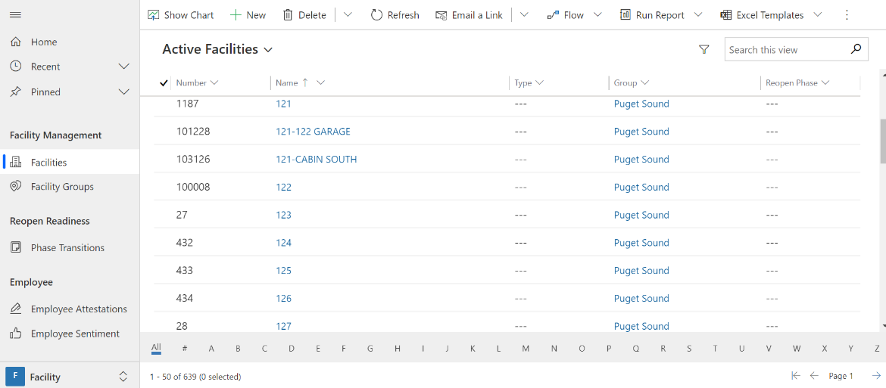
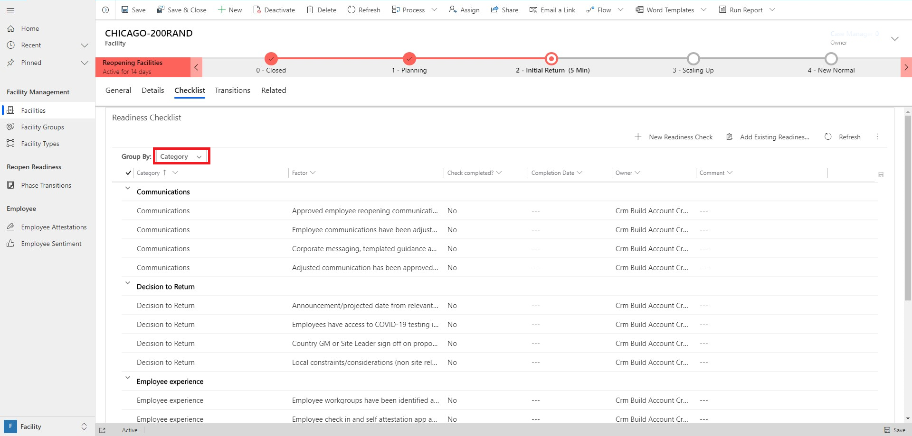
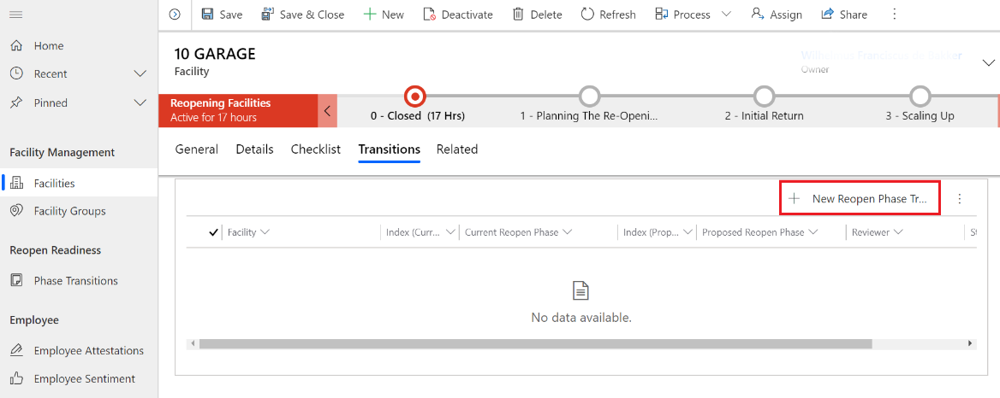

# Use the Facility Safety Management app

The Facility Safety Management app provides step-by-step instructions to facility managers in the organization for using the app to manage the reopening and readiness of the facilities. 

This helps the organizations ensure that they can provide a safe working environment for employees to return to the workplace using the Return to the Workplace solution.

## App at a glance

The left pane lists all the components available in the **Facility Management** area.

> [!div class="mx-imgBorder"]
> 

## App components

The Facility Safety Management app has the following components:

**Facility Management**

-  **Facilities**- List of the facilities (for example, buildings and plants) that require monitoring to reopen.

-  **Facility Groups** - Provides a flexible way to group facilities. For example, by campus or geographical region.

**Reopen Readiness**

-  **Phase Transitions** - A phase transition is used to create a request to transition to a new phase. When the transition is approved, the facility will be updated with the proposed phase.

-  **Readiness Factors** -  Readiness factors are yes-or-no questions about reopening a building. They are linked to the reopening phase by a checklist on a facility.

- **Measurements** -  The actual values for a metric to help track parameters over time. For a single metric, measurements can be entered for each facility.

**Employee**

- **Employee Sentiment** -  Keeps track of general employee well-being. This is self-reported information, but it's a valuable parameter when tracked consistently over time and with bigger groups. This data is typically entered by employees using the employee app.

- **Employee Attestation** - Keeps track of employee health assessments or attestations based on a series of questions answered by the employee. This data is typically entered by employees using the employee app.

## Manage and monitor facilities 

This section covers how to manage and monitor facilities.

### Create a facility 

By default, two facilities are provided as an example.

**To create a new facility**

1. Select **Facilities** in the left pane, and then select **New**.

   > [!div class="mx-imgBorder"]
   > 

2. Enter appropriate values in the fields:
 
   > [!div class="mx-imgBorder"]
   > 

   | **Field**              | **Description**                                |
   |------------------------|------------------------------------------------|
   | Facility Number        | Enter a number for the new facility.                  |
   | Name                   | Enter a  name for the new facility.                    |
   | Description            | Enter the description for the new facility.              |
   | Facility Type          | Select the appropriate facility type.   |
   | Facility Group         | Select an appropriate group for the facility. |
   | Reopen Phase           | Select an appropriate reopen phase.  |
   | Address Street 1       | Enter the first line of the street address.            |
   | Address Street 2       | Enter the second line of the street address.             |
   | Address Postal Code    | Enter the postal code.         |
   | Address City           | Enter the city.               |
   | Address State/Province | Enter the state or province.      |
   | Address Country        | Enter a country.        |

3. Select **Save & Close**. The newly created record is available in the
    **Active Facility Types** view.

To edit the record, select it, update the values, and then select **Save & Close**.

**To assign a facility to a user**

1. A facility can be assigned to a user, to do so switch to the **Active Facilities** view.

   > [!div class="mx-imgBorder"]
   > 

2. Select a facility, select **Assign**, and then select a **User** to assign the facility to.

   > [!div class="mx-imgBorder"]
   > 

### Monitor a facility

The facility manager can monitor and assesses the current status of their facilities
by reviewing the facility's associated dashboard, details, checklist, and
transitions.

**To monitor a facility**

1. Select **Facility** from the left pane. The default view, My Facilities, shows only your facilities. When switching views, you can see either all active or inactive facilities. 

2. Select the facility record for which you want to access data. The **General** tab shows the facility manager dashboard. The dashboard shows the COVID-19 data based on the address details of the facility, checklist completion for the current phase, employee attestation, and employee sentiment. More information: [Power BI dashboard](dashboard-for-executive-leadership.md).

   > [!div class="mx-imgBorder"]
   > 

3. Select the **Details** tab for the facility.
   > [!div class="mx-imgBorder"]
   > 

   - Select the **Checklist** tab to see checklist items and their completion status.

     > [!div class="mx-imgBorder"]
     >  

   - Select the **Transitions** tab to see any related transition requests and their status.

     > [!div class="mx-imgBorder"]
     > 

### Updating the checklist

The **Checklist** tab contains an editable grid displaying the checklist for the current facility or phase combination. The editable grid provides an easy way for to find checklist items by category and then update the individual items, where applicable. 

**To find and update checklist items**

1. Select **Facilities** from the left pane.

2. Select the facility for which you want to find and update checklist items.

3. Select the **Checklist** tab.

   > [!div class="mx-imgBorder"]
   > 

4. Select **Category**, and then select the category you want to search
    in.

   > [!div class="mx-imgBorder"]
   > 

5. Select the drop-down and select **Yes** to confirm the check is completed. 

6. Add the date in the **Completion date** column, and then select **Save** to update the checklist.

    > [!div class="mx-imgBorder"]
    > 

## Moving facility to a new phase

When a facility manager asserts that a facility should be moved to a new phase, the manager can apply for a transition. Only the facility manager can create
a new transition record that indicates the new phase. After the transition is saved, a reviewer can be assigned. A reviewer must **Accept** or **Reject** the transition. Either way, the transition record is closed and stored as a historical record. When the transition is accepted, the proposed phase is applied to the facility.

The new phase comes with its own checklist and set of metrics and goals. These will be made available on the facility by a background process. So there will be a small delay between accepting a transition and the actual changes on the facility record.

A reviewer&mdash;for instance, a facility manager supervising many facility managers in a facility group&mdash;can find the backlog in **Phase transitions**. For example, the list can be filtered by the facility group or by the reviewer to find the phase transitions that require attention.

> [!div class="mx-imgBorder"]
> 

### Create a transition request

1. Select **Facilities** in the left pane, and select a facility record from the active facilities list.

2. Select the **Transitions** tab. If any existing or previous transition request were established, they'll appear in the subgrid.

3. Select **New Reopen Phase Transition**.

   > [!div class="mx-imgBorder"]
   > 

4. Enter appropriate values in the fields:

   > [!div class="mx-imgBorder"]
   > 

   | **Field**    | **Description**    |
   |-----------------------|---------------|
   | Proposed Reopen Phase | Select the next reopen phase you want to transition to.|
   | Summary | Enter the summary information about moving to the next or targeted reopen phase. |
   | Reviewer | Select appropriate resources to review and approve the new transition. |

5. Select **Save & Close**. The newly created record is available in the **Transitions** tab subgrid for the facility.

To edit the record, select it, update the values, and then select **Save & Close**. After the phase transition is approved or rejected, the record can't be updated.

### Approve or reject a transition

1. Select **Phase Transitions** in the left pane.

   > [!div class="mx-imgBorder"]
   > 

2. Filter the transitions by name on the **Reviewer** column.

3. Select the **Transition** record. Complete any analysis required before selecting **Approved** or **Rejected** in the **Review Status** field.

4. For approvals, select **Approved** and enter any comments in the **Review Comments** field. Select **Save & Close**.

   > [!div class="mx-imgBorder"]
   > 

5. For rejections, select **Rejected** and enter any comments in the **Review Comments** field. Select **Save & Close**.

   > [!div class="mx-imgBorder"]
   > 

The review status for the transition is updated, and appropriate back-end processes are triggered to move the facility to the targeted reopen phase.

### Create transition records via the Business Process Flow

For ease of use we can also use the business process flow to create new transition records. There are two cases:

1. Moving forward

Given that the facility is not in the final phase, the user can click on the circle of the current stage and select **Next Stage**. The business process flow wont move instantly, but in the background a new transition record is created and the user will be navigated to that record. The record is pre populated with the next phase and is ready for approval.

2. Moving backward

Given that the facility is not in the first phase, the user can click on the cirle of current stage and select **<** to move back. Or the user can select the circle of any previous stage and click **Set Active**. The business process flow will change imediatly. In the background a phase transition record is created and approved automatically. This in turn will trigger the background process that will update the facility with the checklist, metrics and goals corresponding to the selected phase. Please allow for some time for this to happen. The user can continue to perform other tasks.

## Monitor employee attestations

Facility managers can monitor whether their organization's employees are
feeling healthy enough to be eligible to return to their facility. They can track employee self-attestations of their health based on a series of
questions the employees answer. This data is typically entered by the employee using the employee app. Facility managers can view the summary of the responses in the **Employee Attestations** area of the facility manager app.

> [!div class="mx-imgBorder"]
> 

## Monitor employee sentiments

This area of the facility manager app keeps track of general employee sentiment about the prospect of returning to their workplace. This information is
self-reported, but it's a valuable parameter when tracked
consistently over time and with bigger groups. This data is typically entered by the employee using the employee app. Facility managers can view the summary of the responses in the **Employee Attestations** area of the facility manager app.

> [!div class="mx-imgBorder"]

## Feedback about the solution

To provide feedback about the Return to the Workplace solution, visit <https://aka.ms/rtw-community>.