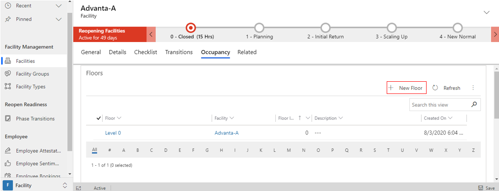
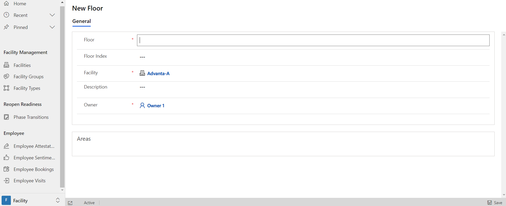
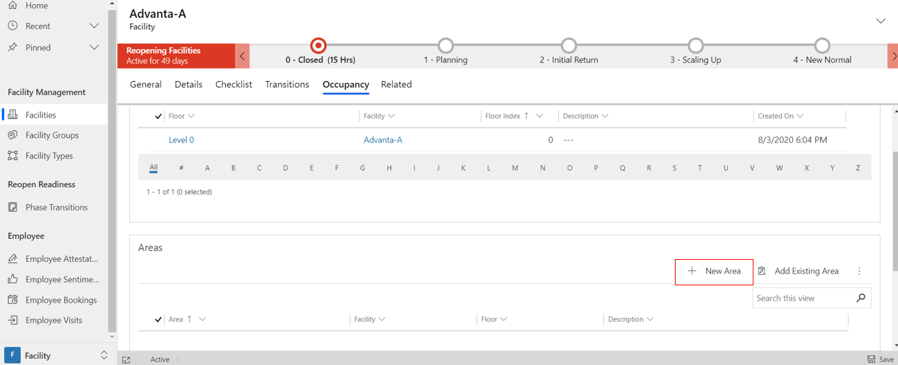
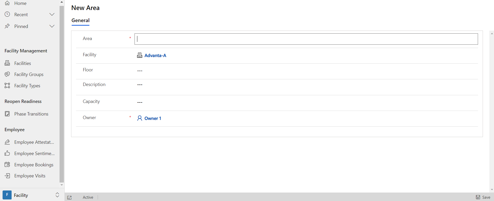
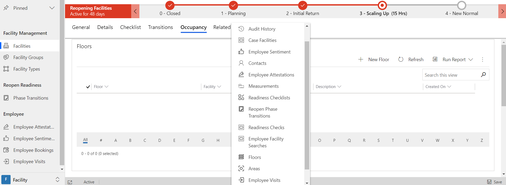

# Use the Facility Safety Management app

The Facility Safety Management app provides step-by-step instructions to facility managers in the organization for using the app to manage the reopening and readiness of the facilities. 

This helps the organizations ensure that they can provide a safe working environment for employees to return to the workplace using the Return to the Workplace solution.

## App at a glance

The Return to Workplace solution supports organization’s goal to Reopen its facilities to its employees as safely and as quickly as possible in an effort to return to normal.  The Safety Management app as part of the overall solution provides Facility Managers with a tool that provides them with the capabilities to manage and support the organization’s journey through their specific reopening plan for their facilities  and its associated phases and goals.  

It is the Facility Manager the facilitates the execution of the organizations reopening plan and their reopening phases that have been configured (see [Configure the solution](configure.md) for steps on configuration).   Facility Managers in supporting the goal to reopening their facilities safely and quickly will lead the required assessments of Facility Readiness and review its status.  The assessments take the form of executing  Checks on a Facility’s Readiness Checklist.   When assumed to be ready based on the results of these checks, the Facility Manager will then assert readiness to move to their next Reopen Phase by initiating a phase transition request.   This request then is processed by the organization’s assigned reviewer where it can then be approved.  This will implement a four-eyes principle, while the checklist allows for a consistent discussion on readiness throughout the company.  Once the reviewer approves the transition the facility is moved to the next phase where a new checklist applicable to the new phase is created and managed.  

The left pane lists all the components available in the **Facility Management** area.

> [!div class="mx-imgBorder"]
> 

## App components

The Facility Safety Management app has the following components:

**Facility Management**

-  **Facilities**- List of the facilities (for example, buildings and plants) that require monitoring to reopen.

-  **Facility Groups** - Provides a flexible way to group facilities. For example, by campus or geographical region.

-  **Facility Types** - Type of facility. For example, building, datacenter, parking space.

**Reopen Readiness**

-  **Phase Transitions** - A phase transition is used to create a request to transition to a new phase. When the transition is approved, the facility will be updated with the proposed phase and its associated checklist based upon the phase's configured readiness factors.

**Employee**

- **Employee Sentiment** -  Keeps track of general employee well-being. This is self-reported information, but it's a valuable parameter when tracked consistently over time and with bigger groups. This data is typically entered by employees using the employee app.

- **Employee Attestation** - Keeps track of employee health assessments or attestations based on a series of questions answered by the employee. This data is typically entered by employees using the employee app.

- **Employee Bookings** - Keeps track of the employee booking having the employee, area, start and end arrival time. This is linked to the employees attestation and recors if there is a visit for that booking.

- **Employee Visits** - Keeps track of the visits. This is linked to an employee and a booking. 

## Manage and monitor facilities 

This section covers how to manage and monitor facilities.

### Create a facility 

By default, two facilities are provided as an example.

**To create a new facility**

1. Select **Facilities** in the left pane, and then select **New**.

   > [!div class="mx-imgBorder"]
   > 

2. Enter appropriate values in the fields:
 
   > [!div class="mx-imgBorder"]
   > 

   | **Field**              | **Description**                                |
   |------------------------|------------------------------------------------|
   | Facility Number        | Enter a number for the new facility.                  |
   | Name                   | Enter a  name for the new facility.                    |
   | Description            | Enter the description for the new facility.              |
   | Entry Window Interval  | Select the window interval for entry between 30 mins, 1 hour and none.          |
   | Facility Type          | Select the appropriate facility type.   |
   | Facility Group         | Select an appropriate group for the facility. |
   | Reopen Phase           | Select an appropriate reopen phase.  |
   | Address Street 1       | Enter the first line of the street address.            |
   | Address Street 2       | Enter the second line of the street address.             |
   | Address Postal Code    | Enter the postal code.         |
   | Address City           | Enter the city.               |
   | Address State/Province | Enter the state or province.      |
   | Address Country        | Enter a country.        |

3. After filling in **details**, click on **save**. Go under the **Occypancy** tabb and fill in the required information to create **floors** and **areas** linked to the new facility. 

**New Floor**

Click on **+New Floor** and fill in the form.

   > [!div class="mx-imgBorder"]
   > 

| **Field**       | **Description**                                |
   |--------------|------------------------------------------------|
   | Floor        | Name for the floor.                 |
   | Floor Index  | Number stablished for the floor.                    |
   | Facility     | Must be the newly facility name.             |

   > [!div class="mx-imgBorder"]
   > 

**New Area**

After filling in a floor and clicking **save**, a floor is created and the **area** option enables. Create an area, linked to the new floor, by clicking on **+New Area** and filling the form.

   > [!div class="mx-imgBorder"]
   > 

| **Field**       | **Description**                                |
   |--------------|------------------------------------------------|
   | Area        | Name for the area.                 |
   | Facility  | By default, the newly created facility.                   |
   | Floor     | By default, the newly floor created.           |
   | Capacity    | People capacity for the area.             |

   > [!div class="mx-imgBorder"]
   > 

4. Select **Save & Close**. The newly created record is available in the
    **Active Facility Types** view.

To edit the record, select it, update the values, and then select **Save & Close**.

**To assign a facility to a user**

1. A facility can be assigned to a user, to do so switch to the **Active Facilities** view.

   > [!div class="mx-imgBorder"]
   > 

2. Select a facility, select **Assign**, and then select a **User** to assign the facility to.

   > [!div class="mx-imgBorder"]
   > 

### Monitor a facility

The facility manager can monitor and assesses the current status of their facilities
by reviewing the facility's associated dashboard, details, checklist, and
transitions.

**To monitor a facility**

1. Select **Facility** from the left pane. The default view, My Facilities, shows only your facilities. When switching views, you can see either all active or inactive facilities. 

2. Select the facility record for which you want to access data. The **General** tab shows the facility manager dashboard. The dashboard shows the COVID-19 data based on the address details of the facility, checklist completion for the current phase, employee attestation, and employee sentiment. More information: [Power BI dashboard](dashboard-for-executive-leadership.md).

   > [!div class="mx-imgBorder"]
   > 

3. Exploring the Facility

   - Select the **Details** tab for the facility.
     > [!div class="mx-imgBorder"]
     > 

   - Select the **Checklist** tab to see checklist items and their completion status.

     > [!div class="mx-imgBorder"]
     >  
     >[!NOTE]
     >Checklist items are configured as part of the global process for managing Reopen Phases and their associated Readiness Factors.  Therefore, new Checks are added as Readiness Factors on a Reopen Phase and not on the Facility.    

   - Select the **Transitions** tab to see any related transition requests and their status.

     > [!div class="mx-imgBorder"]
     > 

   
   - Select the **Occupancy** tab to see and add floors and areas to the facility.

     > [!div class="mx-imgBorder"]
     > 

   - Select the **Related** tab to see any related acctions.

     > [!div class="mx-imgBorder"]
     > 

### Updating the checklist

The **Checklist** tab contains an editable grid displaying the checklist for the current facility or phase combination. The editable grid provides an easy way for to find checklist items by category and then update the individual items, where applicable. 

**To find and update checklist items**

1. Select **Facilities** from the left pane.

2. Select the facility for which you want to find and update checklist items.

3. Select the **Checklist** tab.

   > [!div class="mx-imgBorder"]
   > 

4. Select **Category**, and then select the category you want to search
    in.

   > [!div class="mx-imgBorder"]
   > 

5. Select the drop-down and select **Yes** to confirm the check is completed. 

6. Add the date in the **Completion date** column, and then select **Save** to update the checklist.

    > [!div class="mx-imgBorder"]
    > 

## Moving facility to a new phase

When a facility manager asserts that a facility should be moved to a new phase, the manager can apply for a transition. Only the facility manager can create a new transition record that indicates readiness to move to a new phase. After a new transition is created and saved it will appear in the sub-grid with on the Transitions tab of the Facility record with a status of Submitted.  A reviewer is now able to be assigned to Reopen Phase transition. The reviewer once assigned can then take action on that Reopen Phase Transition request by Accepting or Rejecting it.  Upon approval or rejection of the transition record it is processed and when complete the request is considered closed and stored as a historical record. When complete a transition will appear in the sub-grid as with either Accepted (approved request) or Rejected (rejected request). When a transition is accepted, the transition record proposed phase is applied to the facility record’s Reopen Phase field.  This update will trigger the background process that will update the business process flow stage, aligning the Reopen Phase and current BPF stage.

Additionally the background process will create a new checklist for the Facility along with a new set of metrics and goals. The new checklist that is created is based upon the Readiness Factors that were previously setup and configured by the Facility Manager for the selected Reopen Phase.  The new checklist can then be accessed from the Facility record’s Checklist Tab.  (note:  during the execution of the background processes there may be a delay before these updates are completed and viewable in the Facility’s manager’s view of the screen.  You may need to select the refresh button to see the updates on the screen).

A reviewer&mdash;for instance, a facility manager supervising many facility managers in a facility group&mdash;can find the backlog in **Phase transitions**. For example, the list can be filtered by the facility group or by the reviewer to find the phase transitions that require attention.

>[!NOTE]
> Transitions from one phase to another cannot be completed without an approved transition and therefore it is highly recommended that organizations ensure someone has been given the responsibillity to monitor transitions and ensure they have the appropriate assigned Reviewer.

> [!div class="mx-imgBorder"]
> 

### Create a transition request

1. Select **Facilities** in the left pane, and select a facility record from the active facilities list.

2. Select the **Transitions** tab. If any existing or previous transition request were established, they'll appear in the subgrid.

3. Select **New Reopen Phase Transition**.

   > [!div class="mx-imgBorder"]
   > 

4. Enter appropriate values in the fields:

   > [!div class="mx-imgBorder"]
   > 

   | **Field**    | **Description**    |
   |-----------------------|---------------|
   | Proposed Reopen Phase | Select the next reopen phase you want to transition to.|
   | Summary | Enter the summary information about moving to the next or targeted reopen phase. |
   | Reviewer | Select appropriate resources to review and approve the new transition. |

5. Select **Save & Close**. The newly created record is available in the **Transitions** tab subgrid for the facility.

To edit the record, select it, update the values, and then select **Save & Close**. After the phase transition is approved or rejected, the record can't be updated.

### Approve or reject a transition

1. Select **Phase Transitions** in the left pane.

   > [!div class="mx-imgBorder"]
   > 

2. Filter the transitions by name on the **Reviewer** column.

3. Select the **Transition** record. Complete any analysis required before selecting **Approved** or **Rejected** in the **Review Status** field.

4. For approvals, select **Approved** and enter any comments in the **Review Comments** field. Select **Save & Close**.

   > [!div class="mx-imgBorder"]
   > 

5. For rejections, select **Rejected** and enter any comments in the **Review Comments** field. Select **Save & Close**.

   > [!div class="mx-imgBorder"]
   > 

The review status for the transition is updated, and appropriate back-end processes are triggered to move the facility to the targeted reopen phase.

### Create transition records via the Business Process Flow

For ease of use we can also use the business process flow to create new transition records. There are two cases:

1. Moving forward

Given that the facility is not in the final phase, the user can click on the circle of the current stage and select **Next Stage**. The business process flow wont move instantly, but in the background a new transition record is created and the user will be navigated to that record. The record is pre populated with the next phase and is ready for approval.

2. Moving backward

Given that the facility is not in the first phase, the user can click on the cirle of current stage and select **<** to move back. Or the user can select the circle of any previous stage and click **Set Active**. The business process flow will change imediatly. In the background a phase transition record is created and approved automatically. This in turn will trigger the background process that will update the facility with the checklist, metrics and goals corresponding to the selected phase. Please allow for some time for this to happen. The user can continue to perform other tasks.

## Monitor employee attestations

Facility managers can monitor whether their organization's employees are
feeling healthy enough to be eligible to return to their facility. They can track employee self-attestations of their health based on a series of
questions the employees answer. This data is typically entered by the employee using the employee app. Facility managers can view the summary of the responses in the **Employee Attestations** area of the facility manager app.

> [!div class="mx-imgBorder"]
> 

## Monitor employee sentiments

This area of the facility manager app keeps track of general employee sentiment about the prospect of returning to their workplace. This information is
self-reported, but it's a valuable parameter when tracked
consistently over time and with bigger groups. This data is typically entered by the employee using the employee app. Facility managers can view the summary of the responses in the **Employee Attestations** area of the facility manager app.

> [!div class="mx-imgBorder"]

## Feedback about the solution

To provide feedback about the Return to the Workplace solution, visit <https://aka.ms/rtw-community>.