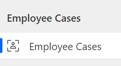
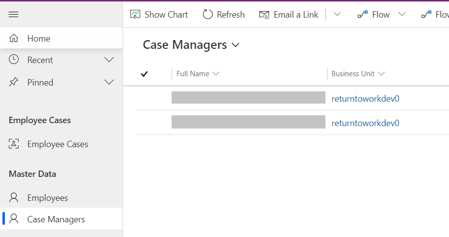
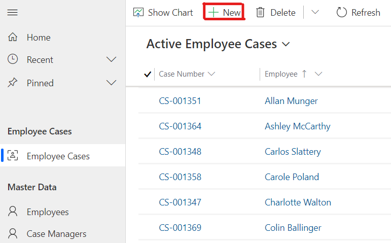
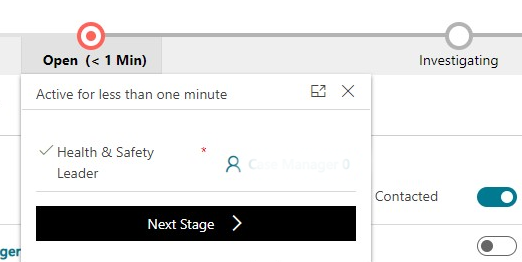
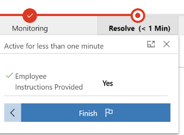

# Use the Workplace Care Management app

This article provides step-by-step instructions to case managers in the organization for using the Workplace Care Management app to manage employee cases. 

To assist Health and Safety Leads, and to help ensure proper case handling, this app implements a four-step process. The current stage of an employee case is clearly depicted in the business process flow on the employee case form. Employee cases will be managed through the following process stages:

1. **Open** – In this stage, you record basic information about the case. At this moment, you as a Health and Safety Lead also become the case manager.

2. **Investigating** – In this stage, you perform steps to ensure that employee checks and screenings are being completed in accordance with company policy. The result of these checks is a clear instruction to the employee. When this is communicated to the employee, the case is moved to the next stage.

3. **Monitoring** – After the investigating stage is complete and the employee has been given instructions or guidelines, they're monitored until they're
healthy enough to be eligible to return to the workplace.

4. **Resolve** – This is the wrap-up stage for the case, where you can enter closing remarks.

You use this app to:

- [Manage employee and case managers master data](#manage-employee-and-case-managers-master-data).

- [Manage employee cases](#manage-employee-cases).

<!-- Removing this, as we don't have any reference for this section[Monitor the employee cases dashboard](#monitor-the-employee-cases-dashboard).-->

## App at a glance

The left pane lists all the components available in the **Employee Cases** area.

> [!div class="mx-imgBorder"]
> 

## App components

The Workplace Care Management app has the following components:

**Employee cases** 

Lists all the cases that have been created.

> [!div class="mx-imgBorder"]
> 

**Master data**

- **Employee** - List of all employees. Employees are contacts.

- **Case managers** - List of all the users who have access to the **Employee Cases** area.

> [!div class="mx-imgBorder"]
> 

## Getting started with the Workplace Care Management app

Employee safety is the main goal for Health and Safety Leads. You use this app to decide whether to revoke an employee's ability
to check in to the workplace. The goal of the case management is to provide a
clear insight into the work backlog and to make sure that the same process is used to manage all cases.

At the case level, no additional personal or privacy-related information is
stored or gathered. The case must be regarded as a checklist that proper
procedures have been applied.

## Manage employee and case managers master data

### Manage employees

You can create a new employee contact if the contact doesn't exist.

**To create an employee contact**

1. Select **Employee** in the left pane, and then select **New**.

   > [!div class="mx-imgBorder"]
   > 

2. Enter appropriate values in the fields:

   | **Field**   | **Description**  |
   |---------------|------------------|
   | First Name | Enter the first name of the employee. |
   | Last Name | Enter the last name of the employee.  |
   | Email | Enter an employee email address. |
   | Business Phone| Enter the employee mobile or phone number. |
   | Preferred Method of Contact | Select the method of contact the employee prefers from the drop-list. |

3. Select **Save & Close**. The newly created record is available in the
    **Active Contacts** view.

To edit the record, select it, update the values, and then select **Save & Close**.

### Manage case managers

Access to employee cases is restricted to only part of the organization. You can view a list of case managers who can manage employee cases.

**To view the list of case managers**

1. Select **Case Managers** in the left pane.

   > [!div class="mx-imgBorder"]
   > 

2. Select the user record you're interested.

   > [!div class="mx-imgBorder"]
   > 

3. Select **Save & Close**.

To edit the record, select it, update the values, and then select **Save & Close**.

## Manage employee cases

The following illustration of the case manager process explains how a case is created and managed by capturing different data at various stages to identify, investigate, and resolve the case. When a case manager is notified, an employee case is created. The employee case is taken through stages where you get more details and perform a screening (investigating), provide instructions (monitoring), and close the case (resolved).

> [!div class="mx-imgBorder"]
> 

### Employee case creation

Case managers are the resource who manages employee cases.

1. Select **Employee Cases** from the left pane, and then select **New**.

   > [!div class="mx-imgBorder"]
   > 

2. Enter the employee name for the new case.

   > [!div class="mx-imgBorder"]
   > 

3. Save the record.

### Managing a case – moving a case through the process stages

#### Open

This is the first process stage. The Health and Safety Lead starts the case and can verify that all basic information is available. The Health and Safety Lead becomes the case manager and will verify the employee details and assign the case to a different case manager. The key pieces of data to be captured and recorded before moving to the next stage are:

- Health & Safety Lead - Case manager owning the case.

  > [!div class="mx-imgBorder"]
  > 

#### Investigating

In this process stage, the case manager contacts the employee to verify how the employee is feeling, and continues to investigate by capturing and recording the case-related data and updating fields on the case form.
The key pieces of data to be captured and recorded before moving to the next stage are:

- Employee Contacted (Yes/No)

- Screened (Yes/No)

- Risk Assessment

  > [!div class="mx-imgBorder"]
  > 

#### Monitoring

In this process stage, the case manager monitors and manages the cases, ensuring that guidance or instructions that were provided are being followed and that expected target dates for being eligible to return to work are updated for the employee. This stage can be regarded as a holding stage, meaning that it's clear when the next moment of contact will be and when the case needs to be followed up on. The key pieces of data to be captured and recorded before moving to the next stage are:

- Employee Instructions Provided (Yes/No)

  > [!div class="mx-imgBorder"]
  > 

#### Resolve

In this process stage, the case manager completes the process by resolving the
case, and selects **Finish**. The key pieces of data to be captured and recorded are:

- Employee Instructions Provided (Yes/No)

  > [!div class="mx-imgBorder"]
  > 

### Case facilities

As part of the investigation, a case manager might need to register which facilities are involved in this case. When you open an employee case, this can be done on the **Case Facilities** tab.

On the **Case Facilities** tab, select **New Case Facility** to relate a facility to this case. When the record is created, further details can be entered:

| **Field**   | **Description**  |
|---------------|------------------|
| Date From | Enter the start date of the employee visiting that facility. |
| Date To | Enter the end date of the employee visiting that facility.  |
| Comment | Enter additional information, when applicable. |

### Case contacts

An employee under investigation might have had contact with one or more colleagues. This type of information can be logged on the **Case Contacts** tab.

On the **Case Contacts** tab, select **New Case Contact** to relate an employee to this case. When the record is created, further details can be entered:

| **Field**   | **Description**  |
|---------------|------------------|
| Risk Assessment | This field provides an easy way to prioritize other employees based on their interactions with the employee under investigation. |
| Comment | Enter additional information, when applicable. |

<!--
## Issues and feedback

- To report an issue with the Return to the Workplace solution, visit <https://aka.ms/rtw-issues>.

- For feedback about the Return to the Workplace solution, visit <https://aka.ms/rtw-feedback>.
-->
