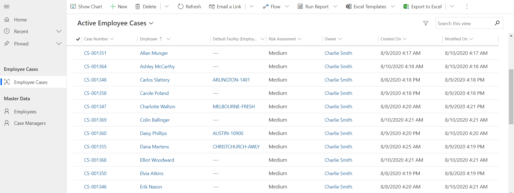
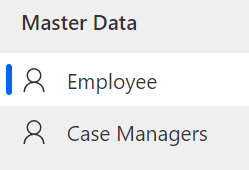
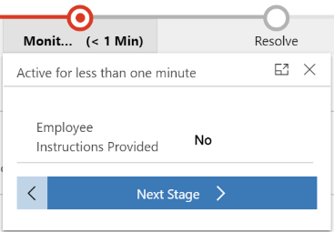

# Overview

This document provides Case Managers in organizations a guide on
how to use the Case Management App to manage employee cases.

These cases will be managed through the following process stages:

1.  Open – In this stage the Health & Safety lead can record basic information
    regarding the case.

2.  Investigating – In this stage the Health & Safety Lead is performing steps
    to ensure the employee checks and screenings are being completed as per
    their company policy. The end result of these checks is a clear instruction
    to the employee. When this is communicated to the employee, the case can
    move towards the next stage.

3.  Monitoring – After the investigating stage is complete and employee has been
    provided with instructions/guidelines they are monitored until they are
    healthy enough to be eligible to return to the workplace

4.  Resolve – case is closed

Health & Safety Leads will use this app to:

-   [Manage Employee and Case Managers Master Data](#Manage-Employee-and-Case-Managers-master-data)

-   [Manage Employee Cases](#Manage-Employee-Cases)

-   [Monitor Employee Cases (dashboard)](#Monitor-employee-cases-(dashboard))

## Prerequisites

The following prerequisites apply to this guide:   
- The environment has all the Return to Workplace components in place with the
    Model Driven App, Canvas Apps and Power BI Dashboards. 
- Solution Administrator has completed all required setup (configurations and master
    data)
- Execution of how to steps require users have the required security role(s)
    in place. Contact your IT Admininstrtaor if you are unable to access.
- The sample data is in the package and needs to be installed on the
    environment. 

## Case Management app at a glance
The left-hand side menu lists all the components available in the ‘Employee
Cases ’ Area.

## Case Management app components

For the Health & Safety Leads one area called ‘Employee Cases’ is available with
the following components.

### Master Data

-   Employee - List of all employees. These are the basic contacts

-   Case Managers - List of all users that have access to the Employee Cases
    area.

### Employee Cases

-   Employee Cases  
    Lists of all cases that have been created

### Employee Cases Dashboard

-   Cases

-   Workload

## Getting started with the Case Management app

Employee Safety is the main goal for the Health & Safety Lead. Therefor the
Employee Case allows the Health & Safety Lead to revoke the employee's ability
to check into a workplace facility. The goal of case management is to provide
clear insight into the work backlog and to make sure that the managing of all
cases follow the same process.

**At the case level, no additional personal or privacy related information is
stored or gathered. The case must be regarded as a checklist that proper
procedures have been applied**

## Manage Employee and Case Managers Master Data

### Manage Employee

Case Managers are able to create a new Employee contact, if one does not exist.
To add an Employee refer to the following steps:

Select **Employee** in the left pane and then select **+New**.

In the **New Contact** screen, enter your new Employee by entering the
    appropriate values:

| **Field**                   | **Description**                                        |
|-----------------------------|--------------------------------------------------------|
| First Name                  | First name for the new employee                        |
| Last Name                   | Last name for the employee                             |
| Email                       | The employee email                                     |
| Business Phone              | The employee business phone numer                      |
| Mobile Phone                | The employee mobile/cell phone number                  |
| Preferred Method of Contact | Select the desired method of contact from the droplist |

Select **Save & Close**. The newly created record will be available in the
    **Active Contacts** list.

To edit the record, select the newly created record, update the values as
required, and select **Save & Close**.

### Manage Case Managers

Case Managers are able to view a list of employees that are able to manage
employee cases. This list of users can be accessed by the following steps:

Select **Case Managers** in the left pane.

Specific details of a selected Case Manager can be viewed by selecting the
    desired user record form the view provided.

Select **Save & Close**. The newly created record will be available in the
    **Enabled Users** list.

To edit the record, select the newly created record, update the values as
required, and select **Save & Close**.

## Manage Employee Cases

### Process Flow

### Case Triggers / Pre-requisites

-   Employee is not feeling well and contacts a case manager via email.

### Employee Case Creation

Case managers will be the resource managing employee cases. When notified they
will need to open a new case record to be managed. A new case can be created by
performing the following steps:

Select the Module “Employee Cases” and then select the **Employee Cases**
    sub-area from the left pane and Select **+New**

Case Manager opens the case and capture the Employee name for the new case.

### Managing a case – moving a case through the process stages

#### Open Stage

   In this process stage the Case Manger makes contact with the employee that
   notified the case management team that he/she is not feeling well. The key
   pieces of data to be captured and recorded prior to moving to the next stage
   are:

-   Employee Contacted – Yes/No, to be set to Yes once the Case manager has
    contacted the employee about their notification.

-   Health & Safety Lead - Case Manager owning this case

### Investigating

   In this process stage the Case Manger continues to investigate capturing and
   recording case related data and updating the fields on the case form.

   The key pieces of data to be captured and recorded prior to moving to the
   next stage are:

-   Screened (Yes/No)

-   Public Health Official Notified

-   Risk Assessment

### Monitoring

   In this process stage the Case Manger monitors the case and manages the case
   ensuring that employee provided guidance/instructions are being followed and
   expected target dates for return to work eligibility are updated for the
   employee.

   The key pieces of data to be captured and recorded prior to moving to the
   next stage are:

-   Employee Instructions Provided (Yes/No)

### Resolve

   In this process stage the Case Manger completes the process by resolving the
   case. Selecting Finish.

   The key pieces of data to be captured and recorded prior to moving to the
   next stage are:

-   Employee Instructions Provided (Yes/No)

## Monitor Employee Cases (Dashboard)

The dashboard consists out of two tabs, both with a distinctive set of
information.

### Cases

On this tab the Health & Safety Lead will see insights in all the cases.
Insights in the workload and work composition:

-   New cases per day

-   Resolved cases per day

-   Number of active cases per phases

Workload  
This tab of the dashboard will display information regarding the progression of
the cases. That way the Health & Safety leads can monitor if cases are dealt
with in a proper fashion.

-   Case duration

-   Cases per facility
