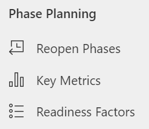
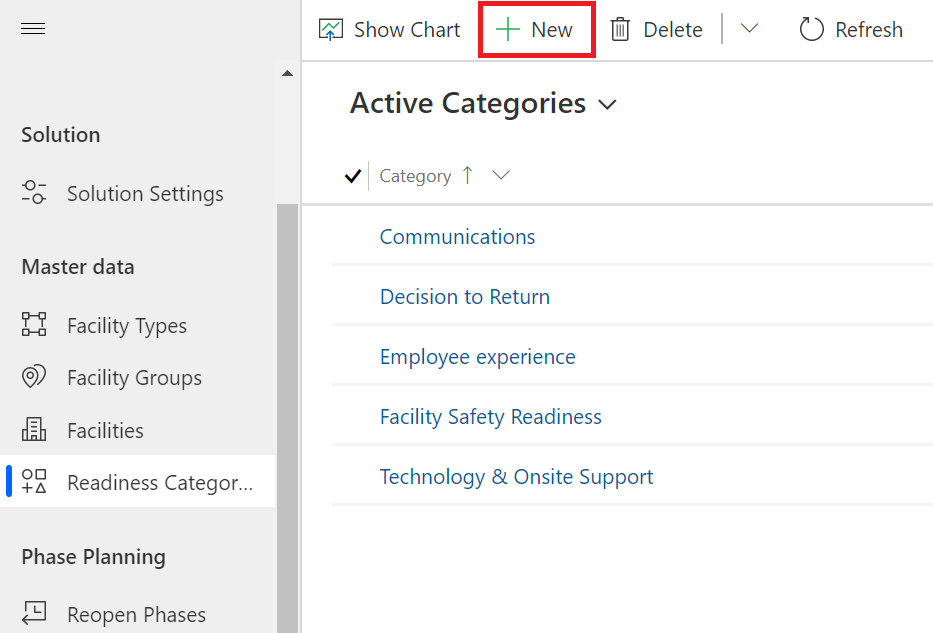
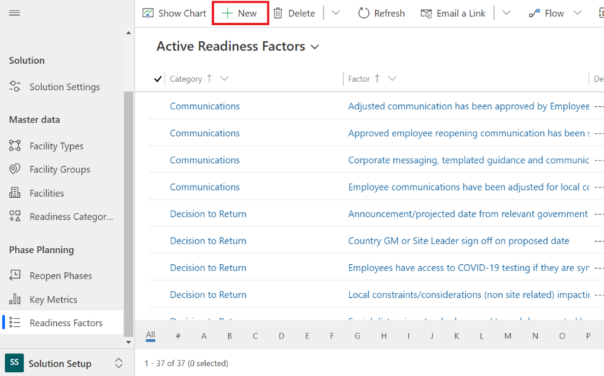
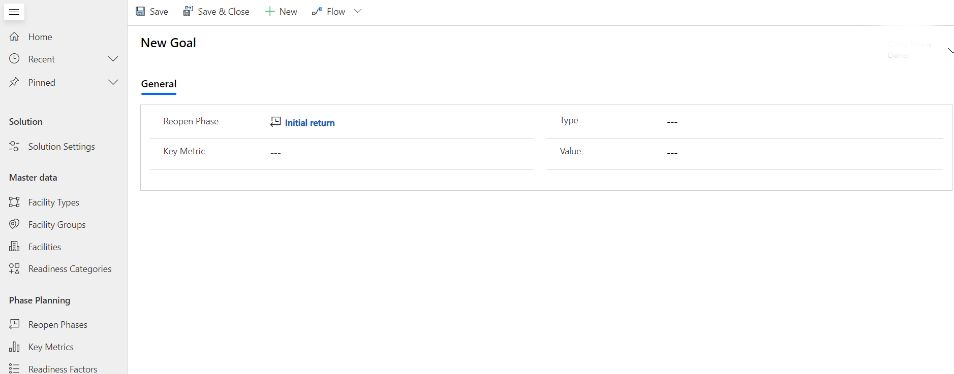
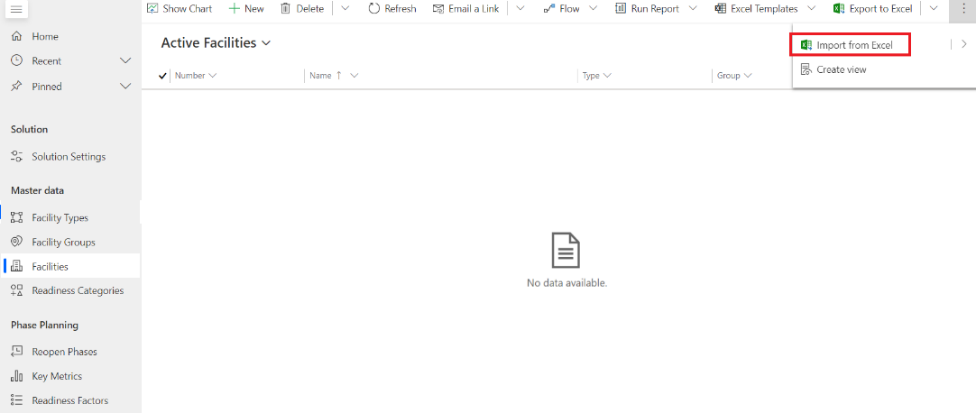
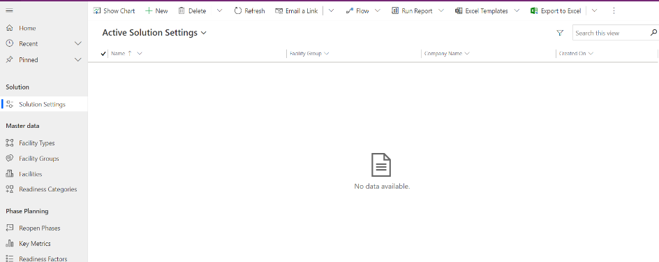
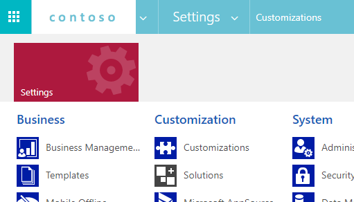
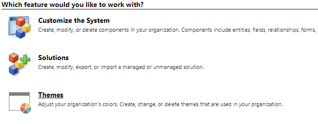
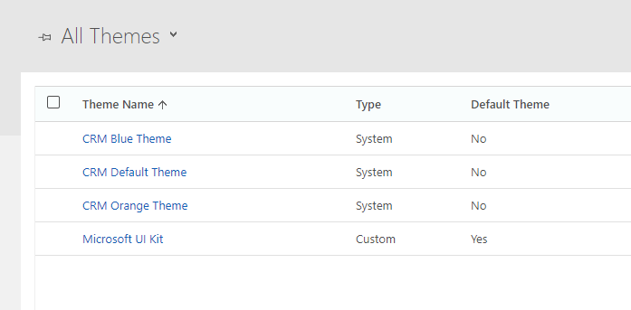

# Overview
This guide provides solution administrators a guide on how they need to
configure the Return to Workplace solution. A solution administrator is
responsible for making sure the facility manager can guide their facilities
throughout their phases. This means that the following steps are needed and will
be covered in the document:

-   [Plan Reopening Phase](#Plan-Reopening-Phase)

-   [Manage Facilities](#Manage-Facilities)

-   [Specify Solution Settings](#Specify-Solution-Settings)

## Prerequisites
The following prerequisites apply to this guide:

-   The environment needs to have all the Return to Workplace components in
    place with the Model Driven Apps, Canvas Apps and Power BI Dashboards.

-   For the following steps you need to have the right security roles in place.

    Contact your IT Administrator if you are unable to access.

-   The sample data is in the package and needs to be installed on the
    environment.

## Plan Reopening Phases

Plan reopening requires the solution administrator to define Reopen Phases to
reopen. Within these phases you define a goal upon which track progress on a
certain metric. These metrics can be sorted via categories to ease use. In the
phases you also define readiness factors which defines the steps required to be
taken in that phase.

In the model-driven app, you select the **Setup** module, which allow you to
configure the plan.

When planning a reopening you need to step through the following steps:

1.  [Define Key Metrics](#Define-Key-Metrics)

2.  [Setup Readiness Categories](#Setup-Readiness-Categories)

3.  [Define Readiness Factors](#Define-Readiness-Factors)

4.  [Setup a Reopen Phase](#Setup-a-Reopen-Phase)

5.  [Set the Goals and Readiness Factors for a Phase](#Set-the-Goals-and-Readiness-Factors-for-a-Phase)

## Define Key Metrics

We have 5 key metrics which are tracked, and they will be provided within the
default set of data. When you have more, you can define your own key metrics. To
create a new key metric, follow the below steps:

1.  Select **Key Metrics** in the left pane and select **New**.

    

2.  I n the **Key Metrics** page, specify a Name.

    

| **Field** | **Description**           |
|-----------|---------------------------|
| Name      | A name for the Key Metric |

3.  Select **Save & Close**. The newly created record will be available in the
    **Active Key Metrics** list.

To edit the record, select the newly created record, update the values as
required, and select **Save & Close**.

## Setup Readiness Categories

Categories organize readiness factors. By default, we provide 6 categories, when
you want add a category, follow the below steps:

1.  Select **Categories** in the left pane and select **New**.

    

2.  In the New **Category** screen, specify a Category.

    

| **Field** | **Description**             |
|-----------|-----------------------------|
| Name      | A name for the new Category |

3.  Select **Save & Close**. The newly created record will be available in the
    **Active Categories** list.

To edit the record, select the newly created record, update the values as
required, and select **Save & Close**.

## Define Readiness Factors 

Readiness Factors will be used to check off when you want to move through
phases. By default, numerous readiness factors will be in the solution. When you
want more readiness factors, follow the below steps:

1.  Select Readiness Factors in the left pane and Select New.

    

2.  In the New **Readiness Factor** screen specify the appropriate values:

    

| **Field**   | **Description**                                                     |
|-------------|---------------------------------------------------------------------|
| Factor      | Type a name for your Factor                                         |
| Description | A description of your Readiness Factor.                             |
| Category    | Select the appropriate Category to assign to your Readiness Factor. |

3.  Select **Save & Close**. The newly created record will be available in the
    **Active Readiness Factors** list.

    To edit the record, select the newly created record, update the values as
    required, and select **Save & Close**.

## Setup a Reopen Phase

In your reopen plan you define a couple of phases through which a facility will
walk. The phases will be in the solution by default. If you want to add or edit
these phases, follow the following steps:

1.  Select **Reopen Phases** in the left pane and select **New**.

    

2.  In the **New Reopen Phase** page, specify the Index, Name, and Description:

    

| **Field**     | **Description**                                                                                                                                       |
|---------------|-------------------------------------------------------------------------------------------------------------------------------------------------------|
| Index         | Type a unique index number to establish where in the sequence of the phases that the new phase shall be placed                                        |
| Name          | Type a name for your new Reopen Phase                                                                                                                 |
| Description   | A description of your Readiness Factor.                                                                                                               |
| Process Stage | Select the appropriate Process Stage to assign to your new Reopen Phase. This identifies which stage in the business process flow should be activated |

3.  Select **Save & Close**. The newly created record will be available in the
    **Active Reopen Phases** list.

To edit the record, select the newly created record, update the values as
required, and select **Save & Close**.

## Set the Goals and Readiness Factors for a Phase

1.  Select **Reopen Phases** in the left pane and select the Reopen Phase for
    which you need to add a new goal (example below – “**Initial Return**”)

    

2.  In the section “Key Metrics” select **+ New Goal.**

    

3.  In the **Goals** page, specify the appropriate values:

    

| **Field**    | **Description**                                |
|--------------|------------------------------------------------|
| Reopen Phase | Type a name for your Reopen Phase              |
| Key Metric   | Select a Key Metric for the goal.              |
| Type         | Select an appropriate goal type from the list: |
| Value        | Enter a numerical target value for the goal    |

-   Lower

-   Higher

-   Equal or Lower

-   Equal or Higher

4.  Select **Save & Close**. The newly created record will be available in the
    **Key Metrics** list.

To edit the record, select the newly created record, update the values as
required, and select **Save & Close**.

5.  To set Readiness Factors for your new Reopen phase select the **Readiness
    Factors** tab

    

6.  Select the button **Add Existing Readiness Factor**

7.  Select your desired Readiness Factor(s) to link to your new Reopen Phase.
    You can select multiple factors from the list prior to pressing the **Add**
    button.

8.  Select the **Add** button to complete the selection process to link your
    selected **Readiness Factors** to your new **Reopen Phase**

    

## Manage Facilities
Facilities are an important part of the Return to Workplace solution. Various
facility types are available like a building or conference center define the
types of facilities which are stored. The Solution Administrator has the responsibility
to manage Facility Types which shall include creating new and updating existing.
The facilities creation that is responsibility of the Facility Manager can be
supported by Solution Administrators through an import record process where needed.

When managing facilities, you will step through the following steps:

1.  Define Facility Types

2.  Import Facilities

## Define Facility Types

Facility types are defined as the types of facilities we support in the
solution. By default, two are provided as an example, you can define more by
following the following steps:

1.  Select **Facility Types** in the left pane and select **New**.

2.  In the New **Facility Type** screen, specify the appropriate values:

    

| **Field**   | **Description**                     |
|-------------|-------------------------------------|
| Type        | A name for your type of Facility    |
| Description | A description of your Facility Type |

3.  Select **Save & Close**. The newly created record will be available in the
    **Active Facility Types** list.

To edit the record, select the newly created record, update the values as
required, and select **Save & Close**.

## Import Facilities 

The Facility sample data file is available in the deployment package (.zip).
When you extract the .zip file, the sample data files are available under the
**SampleData** folder.

**How to load Facility data from data files**

To load sample Facility data from the Excel file to the Facility entity:

1.  In the left navigation pane select **Facilities** (in the area of Facility
    Management)

2.  Select **Import from Excel** to select the Facilities data file

    

3.  Browse to the **SampleData** folder and select the **Facilities.xlsx** file.
    Change this file according to your own needs and proceed with the wizard
    steps to import the data.

4.  After the sample data is imported, you will see the imported records in the
    entity:

    

## Specify Solution Settings

The overall solution requires certain configurations to make sure that the user
has the correct guidance. Via solution settings, settings like contact emails or
attestations are configured. Via themes, it is possible to tailor the experience
of an employee according to the company branding.

When setting up the solution, you step through the following steps:

1.  Set Solution Settings

2.  Define Theming

## Set Solution Settings

Via Solution Settings you can tailor the experience for employees to match the
company guidelines and culture.

1.  Select **Settings** in the left pane and select **New**.

    

2.  In the New Setting screen, specify the appropriate values

    

Disclaimer: the following isn’t implemented yet; this will come in new releases.

## Define Theming

Theming allows you to change the experience of the employee.

1.  Select **Settings** and then **Customizations**.

    

2.  Under Customizations select **Themes**.

    

3.  From the list select the default theme.

    

4.  You can select the different colors from the theme.

    
