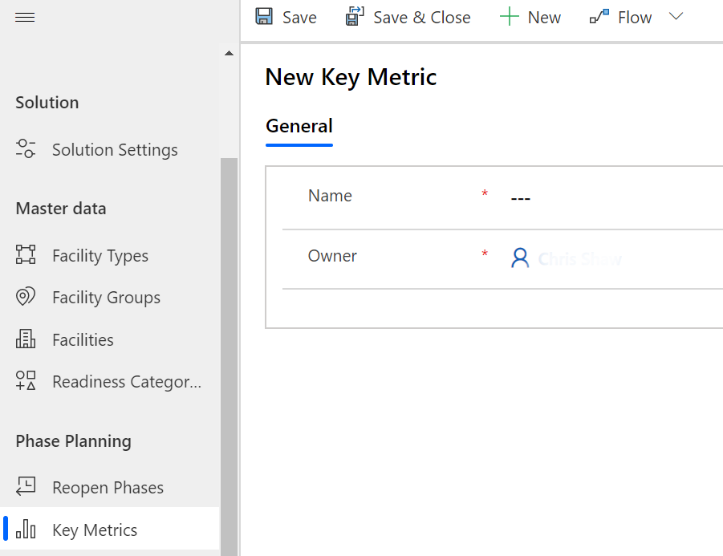
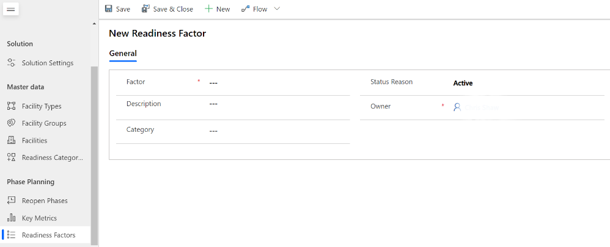
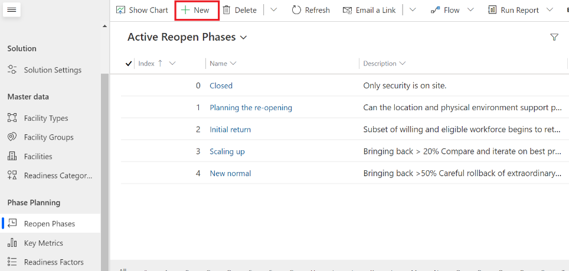
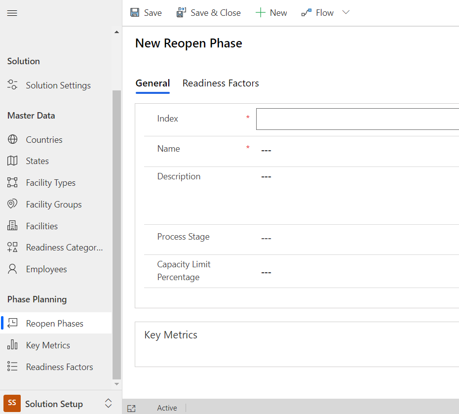
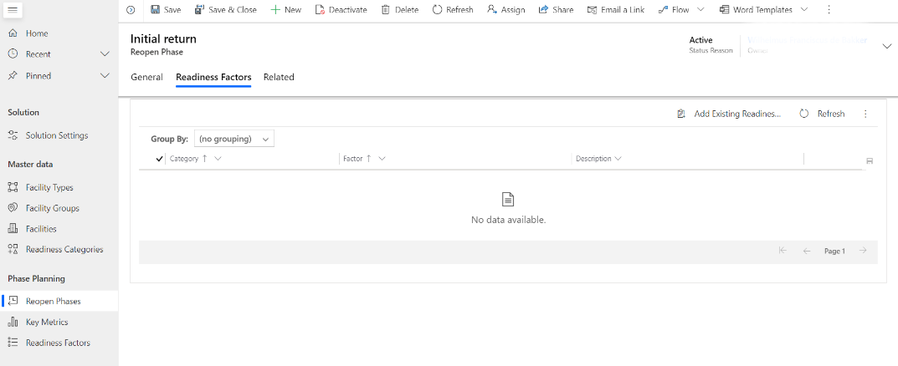
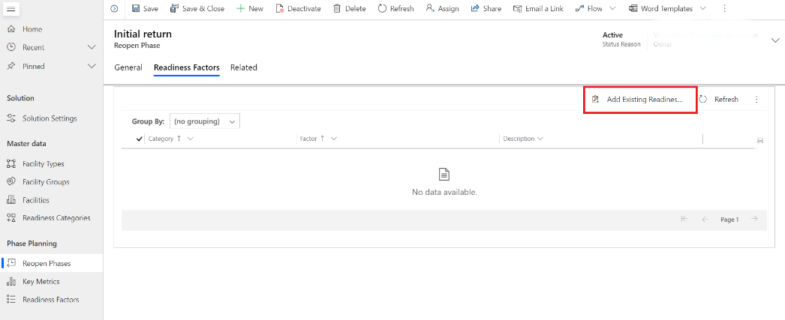
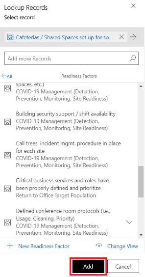
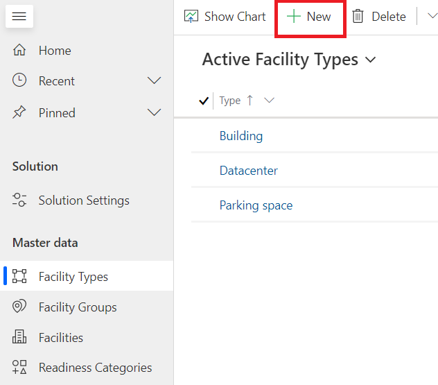
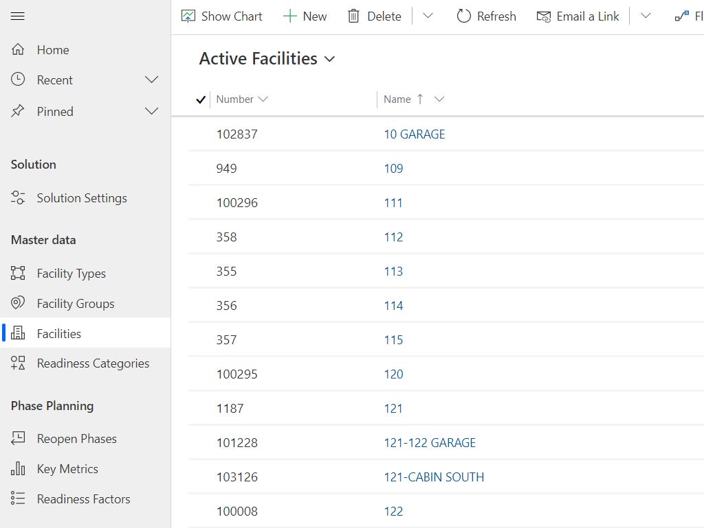

# Configure the Return to the Workplace solution

This article provides step-by-step instructions for IT administrators to configure the Return to the Workplace solution. IT administrators are responsible for making sure the facility manager can guide their facilities throughout the phases. The following steps will be covered in this article:

- [Plan reopening phase](#plan-reopening-phases)

- [Manage facilities](#manage-facilities)

- [Specify solution settings](#specify-solution-settings)

## Prerequisites

The following prerequisites apply to this guide:

- The environment needs to have all the Return to the Workplace components in place with the model-driven apps, canvas apps, and Power BI dashboards.

- The sample data file to import facilities into the organization. Make sure that you have appropriate security roles to import the data

## Plan reopening phases

Reopening the workplaces safely requires certain planning in phases to ensure the safety of the employees. To open a workplace, you need to define phases. Within these phases, you need to define goals, metrics, and readiness factors. These metrics can be sorted via categories.

In the model-driven app, you select the **Setup** module, that allows you to configure the plan.

> [!div class="mx-imgBorder"]
> 

To define a reopen phase, you need to define the following:

1. [Define key metrics](#define-key-metrics)

2. [Setup readiness categories](#setup-readiness-categories)

3. [Define readiness factors](#define-readiness-factors)

4. [Setup a reopen phase](#setup-a-reopen-phase)

5. [Set the goals and readiness factors for a phase](#set-the-goals-and-readiness-factors-for-a-phase)

## Define key metrics

There are five key metrics that are tracked and provided within the default solution. You can define more metrics if you want. To create a new key metric:

1. Select **Key Metrics** in the left pane and select **New**.

   > [!div class="mx-imgBorder"]
   > 

2. Enter a meaningful name in the field.

    | **Field** | **Description**           |
   |-----------|---------------------------|
   | Name      | Enter a name for the key metric. |
   |||

   > [!div class="mx-imgBorder"]
   > 

  
3. Select **Save & Close**. The newly created record is available in the **Active Key Metrics** view.

To edit the record, select the newly created record, update the values as required, and select **Save & Close**.

## Setup readiness categories

Readiness categories organize the readiness factors. By default, there are six categories defined. To create a new readiness category:

1. Select **Readiness Categories** in the left pane and select **New**.

   > [!div class="mx-imgBorder"]
   > 

2. Enter a meaningful name for the category.

    | **Field** | **Description**             |
   |-----------|-----------------------------|
   | Name      | Enter name for the new Category.|
   |||

   > [!div class="mx-imgBorder"]
   > 

3. Select **Save & Close**. The newly created record is available in the **Active Categories** view.

To edit the record, select the newly created record, update the values as required and, select **Save & Close**.

## Define readiness factors 

Readiness factors are used to determine if the workplaces can move through phases. By default, there are few readiness factors defined in the solution. To create a new readiness factor:

1. Select **Readiness Factors** in the left pane and select **New**.

   > [!div class="mx-imgBorder"]
   > 

2. Enter appropriate values in the fields:

   | **Field** |  **Description** |
   |-------------|------------------------------|
   | Factor | Enter a name for the factor.  |
   | Description | Enter the description for the readiness factor. |
   | Category | Select the appropriate category to assign to your readiness factor. |

   > [!div class="mx-imgBorder"]
   > 

   
3. Select **Save & Close**. The newly created record is available in the **Active Readiness Factors** view.

To edit the record, select the newly created record, update the values as required, and select **Save & Close**.

## Setup a reopen phase

In the reopening plan, you define a couple of phases that guides a facility to safely reopen the workplace. The phases are defined in the solution by default. To create or edit a reopen phase:

1. Select **Reopen Phases** in the left pane and select **New**.

   > [!div class="mx-imgBorder"]
   > 

2. Enter appropriate values in the fields:

    | **Field**   | **Description**       |
   |---------------|------------------------------|
   | Index | Enter a unique index number such that it can be placed in appropriate phase order.|
   | Name | Enter a name for the reopen phase.|
   | Description   | Enter the description for the readiness factor. |
   | Process Stage | Select the appropriate process stage to assign to the new reopen phase. This identifies which stage in the business process flow should be activated. |

   > [!div class="mx-imgBorder"]
   > 

  
3. Select **Save & Close**. The newly created record is available in the **Active Reopen Phases** view.

To edit the record, select the newly created record, update the values as required, and select **Save & Close**.

## Set the goals and readiness factors for a phase

To set goals and readiness factors for a phase: 

1. Select **Reopen Phases** in the left pane and select the reopen phase record for which you need to add a new goal (for example, **Initial Return**)

   > [!div class="mx-imgBorder"]
   > 

2. In the section “Key Metrics” select **+ New Goal.**

   > [!div class="mx-imgBorder"]
   > 

3. Enter appropriate filed values:

   | **Field**    | **Description**     |
   |--------------|--------------------|
   | Reopen Phase | Enter a name for the reopen phase.  |
   | Key Metric   | Select a key metric for the goal.  |
   | Type         | Select an appropriate goal type from the list. |
   | Value        | Enter a numerical target value for the goal. |

   > [!div class="mx-imgBorder"]
   > 

4. Select **Save & Close**. The newly created record is available in the **Key Metrics** view.

To edit the record, select the newly created record, update the values as required, and select **Save & Close**.

5. To set the readiness factors for the new reopen phase record, select the **Readiness Factors** tab

   > [!div class="mx-imgBorder"]
   > 

6. Select **Add Existing Readiness Factor**

   > [!div class="mx-imgBorder"]
   

7. Select the readiness factor that you want to add to your new reopen phase record. You can select multiple records.

8. Select **Add** to complete the selection process to add the selected **Readiness Factors** to your new **Reopen Phase** record.

   > [!div class="mx-imgBorder"]
   > 

## Manage facilities

Facilities are an important part of the Return to the Workplace solution. Various facility types such as buildings, conference centers are defined in the solution by default. The IT administrator is responsible to create or update the existing facility types. The IT administrator can import records to help the facility manager who is responsible for creating facilities.

To manage facilities:

1. [Define facility types](#define-facility-types)

2. [Import facilities](#import-facilities)

## Define facility types

By default, two facility types are provided as an example. To create a new facility type:

1. Select **Facility Types** in the left pane and select **New**.

   > [!div class="mx-imgBorder"]
   > 

2. Enter appropriate values in the fields:

    | **Field**   | **Description**                     |
   |-------------|-------------------------------------|
   | Type        | Enter a name for the type of facility.    |
   | Description | Enter the description for the facility type. |
   |||

   > [!div class="mx-imgBorder"]
   > 

  

3. Select **Save & Close**. The newly created record is available in the **Active Facility Types** view.

To edit the record, select the newly created record, update the values as required, and select **Save & Close**.

## Import facilities 

The facility sample data file is available in the deployment package (.zip file). When you extract the .zip file, the sample data files are available under the
**SampleData** folder.

### How to import facility data from data files

To import sample facility data from the Excel file to the facility entity:

1. On the left navigation pane, select **Facilities** (in the area of Facility Management)

2. Select **Import from Excel** to select the facilities data file.
 
   > [!div class="mx-imgBorder"]
   > 

3. Browse the **SampleData** folder and select the **Facilities.xlsx** file. Change this file according to your own needs and proceed with the steps to import the data.

4. After the sample data is imported, you'll see the imported records in the entity.

   > [!div class="mx-imgBorder"]
   > 

## Specify solution settings

The overall solution requires certain configurations to be made to make sure that the user has the correct information. Through solution settings, contacts, emails, and attestations can be configured. Through themes, you can tailor the experience of an employee according to the company branding.

When setting up the solution, you go through the following steps:

1. [Set solution settings](#set-solution-settings)

2. [Define theming](#define-theming)

## Set Solution Settings

With solution settings, you can tailor the experience for the employees to match the company guidelines and culture. To set solution settings:

1. Select **Solution Settings** in the left pane and select **New**.

   > [!div class="mx-imgBorder"]
   > 

2. Enter the appropriate values in the fields:

   > [!div class="mx-imgBorder"]
   > 

## Define theming

Theming allows you to change the experience of the employee.

1. Select **Settings** and then **Customizations**.

   > [!div class="mx-imgBorder"]
   > 

2. Under Customizations, select **Themes**.
   
   > [!div class="mx-imgBorder"]
   > 

3. From the list, select the default theme.

    > [!div class="mx-imgBorder"]
    > 

4. You can select the different colors from the theme.

   > [!div class="mx-imgBorder"]
   > 

## Issues and feedback

- To report an issue with the Return to the Workplace solution, visit <https://aka.ms/rtw-issues>.

- For feedback about the Return to the Workplace solution, visit <https://aka.ms/rtw-feedback>.