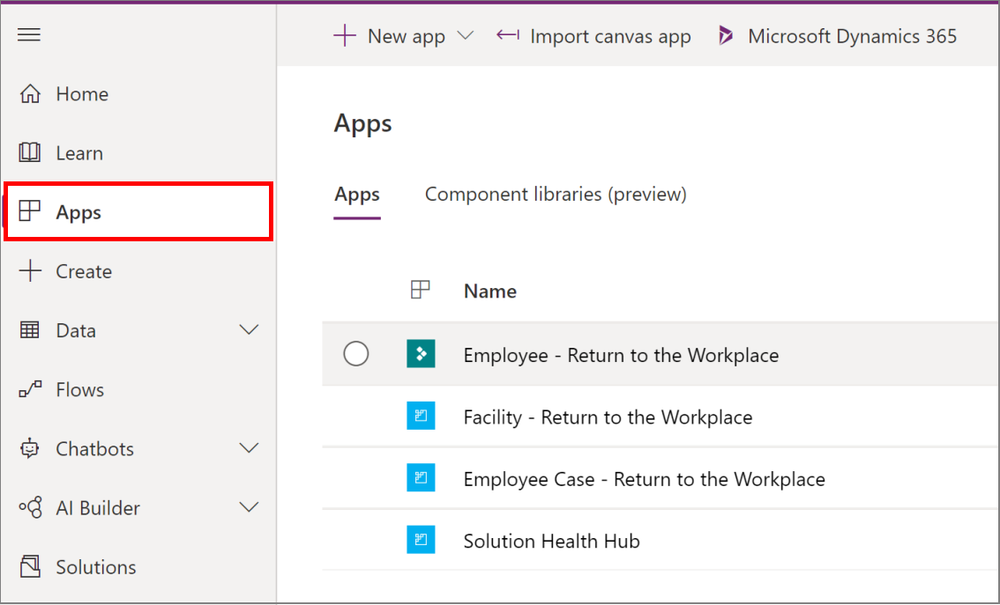
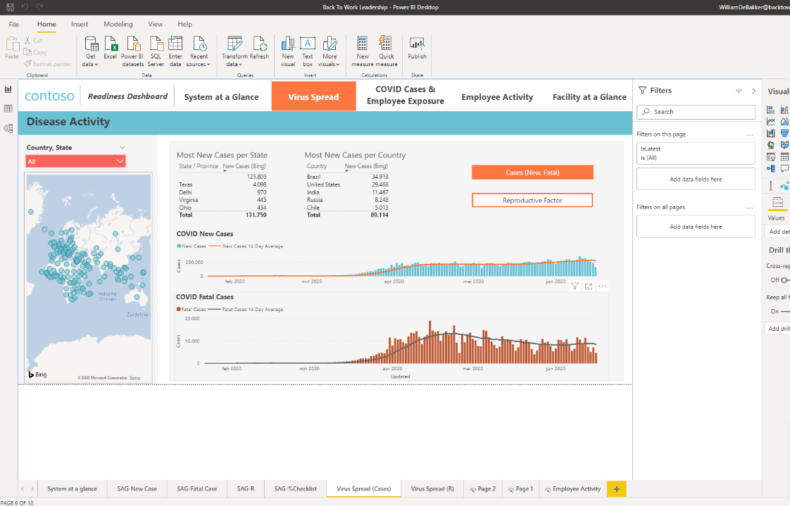
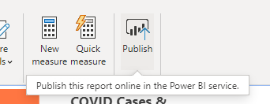
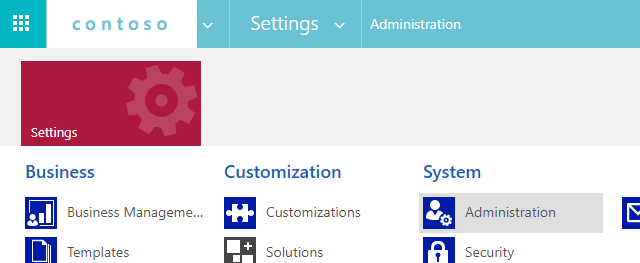
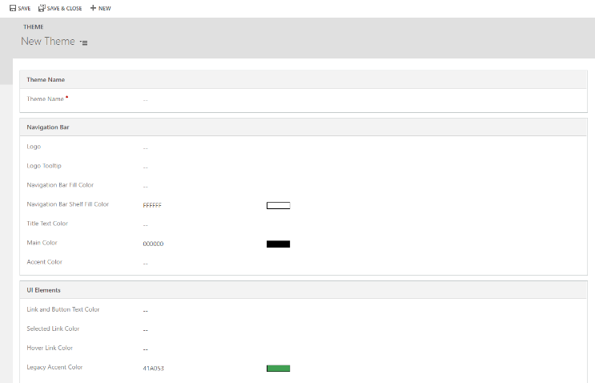

# Deploy the Return to the Workplace solution

This article provides step-by-step instructions to IT administrators on how to deploy the Return to the Workplace solution. Follow the steps in this article to deploy Return to the Workplace solution.

Estimated time to complete these steps: 60–90 minutes

## Prerequisites

- You should be a Global administrator or Dynamics 365 administrator or Power Platform administrator to perform the installation.

- Sign in to Power BI and create a workspace to publish the report. More information: [Create the new workspaces in Power BI](https://docs.microsoft.com/power-bi/collaborate-share/service-create-the-new-workspaces)

- Install Power BI Desktop from the Microsoft Store: [Power BI Desktop](https://aka.ms/pbidesktop)

  > [!NOTE]
  > If you have installed Power BI Desktop by downloading directly from the download center page in the past, remove it and download it from the Microsoft Store. The Microsoft Store version will be updated automatically as new releases are available. If you can’t install from Microsoft Store, install the latest non-Microsoft Store version from the download center page.

## Step 1: Sign up for Power Apps, and create an environment

Sign up for [Power Apps](https://docs.microsoft.com/power-platform/admin/signup-for-powerapps-admin) if you don't have it already, and purchase an appropriate license. More information: [Power Apps pricing](https://powerapps.microsoft.com/pricing/)

After you have purchased Power Apps, create an environment with a Common Data Service database.

1. Sign in to [Power Platform admin center](https://aka.ms/ppac).

2. Create a Common Data Service environment with the database. More information: [Create and manage environments](https://docs.microsoft.com/power-platform/admin/create-environment)

   > [!IMPORTANT]
   > If you select a security group for the database while creating it, remember that any apps can be shared only with users who are members of that security group.

3. Create users, and assign appropriate security roles. More information: [Create users and assign security roles](https://docs.microsoft.com/power-platform/admin/create-users-assign-online-security-roles)

After you have created your environment, you can access it using the following URL: `https://[myenv].crm.dynamics.com`, where `myenv` is the name of your environment. 

## Step 2: Install the package

Follow the steps below to install the Return to the Workplace solution:

1. Go to Microsoft AppSource ([link](https://aka.ms/rtw-app)) to install the **Return to the Workplace solution**.

    > [!div class="mx-imgBorder"]
    > 

2. Select **GET IT NOW** to install the solution on your environment. You're redirected to the actual installation page, where you can select the environment on which to install it on. Installation starts after selecting the environment and accepting the terms and agreement.

3. After the app is installed, sign in to [Power Apps](https://make.powerapps.com) and select your environment from the upper-right corner. In the left navigation pane, select **Apps** to see the new apps.

    > [!div class="mx-imgBorder"]
    > 

## Step 3: Configure and publish Power BI dashboard

The Return to the Workplace solution has two Power BI dashboards, one for executive leadership and one for the facility managers.

1. Go to Microsoft AppSource ([executive leadership](https://aka.ms/rtw-leadershippbi) and [facility manager](https://aka.ms/rtw-facilitypbi)) to install **Return to the Workplace – Leadership** and **Return to the Workplace - Facility Manager** dashboard. Open the **Return to the Workplace** dashboards in the Power BI service or Power BI desktop.

   > [!div class="mx-imgBorder"]
   > 

2. After opening, select **Transform data** and select **Edit Parameters**.

   > [!div class="mx-imgBorder"]
   > 

3. Edit the **CDS Environment** parameter, to enter the environment you want to connect. Select **ok**, you will then be prompted to sign in.

   > [!div class="mx-imgBorder"]
   >

4. After all data is loaded and you're ready with the dashboard, select **Publish**.

   > [!div class="mx-imgBorder"]
   > 

## Step 4: Embed Power BI report in the model-driven app

The facility manager Power BI dashboard is used in the model-driven app. Since these reports are published in a different location, you need to change the location.

1. Go to **Settings** > **Administrator** to enable Power BI integration.

   > [!div class="mx-imgBorder"]
   > 

2. Select **System Settings** , and then on the **Reporting** tab, select **Yes**.

3. Go to [Power Apps](https://make.powerapps.com), select **Solutions** in the left pane, and create a new solution. After opening the solution, press **add existing**, then select entity. From the list of entities select **Facility** and in **select components**, select in the **Forms** tab the **Information Form**.

   > [!div class="mx-imgBorder"]
   > 

4. Export the solution and then apply the following changes in the FormXML [link](https://docs.microsoft.com/en-us/powerapps/maker/model-driven-apps/embed-powerbi-report-in-system-form). Reimport the solution and then **publish all customizations**.

For ease of implementation, you can also use the [Power BI Embedder](https://www.xrmtoolbox.com/plugins/Fic.XTB.PowerBiEmbedder/) in XRMToolBox.

## Step 5: Publish theme

You can always change the look and feel of the app by applying themes to match the company branding. To select a theme:

1. Go to **Settings** > **Customizations**.

   > [!div class="mx-imgBorder"]
   > 

3. Select **Themes**.

   > [!div class="mx-imgBorder"]
   > 

4. Select **New**  to create a **new** theme. Enter the **Name** and determine which colors you want to use. You can also specify the logo, which is used in the sitemap.

   > [!div class="mx-imgBorder"]
   > 

5. Select **Save** and **Publish** the theme. 

   > [!div class="mx-imgBorder"]
   > 

## Step 6: Share canvas app

To share canvas apps to the users:

1. Sign in to [Power Apps](https://make.powerapps.com). Select the **Environment** from the upper-right corner.

2. On the left pane, select **Apps** to view the list of all your apps.

3. Select the **Employee Questionnaire App**.
 
   > [!div class="mx-imgBorder"]
   > 

3. Select the app you want, and select **Share**.

   > [!div class="mx-imgBorder"]
   > 

4. Select users from the list of available users to whom you want to share the app.

5. Repeat this process for other apps too.

   > [!div class="mx-imgBorder"]
   > 

## Step 7: Set the security roles

In the Return to the Workplace solution, you'll see the following security roles are defined:

- Return to the Workplace - Employee, which is used to check-in and look at the details of a location.

- Return to the Workplace - Facility Manager, which allows people to look at the facilities and plan phasing.

- Return to the Workplace - Leadership, which allows you to view the details over the entire system.

- Return to the Workplace - Health & Safety Leader, which managers employee cases.

To assign security roles:

1. Go to **Settings** > **Security**.

   > [!div class="mx-imgBorder"]
   > 

2. Select **Users**, and then select the user that you want to give permissions.

   > [!div class="mx-imgBorder"]
   > 

3. Select the user, and then select **Manage Roles**. After assigning the roles, select **ok**.

   > [!div class="mx-imgBorder"]
   > 

## Service URLs for US Government customers (optional - for government agencies only)

There is a different set of urls to access Power Apps US government environments and Power BI US government tenants. The commercial version of the service urls are used throughout the article. If you have a US Government organization, use the respective US government url for your deployment:

| **Commercial version URL**| **US Government version URL**  |
|-------------------|--------------------------------|
| [https://make.powerapps.com](https://make.powerapps.com)  | [https://make.gov.powerapps.us](https://make.gov.powerapps.us) (GCC)  [https://make.high.powerapps.us](https://make.high.powerapps.us) (GCC High)                |
| [https://admin.powerplatform.microsoft.com](https://admin.powerplatform.microsoft.com) | [https://gcc.admin.powerplatform.microsoft.us](https://gcc.admin.powerplatform.microsoft.us) (GCC)  [https://high.admin.powerplatform.microsoft.us](https://high.admin.powerplatform.microsoft.us) (GCC High) |
| [https://app.powerbi.com/](https://app.powerbi.com/)                  | [https://app.powerbigov.us](https://app.powerbigov.us) (GCC)  [https://app.high.powerbigov.us](https://app.high.powerbigov.us) (GCC High)                 |

More information:

- [Power Apps for US Government](https://docs.microsoft.com/power-platform/admin/powerapps-us-government)
- [Power BI for US Government](https://docs.microsoft.com/power-bi/service-govus-overview)

<!--
## Issues and feedback

- To report an issue with the Return to the Workplace solution, visit <https://aka.ms/rtw-issues>.

- For feedback about the Return to the Workplace solution, visit <https://aka.ms/rtw-feedback>.
-->

## Next steps

[Configure the Return to the Workplace solution](configure.md)

