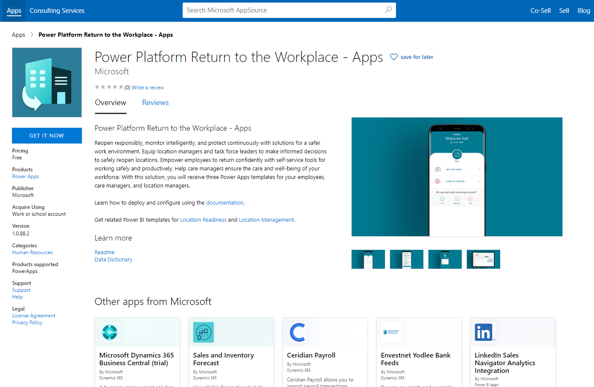
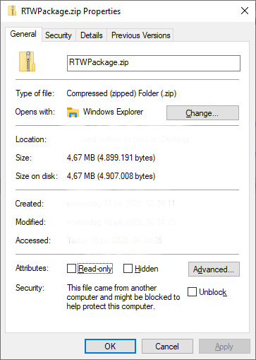
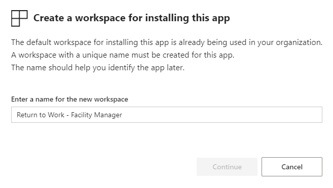
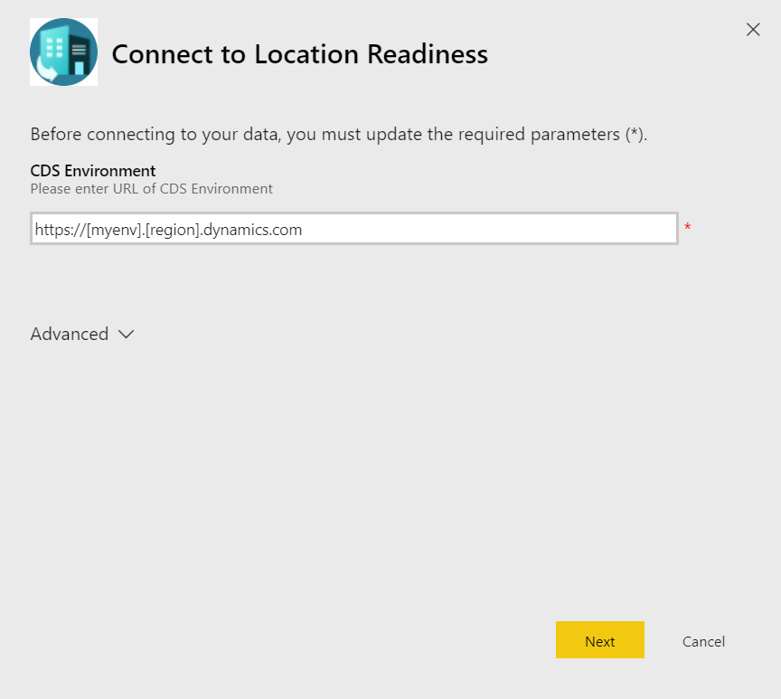
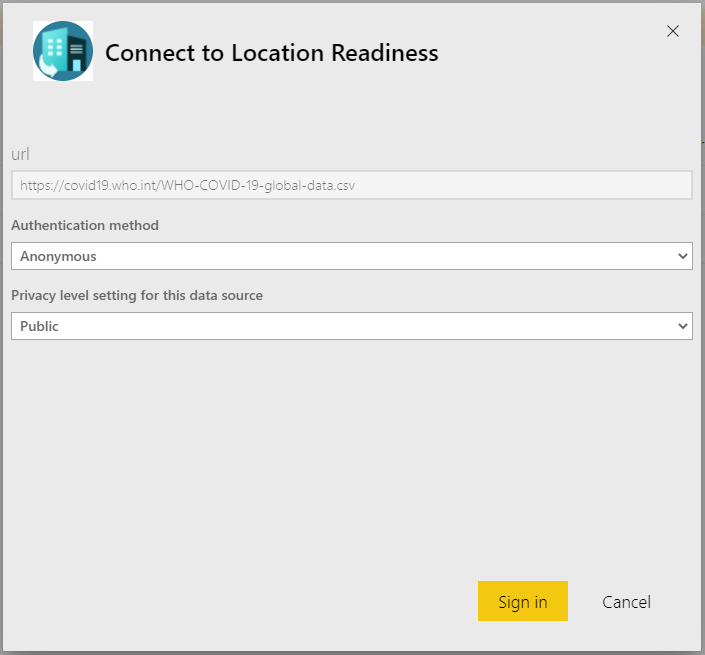
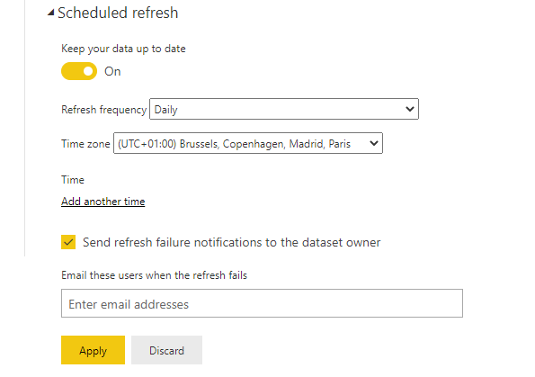
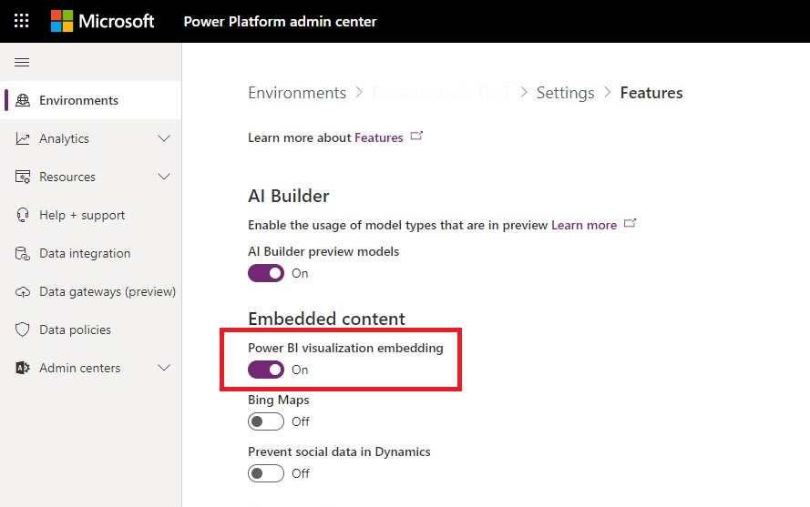
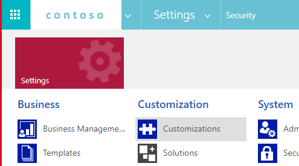

# Deploy the Return to the Workplace solution

This article provides step-by-step instructions to IT administrators on how to deploy the Return to the Workplace solution. Follow the steps in this article to deploy Return to the Workplace solution.

Estimated time to complete these steps: 60–90 minutes

## Service URLs for US Government customers (optional - for government agencies only)

There is a different set of urls to access Power Apps US government environments and Power BI US government tenants. The commercial version of the service urls are used throughout the article. If you have a US Government organization, use the respective US government url for your deployment:

| **Commercial version URL**| **US Government version URL**  |
|-------------------|--------------------------------|
| [https://make.powerapps.com](https://make.powerapps.com)  | [https://make.gov.powerapps.us](https://make.gov.powerapps.us) (GCC)  [https://make.high.powerapps.us](https://make.high.powerapps.us) (GCC High)                |
| [https://admin.powerplatform.microsoft.com](https://admin.powerplatform.microsoft.com) | [https://gcc.admin.powerplatform.microsoft.us](https://gcc.admin.powerplatform.microsoft.us) (GCC)  [https://high.admin.powerplatform.microsoft.us](https://high.admin.powerplatform.microsoft.us) (GCC High) |
| [https://app.powerbi.com/](https://app.powerbi.com/)                  | [https://app.powerbigov.us](https://app.powerbigov.us) (GCC)  [https://app.high.powerbigov.us](https://app.high.powerbigov.us) (GCC High)                 |

More information:

- [Power Apps for US Government](https://docs.microsoft.com/power-platform/admin/powerapps-us-government)
- [Power BI for US Government](https://docs.microsoft.com/power-bi/service-govus-overview)

## Prerequisites

- You should be a Global administrator or Power Platform administrator to perform the installation.

- You must be a Global Admin and must have Power BI Pro license to configure and publish reports.

- Sign in to Power BI and create a workspace to publish the report. More information: [Create the new workspaces in Power BI](https://docs.microsoft.com/power-bi/collaborate-share/service-create-the-new-workspaces) and [share the workspace with others](https://docs.microsoft.com/en-us/power-bi/collaborate-share/service-create-the-new-workspaces#give-access-to-your-workspace)

- Install Power BI Desktop from the Microsoft Store: [Power BI Desktop](https://aka.ms/pbidesktop)

  > [!NOTE]
  > If you have installed Power BI Desktop by downloading directly from the download center page in the past, remove it and download it from the Microsoft Store. The Microsoft Store version will be updated automatically as new releases are available. If you can’t install from Microsoft Store, install the latest non-Microsoft Store version from the download center page.

## Step 1: Sign up for Power Apps, and create an environment

Sign up for [Power Apps](https://docs.microsoft.com/power-platform/admin/signup-for-powerapps-admin) if you don't have it already, and purchase an appropriate license. More information: [Power Apps pricing](https://powerapps.microsoft.com/pricing/)

After you have purchased Power Apps, create an environment with a Common Data Service database.

1. Sign in to [Power Platform admin center](https://aka.ms/ppac).

2. Create a Common Data Service environment with the database. More information: [Create and manage environments](https://docs.microsoft.com/power-platform/admin/create-environment)

   > [!IMPORTANT]
   > If you select a security group for the database while creating it, remember that any apps can be shared only with users who are members of that security group.

3. Create users, and assign appropriate security roles. More information: [Create users and assign security roles](https://docs.microsoft.com/power-platform/admin/create-users-assign-online-security-roles)

After you have created your environment, you can access it using the following URL: `https://[myenv].crm.dynamics.com`, where `myenv` is the name of your environment. 

## Step 2: Install the package

Follow the steps below to install the Return to the Workplace solution:

### Option A - Install the app from Microsoft AppSource

1. Go to Microsoft AppSource ([link](https://aka.ms/rtw-app)) to install the **Return to the Workplace solution**.

    > [!div class="mx-imgBorder"]
    > 

2. Select **GET IT NOW** to install the solution on your environment. You're redirected to the actual installation page, where you can select the environment on which to install it on. Installation starts after selecting the environment and accepting the terms and agreement.

3. After the app is installed, sign in to [Power Apps](https://make.powerapps.com) and select your environment from the upper-right corner. In the left navigation pane, select **Apps** to see the new apps.

    > [!div class="mx-imgBorder"]
    > 

### Option B - Install the app from the deployment package

1. Download the latest deployment package (.zip) from <https://aka.ms/rtw-solution>.

Before extracting the .zip file, ensure that you unblock it.

1.	Right-click the .zip file, select **Properties**.

2.	In the properties dialog box, select **Unblock**, and then select **Apply** followed by **OK**.

    > [!div class="mx-imgBorder"] 
    > 

On extracting the .zip file, you will see the following in the extracted folder:

|**Folder**  |**Description**  |
|---------|---------|
|**Package**     |  The folder contains the Package Deployer tool and the package that you will import later to set up the solution in your environment.       |
|**Power BI**     | Contains the Power BI Reports that will be used to configure reporting. More information: [Step 3: Configure and publish Power BI dashboard](#step-3-configure-and-publish-power-bi-dashboard) 

2.  Navigate to the location where you extracted the [deployment package](#step-1-download-the-deployment-package) (.zip); you'll find a **Package** folder. Under the **Package** folder, run the **PackageDeployer.exe** file to run the tool to deploy the package.

3.  On the next screen, select **Continue**.

4.  You’ll be prompted to connect to your environment. Select **Office 365** as the **Deployment Type**, select **Show Advanced**, and then type your credentials to connect to your environment.

    > [!div class="mx-imgBorder"] 
    > 

5.  Select **Login** to continue.

6.  If you have access to more than one Common Data Service environment, the next screen will prompt you to select the environment where you want to install the package. Select an environment and select **Login**.

    > [!div class="mx-imgBorder"] 
    > 

7.  On the next screen, select **Next.**

8.  The next screen displays you the environment name where the package will be installed. Review the information and select **Next**.

9.  The next screen validates if all the dependencies are available on your environment. Select **Next** to continue with the installation.

10.	The next screen displays the installation status of the package. Please note that it might take a while for the package installation to complete.

11. After the installation is complete, select **Next**.

12.  On the next screen, select **Finish** to complete and close the setup.

13. After the app is installed, sign in to [Power Apps](https://make.powerapps.com) and select your environment from the upper-right corner. In the left navigation pane, select **Apps** to see the new apps.

    > [!div class="mx-imgBorder"]
    > 

(**Quick tip:** After installing the Return to Workplace solution, take note of the URL of your Common Data Service environment instance. You will need it to connect the template app to the data.)

## Step 3: Configure and publish Power BI dashboard

The Return to the Workplace solution has two Power BI dashboards, one for executive leadership and one for the facility managers.

You can publish the Power BI dashboard using either of the following options: using the template app from the AppSource or using the .pbit file available in the deployment package.

### Option A: Publish using the template app from AppSource (Preferred Option)

#### Install the app
1. Go to Microsoft AppSource ([location readiness](https://aka.ms/rtw-leadershippbi) and [location management](https://aka.ms/rtw-facilitypbi)) to install **Return to the Workplace – Location Readiness** and **Return to the Workplace - Location Management** dashboard. 

2.	Select **GET IT NOW** to install the solution on your environment. 
    > [!div class="mx-imgBorder"]
    > 

    You're directed to an agreement pop-up, where you select **Continue** to agree to the terms provided.
    
3. Login to PowerBI and select **Install**.  
    > [!div class="mx-imgBorder"]
    > 

4. Enter the name for the workspace for your app and select **Continue**.
    > [!div class="mx-imgBorder"]
    > 

(**Note:** Share the workspace with other users who require access. [link](https://docs.microsoft.com/en-us/power-bi/collaborate-share/service-create-the-new-workspaces#give-access-to-your-workspace))

#### Connect to data sources
5. Select the icon in your Apps page to open the App.

6. On the splash screen select **Connect**.
    > [!div class="mx-imgBorder"]
    > 

7. In the dialog box that appears, type the URL of your Common Data Service environment instance. For example: https://[myenv].crm.dynamics.com. When done, click **Next**.
    > [!div class="mx-imgBorder"]
    > 

8. In the next dialog that appears determine where the displayed URL is pointing to and take the following step, where appropriate:
    - if pointing to CDS, then set the authentication method to **Microsoft account**. Set privacy level setting to **Organizational**. 
    - if not pointing to CDS, then set the authentication method to **Anonymous**.  Set privacy level setting to **Public**.
    > [!div class="mx-imgBorder"]
    > 

9. After you have completed configurations of your data sources the report will be populated with your data. Repeat these steps for both dashboards.

### Option B: Publish using the .pbit file in the deployment package (GCC Customers only)

This section provides information on how GCC custimers can use the **Return to the Workplace - Location Readiness** and **Return to the Workplace - Facility Manager** dashboard pbit files available in the deployment package to publish the dashboards.
    - Location Readiness dashboard pbit filename:  **Return to Workspace - Leadership.pbit**
    - Location Management dashboard pbit filename:  **Return to Workspace - Facility Manager.pbit**

You will need to execute steps 1-9 below for each pbit file.

1.  Run Power BI Desktop, and sign in using your account.

2.  Navigate to the location where you extracted the [deployment package](#step-1-download-the-deployment-package) (.zip). Under the Power BI Template folder, you will find the appropriate pbit file (Leadesrship.pbit or Facility Manager.pbit file).

3.  Open the pbit file in Power BI Desktop. You'll will be prompted to type the following value: **CDS Environment**. Type the URL of your Common Data Service environment instance. For example: https://*[myenv]*.crm.dynamics.com, where *[myenv]* is the name of your environment. Select **Load.**

    > [!div class="mx-imgBorder"] 
    > 

4.  You will be prompted to enter credentials to connect to your Common Data Service environment. Select **Organizational account** \> **Sign in** to specify your Common Data Service credentials.

    > [!div class="mx-imgBorder"] 
    > 

5.  After signing in, select **Connect** to connect to your data in Common Data Service.

6.  After connecting to CDS you will see a series of pop-ups to configure access to data sources.   These access level and privacy level settings need to be configured to connect to the public data sources for the COVID-19 report data.  Complete access level and privacy selections as shown in the below screen captures.
     
    > [!div class="mx-imgBorder"] 
    > 

    > [!div class="mx-imgBorder"] 
    > 

    > [!div class="mx-imgBorder"] 
    > 

    > [!div class="mx-imgBorder"] 
    > 

    > [!div class="mx-imgBorder"] 
    > 
    
    > [!div class="mx-imgBorder"] 
    > 

    After you have configured the access and privacy levels for COVID-19 public data, you must set the privacy level for CDS data to Organizational. 

    > [!div class="mx-imgBorder"] 
    > 

6.  On successful connection, Power BI report will be displayed. You'll be prompted to apply pending changes to your query; select **Apply changes**.

    > [!NOTE]
    > The report is blank because you haven't yet added data in the system.

7.  Select **Publish** to publish data to your Power BI workspace. You'll be prompted to save your changes; select **Save**.

     > [!div class="mx-imgBorder"] 
     > 

8.  You'll be prompted to save the file as a .pbix file along with your Common Data Service environment information. Provide a name and save it on your computer.
    (**Note:** The filename you enter will be displayed text in your Power BI website)

9.  After saving the .pbix file, you'll be prompted to publish the report. In the **Publish to Power BI** page, select the workspace where you want to publish, and then click **Select**.

    > [!div class="mx-imgBorder"] 
    > 

    The report becomes available in your workspace.

10. [Step for Facility Manager dashbaord only] The URL will be in the following format:
    https://app.powerbi.com/groups/3d6db5d0-22c7-4674-b957-0605c021511d/reports/bf9cd5a1-c176-4786-9c4e-684a79678575/ReportSection?redirectedFromSignup=1 
    Copy the Power BI report URL to a Notepad as you will need it in Step 5 to embed it in the model-driven app.

**Note:** Steps 1-10 above need to be completed for each dashboard (pbit file)

Now, we will configure the data refresh settings for the dataset, [Step 4: Schedule report refresh](#step-4-schedule-report-refresh).

## Step 4: Schedule report refresh
1.  The report becomes available in your workspace. Now, we will configure the data refresh settings for the dataset. Under the **Datasets** tab of your workspace, select the **Schedule refresh** icon for the dataset of your report you just published.

      > [!div class="mx-imgBorder"] 
      > 

2.  The first time you try to set the data refresh setting, you'll see the **Settings** page with a message stating that your credentials aren't valid. Under **Data source credentials**, select **Edit credentials** to specify your credentials.

      > [!div class="mx-imgBorder"] 
      > 

3.  In the next screen for CDS datasource:

      1.  Select **Authentication** method as **Microsoft account**.

      2.  Select **Privacy level setting for this data source** as
          **Organizational**.
          
      3.  Select **Sign in**.

          > [!div class="mx-imgBorder"] 
          > 

    You'll be prompted to specify your credentials and sign in. Upon successful sign in, you'll return to the **Settings** page.

    For all other datasources:
      1.  Select **Authentication** method as **Anonymous**.

      2.  Select **Privacy level setting for this data source** as
          **Public**.
          
      3.  Select **Sign in**.

          > [!div class="mx-imgBorder"] 
          > 

4.  In the **Settings** page, expand **Scheduled refresh** and specify the required details for refreshing data based on a schedule. Select **Apply**.

      > [!div class="mx-imgBorder"] 
      > 

      > [!NOTE]
      > - There are limits to how many times data can refresh. Power BI limits datasets on shared capacity to eight daily refreshes. If the dataset resides on a Premium capacity, you can schedule up to 48 refreshes per day in the dataset settings. More information: [Refresh data](https://docs.microsoft.com/power-bi/refresh-data#data-refresh)
      >- We recommend setting the data to refresh every 30 mins.

5.  Next, go back to your workspace, select the **Reports** tab, and then select the report to open it in browser.

## Step 5: Embed Power BI report in the model-driven app

The facility manager Power BI dashboard is used in the model-driven app. Since these reports are published in a different location, you need to change the location.

1. Go to the [Power Platform admin center](https://admin.powerplatform.microsoft.com/).

2. Select the correct **environment** and then select **Settings**.

3. Select **Product** > **Feature**, set Power BI visualization embedding to **On**.  Then select **Save** lcoated at the bottom of the screen.

   > [!div class="mx-imgBorder"]
   > 

4. Go to [Power Apps](https://make.powerapps.com), select **Solutions** in the left pane, and create a new solution. After opening the solution, press **add existing**, then select entity. From the list of entities select **Facility** and in **select components**, select in the **Forms** tab the **Information Form**.

   > [!div class="mx-imgBorder"]
   > 

4. Export the solution, unpack the solution and then apply the following changes in the FormXML ([link](https://docs.microsoft.com/en-us/powerapps/maker/model-driven-apps/embed-powerbi-report-in-system-form)). Pack the solution, reimport the solution and then **publish all customizations**.

For ease of implementation, you can also use the [Power BI Embedder](https://www.xrmtoolbox.com/plugins/Fic.XTB.PowerBiEmbedder/) in XRMToolBox.

## Step 6: Publish theme

You can always change the look and feel of the app by applying themes to match the company branding. To select a theme:

1. Go to **Settings** > **Customizations**.

   > [!div class="mx-imgBorder"]
   > 

3. Select **Themes**.

   > [!div class="mx-imgBorder"]
   > 

4. Select **New**  to create a **new** theme. Enter the **Name** and determine which colors you want to use. You can also specify the logo, which is used in the sitemap.

   > [!div class="mx-imgBorder"]
   > 

5. Select **Save** and **Publish** the theme. 

   > [!div class="mx-imgBorder"]
   > 

## Step 7: Share canvas app

To share canvas apps to the users:

1. Sign in to [Power Apps](https://make.powerapps.com). Select the **Environment** from the upper-right corner.

2. On the left pane, select **Apps** to view the list of all your apps.

3. Select the **Employee Return to the Workplace App**.
 
   > [!div class="mx-imgBorder"]
   > 

3. Select the app you want, and select **Share**.

   > [!div class="mx-imgBorder"]
   > 

4. Select users from the list of available users to whom you want to share the app.

## Step 8: Set the security roles

In the Return to the Workplace solution, you'll see the following security roles are defined:

- Return to the Workplace - Employee, which is used to check-in and look at the details of a location.

- Return to the Workplace - Facility Manager, which allows people to look at the facilities and plan phasing.

- Return to the Workplace - Leadership, which allows you to view the details over the entire system.

- Return to the Workplace - Health & Safety Leader, which managers employee cases.

To assign security roles:

1. Go to **Settings** > **Security**.

   > [!div class="mx-imgBorder"]
   > 

2. Select **Users**, and then select the user that you want to give permissions.

   > [!div class="mx-imgBorder"]
   > 

3. Select the user, and then select **Manage Roles**. After assigning the roles, select **ok**.

   > [!div class="mx-imgBorder"]
   > 

<!--
## Issues and feedback

- To report an issue with the Return to the Workplace solution, visit <https://aka.ms/rtw-issues>.

- For feedback about the Return to the Workplace solution, visit <https://aka.ms/rtw-feedback>.
-->

## Next steps

[Configure the Return to the Workplace solution](configure.md)

