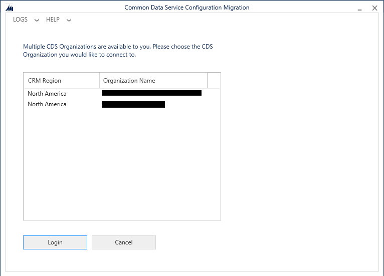
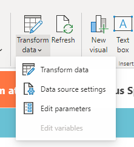
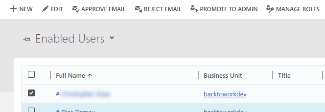

# Deploy the Return to the Workplace solution

This article provides step-by-step instructions to IT administrators on how to deploy the Return to the Workplace solution. Following the steps in this article to deploy Return to the Workplace solution.

Estimated time to complete these steps: 60–90 minutes

## Prerequisites

- You should be a Global Administrator or Dynamics 365 Administrator or Power Platform administrator to perform the installation.

- Create a workspace in Power BI where you will publish the report. Sign in to Power BI and create a workspace. More information: [Create the new workspaces in Power BI](https://docs.microsoft.com/power-bi/collaborate-share/service-create-the-new-workspaces)

- Install Power BI Desktop from the Microsoft Store: https://aka.ms/pbidesktop

  > [!NOTE]
  > If you have installed Power BI Desktop by downloading directly from the download center page in the past, remove it and download it from the Microsoft Store. The Microsoft Store version will be updated automatically as new releases are available. If you can’t install from Microsoft Store, install the latest non-Microsoft Store version from the download center page.

## Step 1: Download the deployment package

Get the latest deployment package (.zip) from your Microsoft account representative.

To unblock the .zip file:

1. Right-click to select the .zip file, and then select **Properties**.

2. In the **Properties** dialog box, select **Unblock**, and then select **Apply** followed by **OK**

When you extract the .zip file, you see the following components in the extracted folder.

| **Folder**    | **Description**                                                                                                                      |
|---------------|--------------------------------------------------------------------------------------------------------------------------------------|
| Package       | The folder contains the Package Deployer tool and the package that you will import later to set up the solution in your environment. |
| Power BI      | Contains the Power BI report template file (.pbit) that you will use to configure reporting.                                         |
| Sample Data   | Contains the sample master data files (.xlsx).                                                                                       |
| Documentation | Contains all the documentation needed.                                                                                               |

## Step 2: Sign up for Power Apps and create an environment

Sign up for [Power Apps](https://docs.microsoft.com/power-platform/admin/signup-for-powerapps-admin) if you don't have it already, and purchase an appropriate license. More information: [Power Apps Pricing](https://powerapps.microsoft.com/pricing/)

After you have purchased Power Apps, create an environment with a Common Data Service database.

1. Sign in to [Power Platform admin center](https://aka.ms/ppac).

2. Create a Common Data Service environment with the database. More information: [Create and manage environments](https://docs.microsoft.com/power-platform/admin/create-environment)

   > [!IMPORTANT]
   > While creating the database, if you select a security group for the database, the apps can be shared only with users that are members of the security group.

3. Create appropriate users in your environment. More information: [Create users and assign security roles](https://docs.microsoft.com/power-platform/admin/create-users-assign-online-security-roles)

After you have created your environment, you can access it using the following URL: `https://[myenv].crm.dynamics.com`, where `myenv` is the name of your environment. 

## Step 3: Install the package

After your environment is ready, you can install the solution via the package.

1. Go to the folder where you extracted the deployment file (.zip). You'll find a **Package** folder. Open the **Package** folder, and then double-click to select
    **PackageDeployer.exe**.

2. On the next screen, select **Continue**.

3. You’ll be prompted to connect to your environment. Select **Office 365** as the **Deployment Type**, select **Show Advanced** and then type your credentials to connect to your environment.      
    
    > [!div class="mx-imgBorder"]
    > 

4. Select **Login** to continue.

5. If you have access to more than one Common Data Service environment, the next screen will prompt you to select the environment where you want to install the package. Select an environment and select **Login**.  

   > [!div class="mx-imgBorder"]
   > 

6. On the next screen, select **Next.**

7. The next screen displays the environment name where the package will be installed. Review the information and select **Next**.

8. The next screen validates whether the package can be installed on your environment. Select **Next** to continue with the installation.  
      
    > [!div class="mx-imgBorder"]
    > 

9. The next screen displays the installation status of the package. Note that it might take a while for the package installation to complete.

10. After the installation is complete, select **Next**.

11. On the next screen, select **Finish** to complete and close the setup.

After the package is installed, you will find a new admin app in your **Apps** list.

> [!div class="mx-imgBorder"]
> 

## Step 4: Install Sample Data

You can install sample data in the environment by importing the data files available in the **Sample Data** folder. In the **Sample Data** folder, there are two files available, one with Contoso data and another with State Street data. To install sample data:

1. Go to the location where you extracted the deployment file (.zip). You'll find a **Sample Data** folder. Open the **Sample Data** folder, and then double-click on the **DataMigrationUtility.exe**.

2. On the next screen, select **Import data**.

3. You’ll be prompted to connect to your environment. Select **Office 365** as the **Deployment Type**, select **Show Advanced** and then type your credentials. Select **Display list of available organizations** to select the right organization.

    > [!div class="mx-imgBorder"]
    > 

4. Select the environment from the list of environments if you have access to more than one.
 
    > [!div class="mx-imgBorder"]
    > 

5. After validation, select the sample file you want to import. You will see the status in the middle. Select **Import Data**  to import the sample data.

   > [!div class="mx-imgBorder"]
   > 

## Step 5: Configure and publish Power BI dashboard

The Return to the Workplace solution contains two Power BI dashboards, one for executive leadership, and another one for the facility managers.

1. Go to the location where you extracted the deployment file (.zip). You'll find a **Power BI** folder. Open the **Return to the Workplace – Leadership** dashboard. The same steps need to be repeated for the **Return to the Workplace – Facility Manager** dashboard.

   > [!div class="mx-imgBorder"]
   > 

2. In Power BI desktop, select **Transform data** and select **Edit Parameters**.

   > [!div class="mx-imgBorder"]
   > 

3. Edit the **CDS Environment** parameter, to your environment. Select **ok**, you will then be prompted to sign in.

   > [!div class="mx-imgBorder"]
   >

4. After all data is loaded and you're ready with the dashboard, select **Publish**.

   > [!div class="mx-imgBorder"]
   > 

## Step 5: Embed Power BI report in the model-driven app

The Facility Manager Power BI dashboard is used in the model-driven app. Since these reports are published in a different location, you need to change the location.

1. Go to **Settings** > **Administrator** to enable Power BI integration.

   > [!div class="mx-imgBorder"]
   > 

2. Select **System Settings** and then on the **Reporting** tab, select **Yes**.

3. Go to [Power Apps](https://make.powerapps.com), select **Data** in the left pane, and select **Entities**. On the top-right corner, remove the **Default** filter and select **All**. Select the **Facility** entity from the list and then in the **Forms** tab, select the **Information Form**.

   > [!div class="mx-imgBorder"]
   > 

4. Click **Switch to classic** to move back to the old interface. In Power BI, select the appropriate **Workspace aka Group** and **Dashboard**. Select **Save** and **Publish**.

   > [!div class="mx-imgBorder"]
   > 

For ease of implementation, you can also use the Power BI embedder in the XRMToolbox. (<https://www.xrmtoolbox.com/plugins/Fic.XTB.PowerBiEmbedder/>)

## Step 6: Publish theme

You can always change the look and feel of the app by applying different themes to match the company branding. To select a theme:

1. Go to **Settings** > **Customizations**.

   > [!div class="mx-imgBorder"]
   > 

3. Select **Themes**.

   > [!div class="mx-imgBorder"]
   > 

4. Select **New**  to create a **new** theme. Enter the **Name** and determine which colors you want to use. You can also specify the logo, which is used in the sitemap.

   > [!div class="mx-imgBorder"]
   > 

5. Select **Save** and **Publish** the theme. 

   > [!div class="mx-imgBorder"]
   > 

## Step 7: Share canvas app

To share canvas apps to the users:

1. Sign in to [Power Apps](https://make.powerapps.com). Select the **Environment** from the top-right corner.

2. On the left pane, select *Apps** to view the list of all your apps.

3. Select the **Employee Questionnaire App**.
 
   > [!div class="mx-imgBorder"]
   > 

3. Select the app you want, and select **Share**.

   > [!div class="mx-imgBorder"]
   > 

4. In the bar where you would like to invite people, select **Everybody** to share the app.

5. Repeat this process for the **Checklist App** too.

   > [!div class="mx-imgBorder"]
   > 

## Step 8: Set the security roles

In the default solution we have defined the following roles, which have their own security roles:

- Return to the Workplace - Employee, which is used to check-in and look at the details of a location

- Return to the Workplace - Facility Manager, which allows people to look at the facilities and plan phasing.

- Return to the Workplace - Leadership, which allows you to view the details over the entire system.

To assign security roles:

1. Go to **Settings** > **Security**.

   > [!div class="mx-imgBorder"]
   > 

2. Select **Users** and then select the user that you want to give permissions.

   > [!div class="mx-imgBorder"]
   > 

3. Select the user, and then select **Manage Roles**. You will find all the roles as indicated above. After selecting the right roles, select **ok**.

   > [!div class="mx-imgBorder"]
   > 

## Service URLs for US Government customers (optional - for government agencies only)

There is a different set of urls to access Power Apps US government environments and Power BI US government tenants. The commercial version of the service urls are used throughout the article. If you have a US Government organization, use the respective US government url for your deployment:

| **Commercial version URL**| **US Government version URL**  |
|-------------------|--------------------------------|
| [https://make.powerapps.com](https://make.powerapps.com)  | [https://make.gov.powerapps.us](https://make.gov.powerapps.us) (GCC)  [https://make.high.powerapps.us](https://make.high.powerapps.us) (GCC High)                |
| [https://admin.powerplatform.microsoft.com](https://admin.powerplatform.microsoft.com) | [https://gcc.admin.powerplatform.microsoft.us](https://gcc.admin.powerplatform.microsoft.us) (GCC)  [https://high.admin.powerplatform.microsoft.us](https://high.admin.powerplatform.microsoft.us) (GCC High) |
| [https://app.powerbi.com/](https://app.powerbi.com/)                  | [https://app.powerbigov.us](https://app.powerbigov.us) (GCC)  [https://app.high.powerbigov.us](https://app.high.powerbigov.us) (GCC High)                 |

More information:

- [Power Apps for US Government](https://docs.microsoft.com/power-platform/admin/powerapps-us-government)
- [Power BI for US Government](https://docs.microsoft.com/power-bi/service-govus-overview)

## Next steps

[Configure the Return to the Workplace solution](configure.md)

