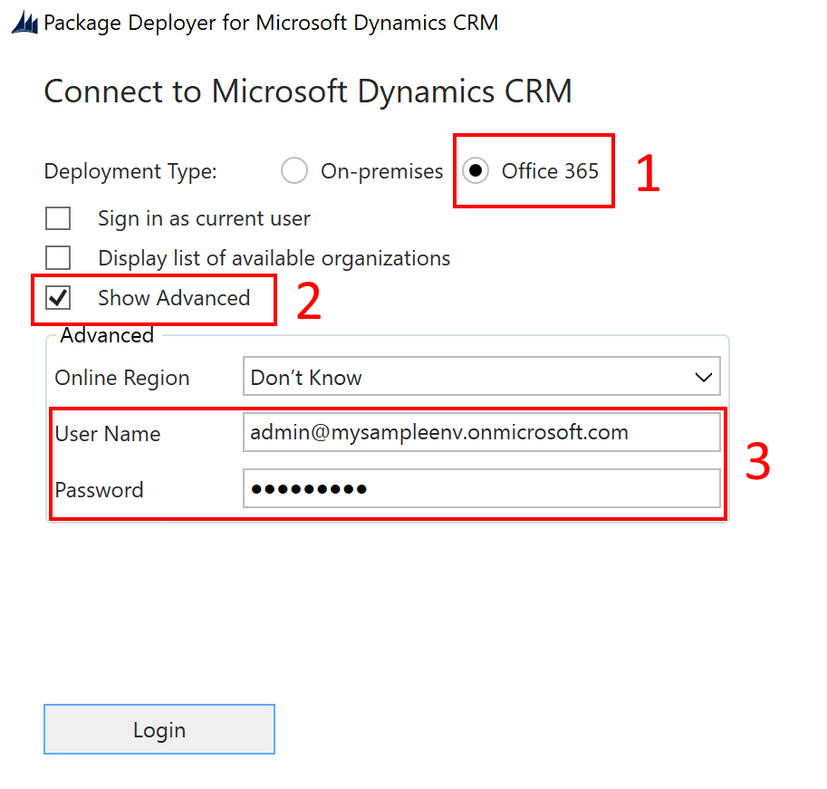
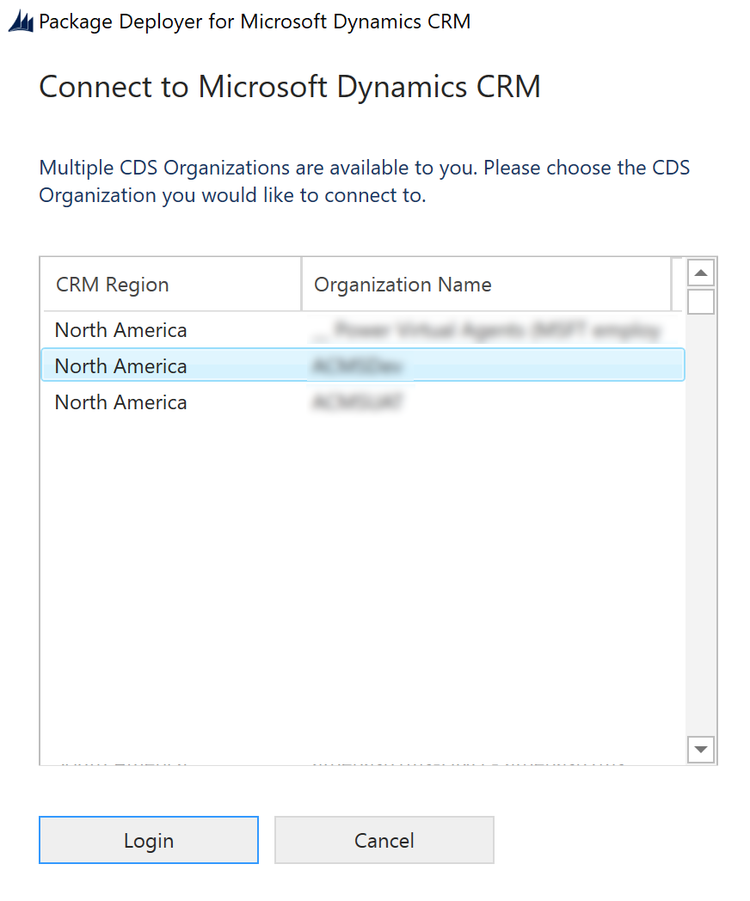
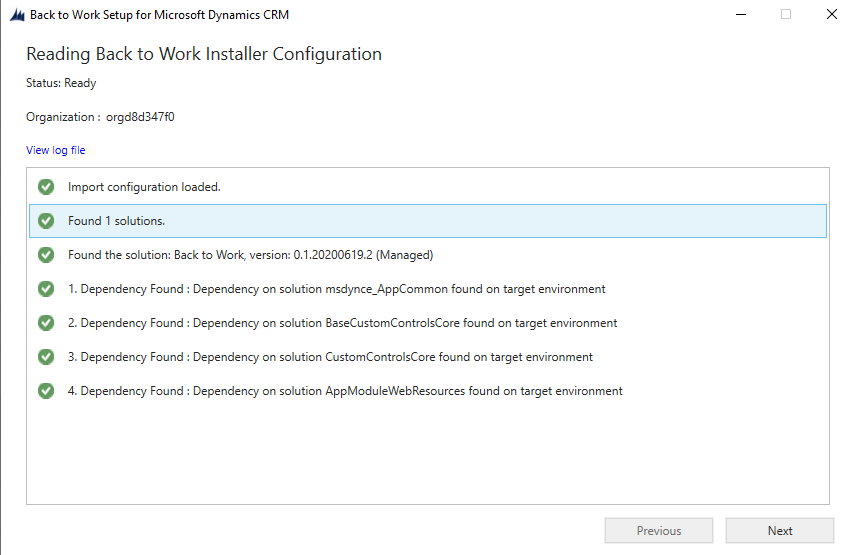
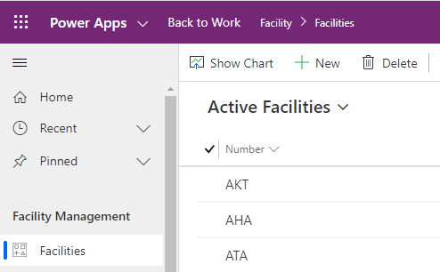
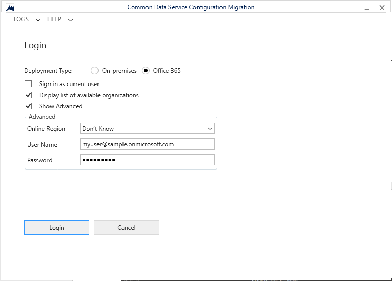
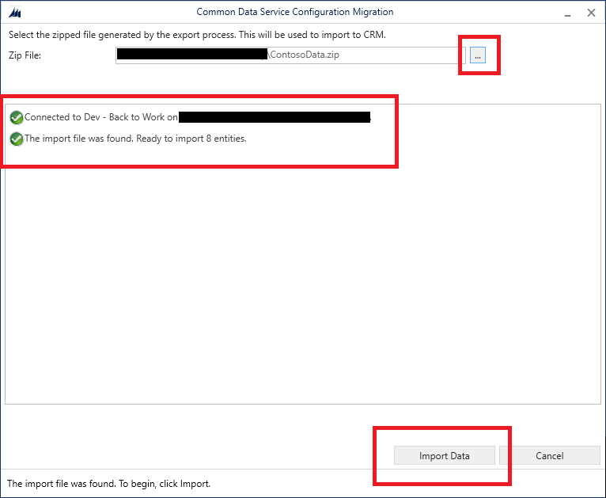
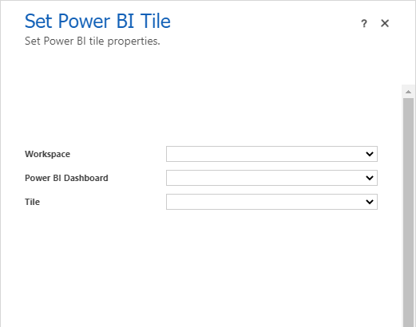

# Prerequisites

The following prerequisites apply to this document:

-   You must a Global Administrator / Dynamics 365 Administrator or Power
    Platform administrator to perform this installation.

-   Create a workspace in Power BI where you will publish the report. Sign into
    Power BI and create a workspace. More information: Create the new workspaces
    in Power BI

-   Install Power BI Desktop from the Microsoft Store: https://aka.ms/pbidesktop

    NOTE: If you have installed Power BI Desktop by downloading directly from
    the Download Center page as an executable in the past, remove it and use the
    one from the Microsoft Store. The Microsoft Store version will be updated
    automatically as new releases are available. If you can’t install from
    Microsoft Store, install the latest non-Microsoft Store version from the
    Download Center page.

# Overview

This document provides IT administrators a guide on how they need to install the
Return to Workplace solution. The following steps are needed and will be covered
in the document:

-   Create an environment and install the package

-   Setup the Power BI Dashboards

-   Configure the Canvas App

-   Set Security Roles

Estimated time to complete these steps: 60–90 minute

## Step 1: Download the deployment package

Get the latest deployment package (.zip) from your Microsoft account
representative.

Before extracting the .zip file, ensure that you unblock it.

1.  Right click the .zip file, select **Properties**.

2.  In the properties dialog box, select **Unblock**, and then select **Apply**
    followed by **OK**

>   On extracting the .zip file, you will see the following in the extracted
>   folder:

| **Folder**    | **Description**                                                                                                                      |
|---------------|--------------------------------------------------------------------------------------------------------------------------------------|
| Package       | The folder contains the Package Deployer tool and the package that you will import later to set up the solution in your environment. |
| Power BI      | Contains the Power BI Report template file (.pbit) that you will use to configure reporting.                                         |
| Sample Data   | Contains the sample master data files (.xlsx).                                                                                       |
| Documentation | Contains all the documentation needed.                                                                                               |

## Step 2: Sign up for Power Apps and create an environment

If you don't already have Power Apps, sign up for Power Apps and purchase an
appropriate license.

More information:

-   [Power Apps Pricing](https://powerapps.microsoft.com/pricing/)

-   [Purchase Power
    Apps](https://docs.microsoft.com/power-platform/admin/signup-for-powerapps-admin)

After you have purchased Power Apps, create an environment with a Common Data
Service database.

1.  Sign in to [Power Platform admin center](https://aka.ms/ppac).

2.  Create a Common Data Service environment with the database. More
    information: [Create and manage
    environments](https://docs.microsoft.com/power-platform/admin/create-environment)

    **[IMPORTANT]** While creating the database, if you select a security group
    for the database, the apps can be shared only with users that are members of
    the security group.

3.  Create appropriate users in your environment. More information: [Create
    users and assign security
    roles](https://docs.microsoft.com/power-platform/admin/create-users-assign-online-security-roles)

>   After you have created your environment, you can access it using the
>   following URL: https*://[myenv].*crm.dynamics.com, where *[myenv]* is the
>   name of your environment. Make a note of this environment URL.

## Step 3: Install the package

After your environment is ready, you can install the solution via the package.

1.  Navigate to the location where you extracted the deployment file (.zip);
    you'll find a **Package** folder. Under the **Package** folder, run the
    **PackageDeployer.exe** file to run the tool to deploy the package.

2.  On the next screen, select **Continue**.

3.  You’ll be prompted to connect to your environment. Select **Office 365** as
    the **Deployment Type**, select **Show Advanced**, and then type your
    credentials to connect to your environment.  
      
    

    

4.  Select **Login** to continue.

5.  If you have access to more than one Common Data Service environment, the
    next screen will prompt you to select the environment where you want to
    install the package. Select an environment and select **Login**.  
      
    

    

6.  On the next screen, select **Next.**

7.  The next screen displays you the environment name where the package will be
    installed. Review the information and select **Next**.

8.  The next screen validates if a starter portal is available on your
    environment. Select **Next** to continue with the installation.  
      
    

    

9.  The next screen displays the installation status of the package. Please note
    that it might take a while for the package installation to complete.

10. After the installation is complete, select **Next**.

11. On the next screen, select **Finish** to complete and close the setup.

After the package is installed, you will find a new admin app in your **Apps**
list.

## Step 4: Install Sample Data

For a quick start you can install Sample Data which is available with the
package. In the folder Sample Data, there are to files available; one with
Contoso data and another with State Street data.

1.  Navigate to the location where you extracted the deployment file (.zip);
    you'll find a **Sample Data** folder. Under the **Sample Data** folder, run
    the **DataMigrationUtility.exe** file to run the tool to deploy the Sample
    Data.

2.  On the next screen, select **Import data**.

3.  You’ll be prompted to connect to your environment. Select **Office 365** as
    the **Deployment Type**, select **Show Advanced**, and then type your
    credentials. Select **Display list of available organizations** to select
    the right organization.

1.  On the next screen select the right environment.

1.  After validation, select the sample file you want to import. You will see
    the status in the middle. After you press **Import** the sample data will be
    imported.

## Step 5: Configure and publish Power BI dashboard

The solution contains two Power BI dashboard, one for Executive Leadership and
another one for the Facility Managers.

1.  Navigate to the location where you extracted the deployment file (.zip);
    you'll find a **Power BI** folder. Open the Return to Workplace – Leadership
    dashboard. The same steps need to be repeated for the Return to Workplace –
    Facility Manager dashboard.

1.  In Power BI desktop, select **Transform data** and press **Edit
    Parameters**.

1.  Edit the **CDS Environment** parameter, to your environment. Press **ok**,
    you will then be prompted to login.

1.  After all data is loaded and you are ready with the Dashboard, press
    **Publish**.

## Step 5: Embed Power BI report in the Model Driven App

The Facility Manager Power BI dashboard is mainly used with the Model Driven
App. Since these reports are published on a different location, this needs to be
changed.

1.  First enable Power BI integration by going to the environment and selecting
    Administration.

1.  Select **System Settings** and then on the **Reporting** tab, press **Yes**.

2.  Go to **make.powerapps.com** and select **Data** and **Entities**. On the
    right top, remove the **Default** filter and put this on **All**. Select
    **Facility** from the list and then in **Forms** open the **Information
    Form**.

1.  Click **Switch to classic** to move back to the old interface. Click on the
    Power BI Report control and select the right **Workspace aka Group** and
    **Dashboard**. Afterwards press **Save** and **Publish**.

For ease of implementation, you can also use the Power BI embedder in the
XRMToolbox. (<https://www.xrmtoolbox.com/plugins/Fic.XTB.PowerBiEmbedder/>)

## Step 6: Publish Theme

Throughout the entire solution we allow you to theme certain components. You can
do this via theming.

1.  Open the environment and to advanced settings.

2.  From **Settings**, select **Customizations**.

1.  Then select **Themes**.

1.  Select **New** create a **new** Theme. Fill in the **Name** and determine
    which colors you want to use. You can also specify the logo which is used in
    the sitemap.

    

2.  After you are done, select **Save**. Then **Publish** the Theme. Below an
    example theme.

## Step 7: Share the Canvas App

The Canvas Apps we provided two Canvas Apps, which should be shared to
everybody.

1.  Open make.powerapps.com and select the right environment on the right top.

2.  Select the **Employee Questionnaire App**.

1.  Select **Share** in the command bar

1.  In the bar where you would like to invite people, enter **Everybody** to
    share the app with everybody available.

2.  Repeat this process also for the **Checklist App**.

## Step 8: Set the Security Roles

In the application we defined the following roles, which have their own security
roles:

-   Return to Workplace - Employee, which is there to check in and can look at
    the details of a location

-   Return to Workplace - Facility Manager, which allows people to look at the
    facilities and plan phasing

-   Return to Workplace - Leadership, which allows you to view the details over
    the entire system

1.  Open your environment and select **Settings** and **Security**.

1.  Open **Users** and select the user which you want to give permissions.

1.  When selecting the user, press **Manage Roles** in the Command Bar. You will
    find all the roles as indicated above here. After selecting the right roles,
    press **ok**.

## Next steps 

The deployment steps are complete now. Business admins can refer to the
**03-Configuration guide for business admin** document to perform the following
steps:

1.  Configure and manage the master data

*Disclaimer*

*Customer bears the sole risk and responsibility for any use of this app.*

*Sample data included in this app are for illustration only and are fictitious*.
*No real association is intended or inferred*
