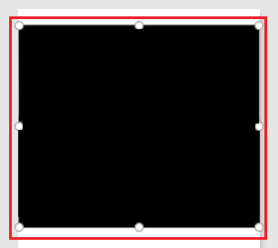
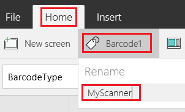
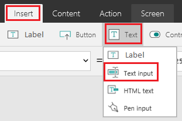
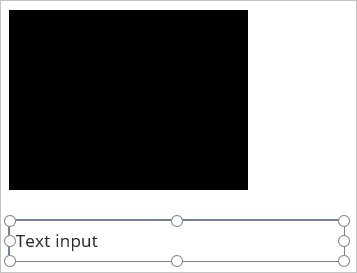
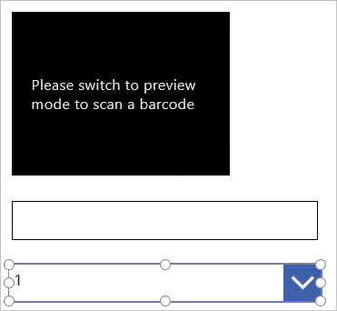
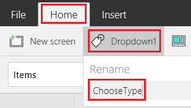

# Scan a barcode in Microsoft PowerApps
Scan several types of barcodes by creating an app and running it on a device, such as a phone, that has a camera. The numerical equivalent of the barcode appears in a **Label** control, and you can upload that data to a variety of [data sources](maker/connections-list.md).

If you're unfamiliar with PowerApps, see [Get started](maker/getting-started.md).

## Known limitations
* Barcodes should be at least 1" (2.5cm) high and 1.5" (4cm) wide.
* To scan barcodes by using a phone, hold it in portrait orientation, and slowly move it from 7" (18cm) to 10" (25cm) away from the barcode.
* Long barcode types (such as I2of5, which can have 15 or more characters) can give truncated or otherwise incorrect results, especially if the barcode isn't printed clearly.
* For iPhones and Android devices, you can specify the **Height** property of the **Barcode** control, but a fixed aspect ratio determines its width.
* You might need to set the **Scanrate** property of the **Barcode** control to **35** or less.
* To delay running out of memory on devices that are running iOS, set the **Height** property of the **Barcode** control to **700** (or lower) and the **Scanrate** property to **30**.
* If the device runs out of memory and the app freezes, restart the app.

## Create a blank app
1. [Sign up for PowerApps](signup-for-powerapps.md), and then do *either* of the following:

   * [Open PowerApps](https://create.powerapps.com/api/start) in a browser on a device that has a camera.
   * [Install PowerApps](http://aka.ms/powerappsinstall) from the Windows Store on a device that has a camera. Open PowerApps, sign in, and then click or tap **New** on the **File** menu (along the left edge).

2. Under **Start with a blank canvas or template**, click or tap **Phone layout** in the **Blank app** tile.

    

3. If you haven't used PowerApps before, get familiar with key areas of the app by taking the intro tour (or click or tap **Skip**).

    

    > [!NOTE]
> You can always take the tour later by clicking or tapping the question-mark icon near the upper-right corner and then clicking or tapping **Take the intro tour**.

## Add a Barcode control
1. On the **Insert** tab, click or tap **Media**, and then click or tap **Barcode**.

    

2. Ensure that the **Barcode** control is selected by confirming that a selection box (with handles to resize the control) surrounds it.

    

3. On the **Home** tab, click or tap **Barcode1**, and then type or paste **MyScanner** under **Rename**.

    > [!TIP]
> The first **Barcode** control that you add is named **Barcode1** by default. If you delete that control and add another **Barcode** control, it will be named **Barcode2** by default. By manually renaming a control, you ensure that formulas will refer to the control by its correct name.

    

## Add a Text input control
1. On the **Insert** tab, click or tap **Text**, and then click or tap **Text input**.

    If the **Insert** tab doesn't appear, maximize your PowerApps window.

    

2. Drag the selection box (not the resize handles) around the **Text input** control down until it appears below **MyScanner**.

    

3. With the **Text input** control still selected, ensure that **Default** appears in the properties list, and then type or paste **MyScanner.Text** in the formula bar.

    

## Change the barcode type
1. On the **Insert** tab, click or tap **Controls**, and then click or tap **Drop down**.

    

2. Move the **Drop down** control so that it appears below the other controls on the screen.

    

3. With the **Drop down** control still selected, ensure that the properties list shows **Items**, and then type or paste this string of text in the formula bar: 
    **[Codabar, Code128, Code39, Ean, I2of5, Upc]**

    

4. On the **Home** tab, rename the **Drop down** control to **ChooseType**.

    

5. Click or tap **MyScanner** to select it, ensure that the properties list shows **BarcodeType**, and then type or paste this string of text in the formula bar: 
    **ChooseType.Selected.Value**

## Test the app
1. Open Preview mode by pressing F5 (or by clicking or tapping the play button near the upper-right corner).

    

2. Hold a barcode up to the camera on the device until the numerical component of the barcode appears in the **Label** control.

    If the numerical component doesn't appear, try a different option in the **BarcodeType** list. If the correct data still doesn't appear, type the correct number in the **Input text** control.

## Next steps
* [Connect the app to a data source](maker/add-data-connection.md) and configure the **[Patch](functions/function-patch.md)** function so that users can save results.
* Add a **[Drop down](controls/control-drop-down.md)** control, and configure it so that users can choose which type of barcode they want to scan.
* Add a **[Slider](controls/control-slider.md)** control, and configure it so that users can adjust the scan rate or the height of the **Barcode** control.
