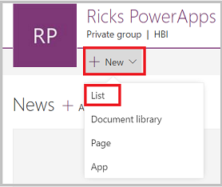
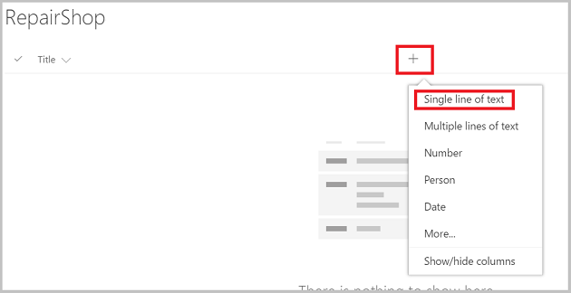
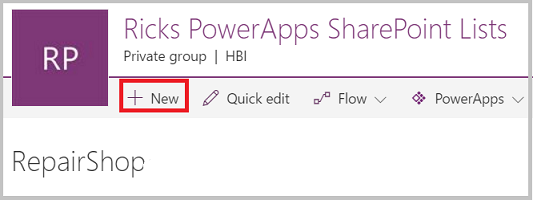
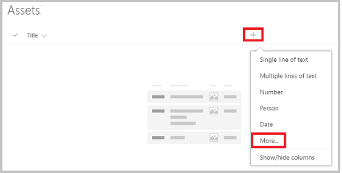
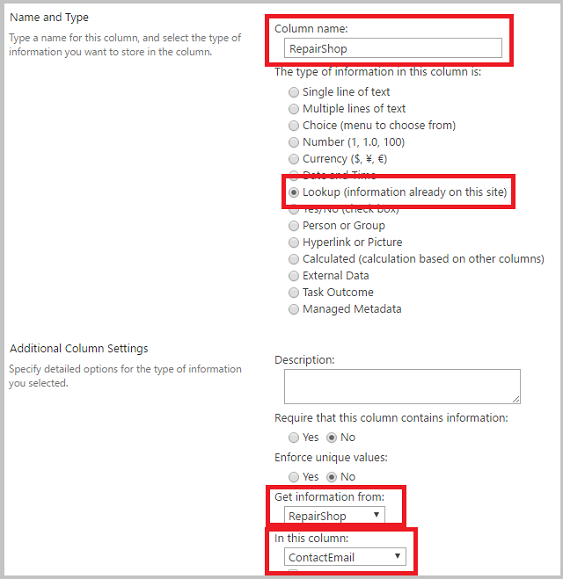
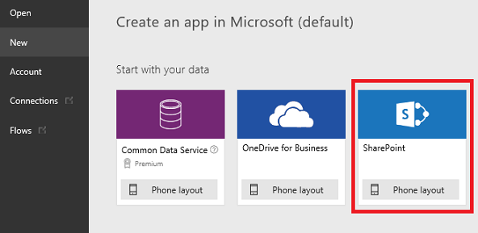
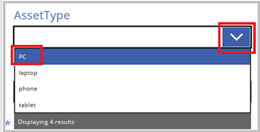
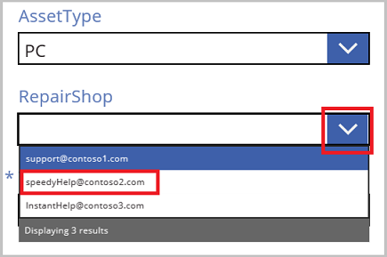

# How to link SharePoint lists using lookup fields
This tutorial shows how you can connect two SharePoint lists with lookup fields.

## Overview
SharePoint provides two types of lookup fields:

* **Lookup**: links to another list: for example an *Orders* list may have a lookup field that links to customers in a *Customer* list;
* **Choice**: clicking or tapping the field displays a small menu of items that you choose from.

In this tutorial, you build an app that uses these kinds of lookup fields.

### What do you use lookup fields for?
Data in an enterprise is large and complex. Data in one SharePoint list often relates to data in another list. Lookup fields are the primary way such business data comes together.

For example, you might have an **Orders** list which has a lookup field that links to a **Customers** list, to show which customer placed the order. The lookup field in the **Orders** list lets you get other data from the **Customers** list as well. You might also use a lookup field to connect the **Orders** list to a **Product** list, and bring in information you need about the product ordered, such as product pictures, specifications, manufacturer details, etc.

### What are Choice fields used for?
**Choice** fields are used for very short lists, but instead of actually creating a separate list, you include the list values in a small menu, which appears when you click or tap on the **Choice** field, and you select one of the values.

Examples include data like Customer Status Code, Product Availability, State Codes; basically any fixed list that is relatively short. This data could in fact be implemented as separate lists, and then you would use a **Lookup** field to link to them, but it is usually easier and quicker to implement them as **Choice** fields.

## Create the lists in SharePoint
In this tutorial, you link two SharePoint custom lists together, **Assets** and **RepairShop**. The **Assets** list is used to track hardware equipment in a team. Since hardware gets broken from time to time, we use the **RepairShop** list to track the local shops which can fix it.

### The lookup fields used in this example
The **RepairShop** list uses the *ContactEmail* field to identify the shop. This list is defined first so that each row in the **Assets** list has something to point to.

The **Assets** list has two lookup fields:

* one called *RepairShop*, of type **Lookup**, which uses email addresses to point to entries in the **RepairShop** list;
* one called *AssetType*, of type **Choice**, which lists the kinds of hardware that this asset might be.

You most likely would define additional fields, depending on the information you need to track.

### Define the RepairShop list and add data
You do this first, so that when you add data to the **Assets** list, **RepairShop** entries are available for you to choose from the *Assets.RepairShop* lookup field.

1. On your SharePoint site, create a new **RepairShop** list.

    

2. Add a *ContactEmail* field of type **Single line of text**.

    

3. Add any other fields you need.

4. Click or tap **+ New** to enter sample data into the list, at least 3 rows with different *ContactEmail* values. When an asset needs to be repaired, you choose one of these.

    

### Define the Assets list
1. On your SharePoint site, create a new **Assets** list.

2. Click or tap the plus sign and choose **More**.

    

3. Add an *AssetType* field of type **Choice**, and in the **Type each choice on a separate line** text box, fill in the values you want to appear in the choice menu. Then click or tap **OK**.

    

4. Start to add another field, just like in step 2: click or tap the plus sign and choose **More**.

5. Add a *RepairShop* field of type **Lookup**, choose **RepairShop** from the **Get information from** text box, and choose *ContactEmail* from the **In this column** text box. Then click or tap **OK**.

    

6. Add any additional fields you want.

## Create an app from the Assets list
You use this app to add data to the **Assets** list.

1. Open PowerApps Studio. If you are new to PowerApps, [sign up for free](https://powerapps.microsoft.com) using your organizational email address and follow the instructions to download PowerApps Studio from the Windows store.

2. In the **File** menu (along the left edge), click or tap **New**, and then click or tap **SharePoint**.

    

1. Choose your SharePoint site from the **Recent sites** list or enter your site's url directly into the text box. Click or tap **GO**.

    

1. Choose the main list from your SharePoint site, in this example, **Assets**. Click or tap the **Connect** button in the lower-right corner.

    

## Add data to the Assets list
Now you can run the app and see how the view details screen looks for the lookup fields.

1. Press F5 or select Preview (  ).

2. Click or tap the **+** symbol in the upper right corner to add an entry.

3. Enter a **Title** for this asset.

4. Click or tap the **AssetType** dropdown arrow. The values displayed are those you entered when you created this field. Choose one of the entries.

    

5. Click or tap the **RepairShop** dropdown arrow. Choose one of the entries.

    

6. In the upper-right corner, click or tap the check mark to save the new entry.

7. (optional) Repeat this procedure to add as many items to the list as you want.

8. Press Esc to return to the default workspace.

## For more information
* [Introducing support for lookups and a new sample app](https://powerapps.microsoft.com/blog/support-for-lookups/)
* [Performance, Refresh button, ForAll, and multiple field lookups](https://powerapps.microsoft.com/blog/performance-refresh-forall-multiple-field-lookups-531/)
* [Generate an app by using a Common Data Service database](data-platform-create-app.md)
* [Create an app from scratch using a Common Data Service database](data-platform-create-app-scratch.md)
