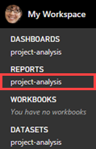
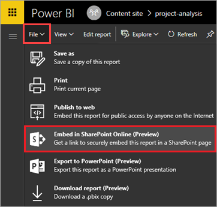
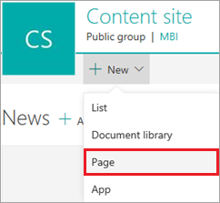
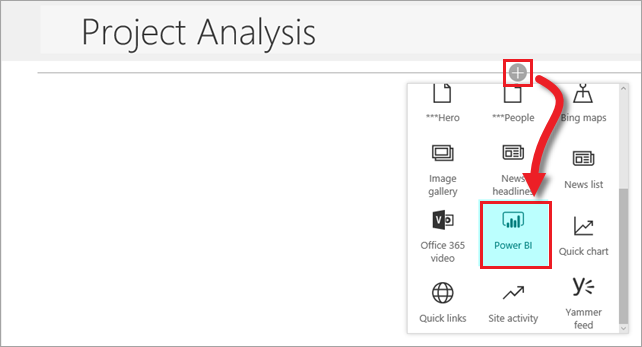
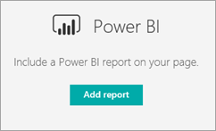
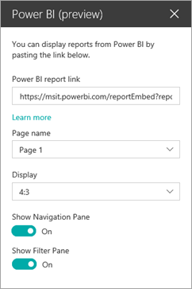
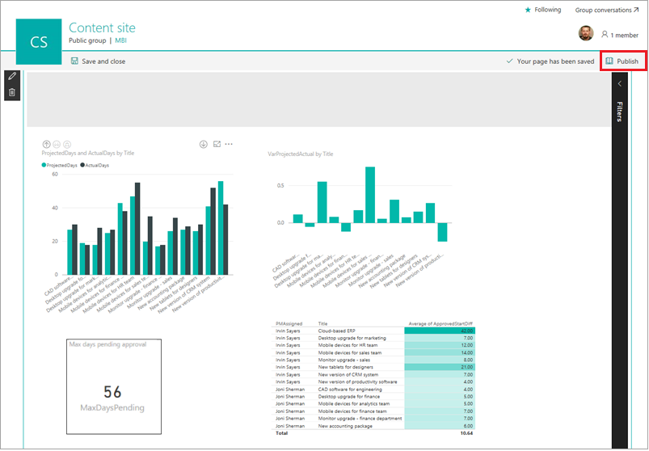

# Embed the Power BI project report in SharePoint Online
> [!NOTE]
> This article is part of a tutorial series on using PowerApps, Microsoft Flow, and Power BI with SharePoint Online. Make sure you read the [series introduction](sharepoint-scenario-intro.md) to get a sense of the big picture, as well as related downloads.

We'll now embed our Power BI report in the same SharePoint Online site that hosts our two lists. Power BI supports a variety of approaches to embedding, including directly integrating into SharePoint pages for web and mobile views.

With this type of embedding, Power BI embeds the report as a web part, provides appropriate access for users, and lets you click through from the embedded report to the report at powerbi.com. First, we'll generate an embed link in Power BI, then use that link in a page that we create. For more information on embedding, see [Embed with report web part in SharePoint Online](https://powerbi.microsoft.com/documentation/powerbi-service-embed-report-spo).

## Step 1: Generate an embed link
1. Sign in to Power BI, then in the left navigation pane, click or tap the report name.
   
    
2. Click or tap **File**, then **Embed in SharePoint Online**.
   
    
3. Copy the embed link from the dialog box to a file, then click or tap **Close**. We will use the link after we create a SharePoint page.
   
    

## Step 2: Embed the report
1. Sign in to SharePoint, then click or tap **Site contents**.
   
    
2. You could just include a report on the team home page, but we'll show you how to create a separate page for it also. Click or tap **New**, then **Page**.
   
    
3. Enter a name for the page, like "Project Analysis".
4. Click or tap  then **Power BI**.
   
    
5. Click or tap **Add report**.
   
    
6. In the right pane, copy the embed URL into the **Power BI report link** box. Set both **Show Filter Pane** and **Show Navigation Pane** to **On**.
   
    
7. The report is now embedded in the page. Click **Publish** to make it available to anyone who can access the underlying report.
   
    

## Step 3: Grant access to the report.
If you are using Office 365 Groups as we recommend, make sure users who need access are members of the group workspace within the Power BI service. This ensures that users can view the contents of that group. For more information, see [Creating groups in Power BI](https://docs.microsoft.com/power-bi/service-collaborate-power-bi-workspace).

That wraps up our work in Power BI for this scenario. You started by pulling data from our SharePoint lists into Power BI, and have now come full circle to embedding your Power BI report back into SharePoint.

## Next steps
The next step in this tutorial series is to [run through the workflow we created end-to-end](sharepoint-scenario-summary.md).

