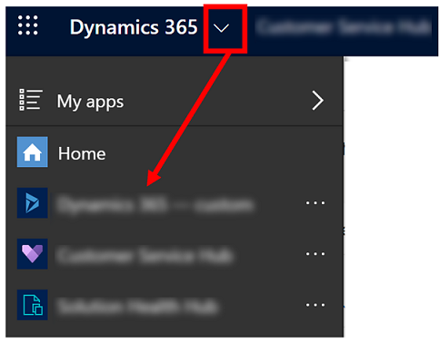
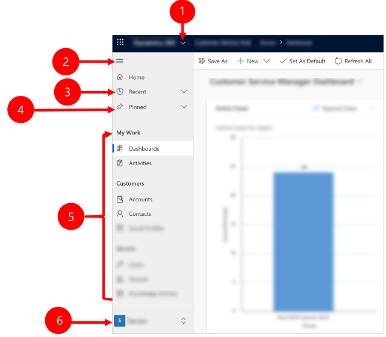

#  Basic navigation in a model-driven app 

This introduction explains how to find and open an app, and how to work with its common user interface elements including lists, forms, and business processes.

## Navigating among apps, areas, and entities

A model-driven app is built out of applications (apps), areas, and entities.

- *Apps* provides a collection of functionalities for accomplishing a specific class of activity such as, managing your accounts and contacts. Use the app-selector menu to navigate between the apps that are available to your organization.

- A *work area* is a subdivision of an app, dedicated to a specific feature. Each work area provides a targeted collection of entities for working in that area. In some cases, the same entity appears in more than one area (or even more than one app). The contacts and accounts entities, for example, appear in a variety of apps and work areas. Use the work-area menu to navigate between work areas for your current app.

- *Entities* represent a specific type of data, such as a contacts and accounts. Entities use a structured data format, which defines the collection of fields available to the entity. Each entity consists of a collection of individual records. For example, for the contacts entity, each record describes a single person, and each record includes a collection of fields such as first name, last name, and email address. Entities normally present two views: a list view, which is typically a table listing available records; and a form view, which shows all available data and settings for a single record. Use the side navigator to move between entities in your current work area.

### Move between apps

Use the app-selector menu to switch between apps.

The apps you see listed in your app-selector menu will depend on which apps you have access to. 

### Move between entities, records, and work areas

It's easy to get around and get back to your favorite or most-used records. The following illustration shows the primary navigation elements.

Legend:

1. **App selector**: Open this menu to move between apps.
1. **Collapse/expand button**: Select this to collapse the navigator to allow more room for the main part of the page. If the navigator is already collapsed, select this button to expand it again.
1. **Recent records**: Expand this entry to view a list of records you were recently using. Select an record here to open it. Select the push-pin icon next to a record listed here to added to your favorites (pinned records).
1. **Favorite records**: Expand this entry to view and open your favorite (pinned) records. Use the **Recent records** list to add records here. Select the remove-pin icon next to a record listed here to remove it from this list.
1. **Entity navigator**: This area lists each entity and dashboard available for the current work area. Select any entry here to open the named dashboard or list-view for that entity.
1. **Work-area selector**: Open this menu to move to another work area. The current work area is named here.

## Working with list views

Usually, when you first open an entity, you'll see the list view, which shows a list of records belonging to that entity, formatted as a table. For example, if you open the **Accounts** entity, you'll see a list of accounts.

Legend:

1. **Select records**: Select one or more records by placing a check in this column. Depending on where you are working, you may be able to apply a single operation to all the selected records at once using buttons in the command bar.
2. **Open a record**: Select any record in the list to open its record view, which shows all the details about the record. Usually you should select from the **Name** column to open a record from the current entity. Some entities provide links to records from related entities in other columns (such as a related contact).
3. **Sort or Filter the list**: Select to sort the list by values in that column or filter the list by values in that column. An arrow in the column heading indicates which column is being sorted and in which direction. 
4. **Command bar**: Use the commands in the command bar to operate on records in the list and perform related actions. Some commands (such as **Delete**) require that you first select one or more target records by placing a check mark in the leftmost column, while others operate on the entire list. You can export the list to an Excel workbook (possibly based on a template), open charts and dashboards, and more, depending on the type of records you are working with.
5. **Search the view**: Enter text in the search field above the list to show only those records in the current view that contain your text.
6. **Filtering and paging**: Select a letter to show only those records whose names start with that letter. If the list contains more records than can be shown on one page, use the paging arrows at the bottom of the list to move forward and backward through the pages.

