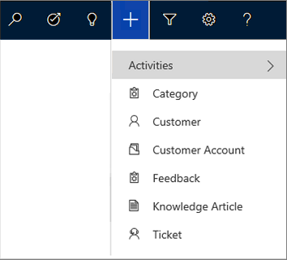

# Add an appointment, email, phone call, notes or task activity to the Timeline 

Add **Activities** in the Timeline area, to keep track of your all your communication with a customer or contact. For example, you can take notes, add a task, send email, add phone call details, or set up appointments. The system automatically timestamps every activity and shows who created it. You and other people on your team can scroll through the activities to see the history as you work with a customer.

- Activities that you add from within a record appear in the **TIMELINE** area of the record. 
- If the **Regarding** field of an activity is set, the activity appears in the record it is associated with. 
- You can also choose the filter pane to filter the activities by record type and date. 
- When a new activity is created, you will get a **What you missed** notification in the **TIMELINE** area.
  
   
 
**Add an activity from the nav bar**
 
The fastest way to add an activity is to use the shortcut on the nav bar and then link it to a record. For example, you can create a phone call activity and then link it to a contact in the system using the **Regarding** field.

1. On the nav bar, click the **plus sign** , and then click **Activities**. 

   
 
2. Choose the type of activity you want to add.

3. Fill in the required information. Use the **Regarding** field to associate the activity with a record.

4. When you're done click, **Save**.

  
## Add a phone call  
  
1.  Open the record that you want to add the activity to. For example, contact record.
  
2.  In the **Timeline** section, click  **plus sign** > **Phone Call**.  

  
3.  Fill in the **Subject** of the call.

     In the **Notes** area, provide a summary of the conversation with the customer. 
  
     The **Call To** field is automatically populated with the record you added the phone call activity to. You can select a different record if needed.  
  
4.  By default, the direction is set to **Outgoing**. You can change it to **Incoming** by clicking **Outgoing**. 
  
6.  When you're done filling in the form, click **Save** to save the activity.  
  
## Add a task  
  
1. Open the record that you want to add the activity to. For example, contact record.
  
2. In the **Timeline** section, click  **plus sign** > **Task**.
  
4. The **Owner** field is set to the current user by default. If you want to reassign the task, click the lookup icon, and then select another user or team.  
  
5. When you're done filling in the form, click **Save** to save the activity. 
  
## Add an email  
 To add an email activity to a record, you must first save the record you are adding the activity to.  
  
1. Open the record that you want to add the activity to. For example, contact record.
  
2. In the **Timeline** section, click  **plus sign** > **E-mail**. 

3. Fill in the subject of the email and use the space provide to write the email.
  
4. To add an attachment to the email, save the email. Then in the **Attachments** section, click **+** to add an attachment.  
  
5. To use a template for the email body, on the command bar, click **Insert Template**, and then select the template.   
  
6. When you're done filling in the form, click **Send**. 
  
## Add an appointment  
 To add an appointment activity to a record, you must first save the record you are adding the activity to.  
  
1. Open the record that you want to add the activity to. For example, contact record.
  
2. In the **Timeline** section, click  **plus sign** > **Appointment**.  
  
3. Use the tooltips to fill in the required information.
  
4. When you're done filling in the form, click **Save** to save the appointment.

## Add notes  
 You can also easily add notes in the activities area.
  
1. Open the record that you want to add the activity to. For example, contact record.
  
2. In the **Timeline** section start typing your notes. Use **Add an attachment** to add any attachments.

3. When you're done filling in the form, click **Add Note** to save the note.

You can also add a note using the **+** in the upper section of the **TIMELINE** area.
  
  
