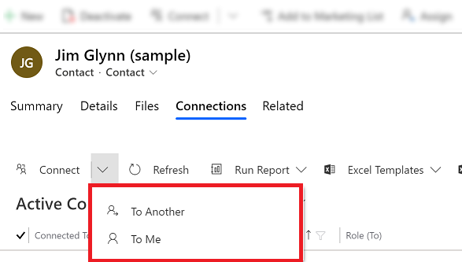
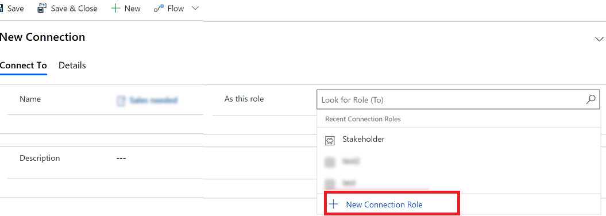
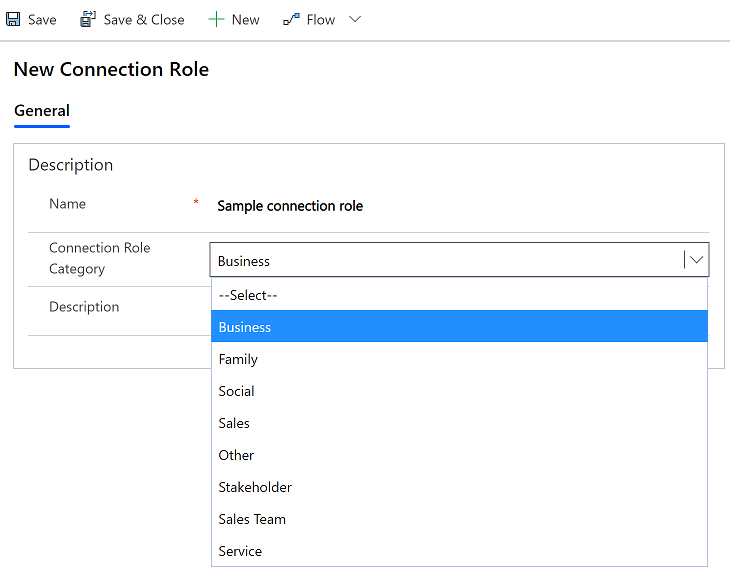
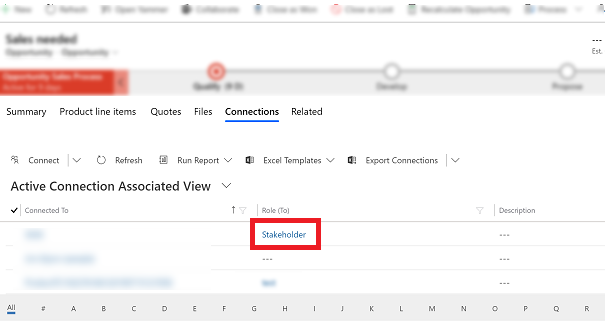
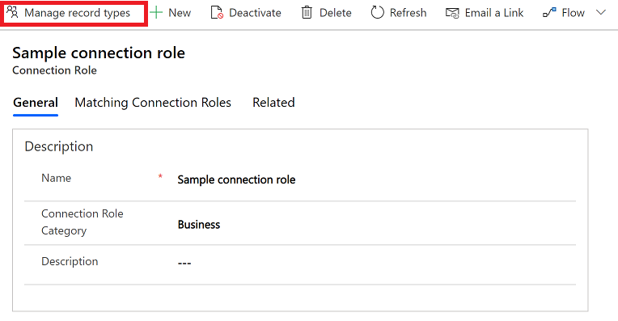
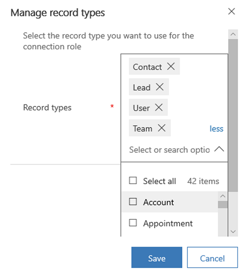

# Add a connection role to to link records to each other|

[!INCLUDE [cc-beta-prerelease-disclaimer](../includes/cc-beta-prerelease-disclaimer.md)]

Connections enable you to easily associate users, contacts, quotes, sales orders, and many other entity records with each other. The records in the association can be assigned particular roles that help define the purpose of the relationship.

It's a quick way to create multiple connections and roles for a particular record. For example, a contact may have many relationships with other contacts, accounts, or contracts. In each relationship a contact may play a different role.

Connection roles are directly associated to a connection. To use a connection role, you must first add a connection to your record.  

1. To add or manage connections, select the record you want to manage like an opportunity.  
2. Select the **Related** tab and then select **Connection**. This will open the connection grid with the list of connections for the record.

  > [!div class="mx-imgBorder"]
  >  

3. Select **Connect** and then choose **To Another** or **To Me**.

  > [!div class="mx-imgBorder"]
  >  
  
4. On the **Name** field, enter or find the name of the record for the connection.

5. On the **As this Role** field select the lookup icon and then choose **New Connection Role**. Or, use the search to find an existing role that you want to associate to the connection and then select **Save**.

  > [!div class="mx-imgBorder"]
  >   

  > [!NOTE]
  > If you have entered information before creating a new connection role, a warning dialog will be displayed asking if you would like to cancel and continue working on the connection or to go ahead and leave the current record you are working on.

6. To create a new connection role, on the **New Connection Role** screen enter a name and then choose a **Connection Role Category**.

  > [!div class="mx-imgBorder"]
  >  

7. When you are done, select **Save & Close**.

  
## Manage Connection Roles

To manage a connection role, select  the connection role from a connection entity. This will open the connection role entity record.  You can edit the name, select a connection role category, and add a description.

  > [!div class="mx-imgBorder"]
  >  
  
You can also manage the connection role types that you want associate to the connection role.

1. Open the connection role and then select **Manage Record Type** on the command. 

  > [!div class="mx-imgBorder"]
  >  
  

2. This will open a list of connection role types that you can add or remove for this connection role.

  > [!div class="mx-imgBorder"]
  >  

