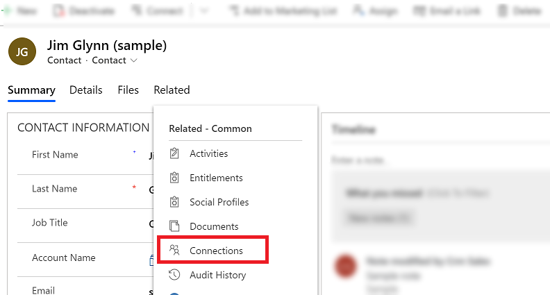

# Add a connection role to to link records to each other|

[!INCLUDE [cc-beta-prerelease-disclaimer](../includes/cc-beta-prerelease-disclaimer.md)]

Connections enable you to easily associate users, contacts, quotes, sales orders, and many other entity records with each other. The records in the association can be assigned particular roles that help define the purpose of the relationship.

It's a quick way to create multiple connections and roles for a particular record. For example, a contact may have many relationships with other contacts, accounts, or contracts. In each relationship a contact may play a different role.

Connection roles are directly associated to a connection. To use a connection role, you must first add a connection to your record.  

1. To add or manage connections, select the record you want to manage like an opportunity.  
2. Select **Related** from the list of options on the page and then select**Connection**. This will open the connection grid with the list of connections for the record.
3. After selecting a connection or creating a new one, you can to add the connection role using the lookup on the connection entity record. Select the role you want to associate to the connection and select **Save**.

  > [!div class="mx-imgBorder"]
  >  
  
  
4. If you do not see the connection role that you need, you can create a new connection role by selection the **New Connection Role** at the bottom of the lookup field. 

  > [!div class="mx-imgBorder"]
  >  
  
  > [!NOTE]
  > If you have entered information before creating a new connection role, a warning dialog will be displayed asking if you would like to cancel and continue working on the connection or to go ahead and leave the current record you are working on.

## Add a new connection

