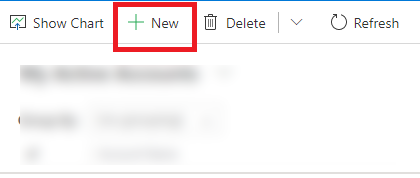
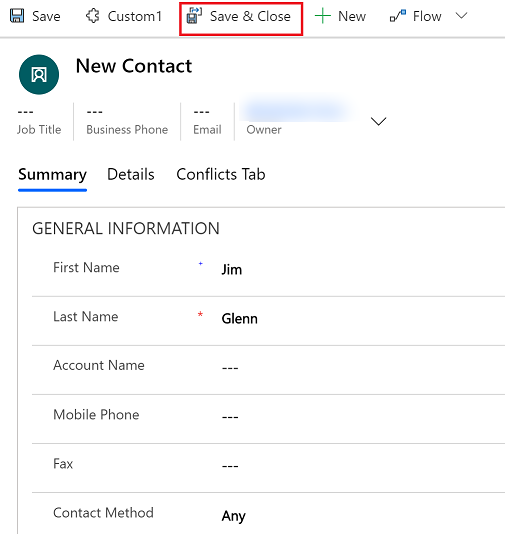

# Create a new record

## Create a new record using the + option on the command bar

The **Create a new record** command or **Quick create** makes it fast and easy to enter almost any type of information into the system. The command is on the nav bar, so it’s available whenever you need to enter new information into the system. You can also save a record and create a new one directly from the **Quick create** form.

> [!NOTE]
> The **Quick create** option is only available for records that are enabled by your admin.
    
1. On the navigation bar, select the **plus sign** , and then select the item you want.  

    > [!div class="mx-imgBorder"] 
    > 
  
2.  Fill in the fields, and then select **Save and Close**. Or, to save and create another record, select the down arrow and then select  **Save & Create New**.

     > [!div class="mx-imgBorder"] 
     > 
  
> [!NOTE]
> An asterisk  next to the field on the screen means the field is required. If you select **Save and Close** before entering required fields an error message will be displayed or if you have entered information and select **Cancel** a warning will be displayed.
>   
> A plus sign  next to the field on the screen means your organization recommends that you fill in the field.  

## Create a new record using the New button 

1. From the left navigation pane, select a record type. For example, select **Contacts** to create a new contact record.
2. On the command bar, select **+New**.

    > [!div class="mx-imgBorder"] 
    > 
  
3. Fill in the appropriate details for new contact and then select **Save and Close**.

   > [!NOTE]
    > If you have unsaved changes and try to go to another record or form, a **Unsaved changes** dialog box will pop-up. If you select **Save and continue**, it will attempt to save your information and open the page you wanted to go to. If you choose to save and continue and there is an error on a field, the dialog will close and you will remain on the page to fix the error before you can navigate away.

    > [!div class="mx-imgBorder"] 
    > 

 
 ## Preview: Use the Save or Save & Close option when editing a record 
 
This is an early-access feature. You can opt in early to enable these features in your environment. This will allow you to test these features and then adopt them across your environments. For information on how to enable these features, see [Opt in to 2020 release wave 1 updates](https://docs.microsoft.com/power-platform/admin/opt-in-early-access-updates).

Use the **Save** or **Save & Close** button on command bar when you edit an existing record. Before this release, the **Save** option was only available on the bottom right corner.

1. From the left navigation pane, select the record type that you want to edit. For example, select **Accounts**.
2. Open the account record that you want to edit and make your changes to the record.
3. To save your changes, on the command bar, select **Save** or **Save & Close**. The **Save** option is still available on the bottom right corner.

    > [!div class="mx-imgBorder"] 
    > 

