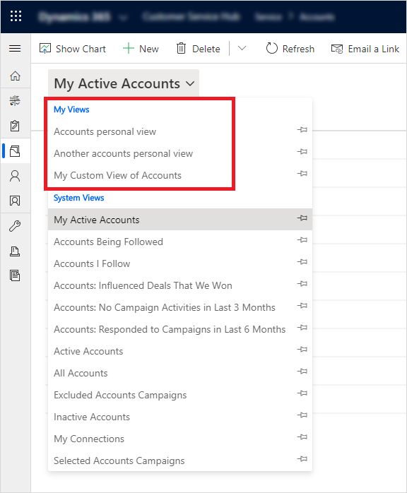
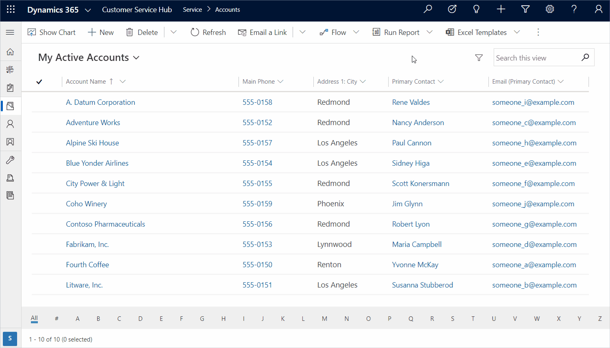
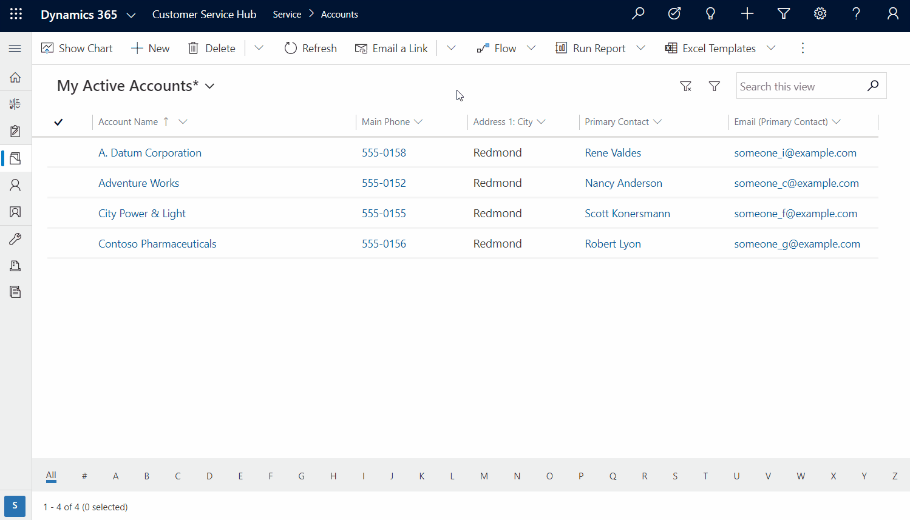
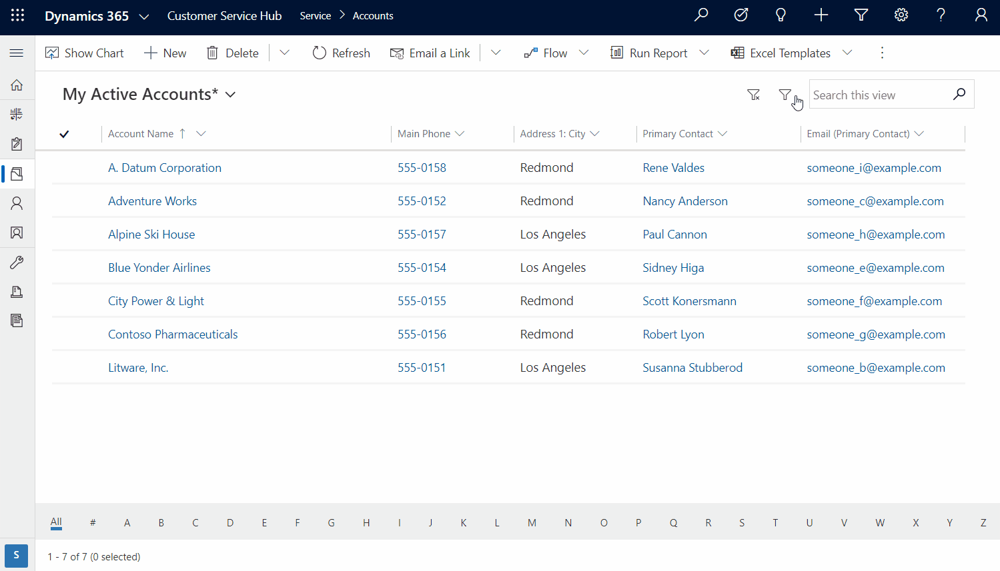

# Edit or create personal views using advanced grid filters 

Easily create a personal view for yourself to see the records that are important to you. The advanced filters allow you to create a wide range of views from simple to complex that you can also add group and nested conditions to.

When you create and save a personal view, it appears in your list of personal views under **My Views**.

> [!NOTE]
> The advanced filter option  is only available to English organizations.

## See the current view definition

- To see which filters were applied to the current view, select a view and then select the filter icon . This opens expression builder and displays the default view definition.

   > [!div class="mx-imgBorder"] 
   > 

## Add conditions to filters

1. To edit the current view and add more filters, select a view and then select the filter icon .
2. On the **Advanced filters** screen use the expression builder to add conditions to filters. For more information on how to add conditions, see [Add conditions to a filter](https://docs.microsoft.com/powerapps/maker/model-driven-apps/create-edit-view-filters#add-conditions-to-a-filter).
3. When you're done, select **Apply**. 

   > [!div class="mx-imgBorder"] 
   > 

### Add a group or nested condition 

To drill down further into your data, you can add a group or nested condition to a filter. For more information, see [Add a group condition to a filter](https://docs.microsoft.com/powerapps/maker/model-driven-apps/create-edit-view-filters#add-a-group-condition-to-a-filter).

   > [!div class="mx-imgBorder"] 
   > 

### Clear filters

To clear filters that were applied and reset the view back to the original definition, select the clear filter icon .

### Save your personal view

An asterisk next to a view name indicates the view has not been saved. 

   > [!div class="mx-imgBorder"] 
   >

1. To save a personal view, on the command bar select the more icon . 
2. Select **Create view** > **Save filter as new view**.
3. On the **Save as new view** dialog box, type in a name and description for the view and then select **Save**.
4. Go to your list of view to see the new personal view that you created.
 
   > [!div class="mx-imgBorder"] 
   > 

   
