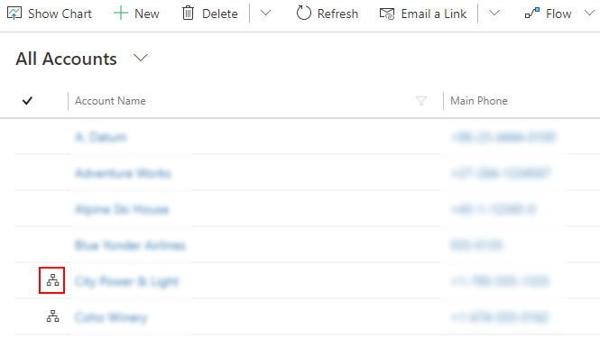

# Use filters on a grid

Grids in Unified Interface have been improved to increase the amount of data that can be seen on your screen. There are many different filtering options that are avilable. The type of data in the column determines which filter options are available. For example, the **Full Name** column in the **Contacts** grid will have different filter options than the **Activity Type** column in the **Activites** Gird.

   > [!div class="mx-imgBorder"]
   > 
   
   
## Lookup field column

When you filter on a lookup column, you can select from a list of records to filter by rather manually typing in the data. For example, on a **Account** lookup column select the acccout names from the list of records to filter by.

   > [!div class="mx-imgBorder"]
   > 

## Date filter

The **Date** filter on grids is a very powerful filter. There are many different filters to choose from, such as **On** to seach by exact date or select filter such as **Next X fiscal year** or **In fiscal period** to search by year.

   > [!div class="mx-imgBorder"]
   > 

## Grid and filter navigation 

When you filter data on a grid the page remembers the filter, sort, and the page state when you navigate away and then come back to the page. This includes quick find, column filtering, page number, and more. The navigation outside the page opens with the initial state.

   > [!div class="mx-imgBorder"]
   > 

The jump bar uses the first sorted field. If no sort change has been made, the jump bar uses the primary field. 

   > [!div class="mx-imgBorder"]
   > 
  
   
When you select the hierarchy icon, it will navigate to the hierarchy form.

   > [!div class="mx-imgBorder"]
   > 
   
You can also open primary field and lookup fields in new tab or window.

   > [!div class="mx-imgBorder"]
   > 

