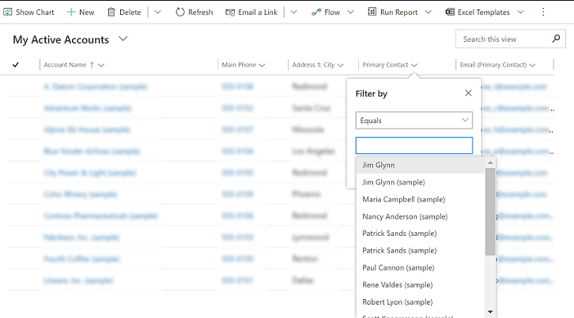
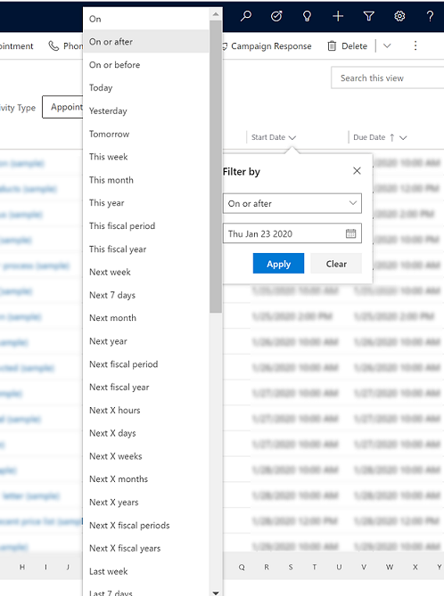
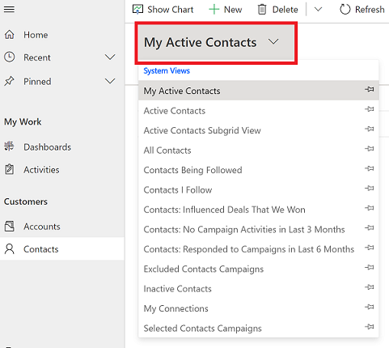
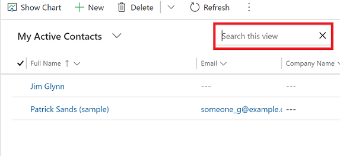

# Use filters on a grid

Grids in the Unified Interface have been improved to increase the amount of data that can be seen on your screen. There are many different filtering options that are avilable. The type of data in the column determines which filter options are available. For example, the **Full Name** column in the **Contacts** grid will have different filter options than the **Activity Type** column in the **Activities** gird.

   > [!div class="mx-imgBorder"]
   > 
   
   
## Lookup field column

When you filter on a lookup column, you can select from a list of records to filter by rather then manually typing in data. For example, on an **Primary Contact** lookup column select the contact name from the list of records to filter by.

   > [!div class="mx-imgBorder"]
   > 

## Date filter

The **Date** filter on grids is a robust filter. There are many different filters to choose from, such as **On** to seach by exact date or select filter such as **Next X fiscal year** or **In fiscal period** to search by year or quarter.

   > [!div class="mx-imgBorder"]
   > 

## Grid and filter navigation 

When you filter data on a grid, the main grid page remembers the filter, sort, and the page state when you navigate away and then come back to the page. This includes quick find, column filtering, page number, and more. The navigation outside the page opens with the initial state.

   > [!div class="mx-imgBorder"]
   > 

The jump bar uses the first sorted field. If no sort change has been made, the jump bar uses the primary field. 

   > [!div class="mx-imgBorder"]
   > 
  
   
When you select the hierarchy icon, it will navigate to the hierarchy form.

   > [!div class="mx-imgBorder"]
   > 
   
You can also open primary field and lookup fields in new tab or window.

   > [!div class="mx-imgBorder"]
   > 

## Use search on a grid
When you use the **Search this view** option on a grid page, the system searchs for data in the view that you are in. 

1. For example, go to the **Contacts** grid and from the list of view select **My Active Contacts**.

    > [!div class="mx-imgBorder"]
    > 
    
2. Select **Search this view** to search for data in the current view that you are in.

    > [!div class="mx-imgBorder"]
    > 

The system will search for data in the **My Active Contacts** view and when search data is displayed, it will show the same set of columns that is in your current view.

   > [!div class="mx-imgBorder"]
   > 

### Use quick find search experience
To switch back to the old quick find search experience that uses an entity's quick find view definition when a search is performd, you will need admin permissions. 
 
1. From the upper-right corner select the **Gear** icon (). Then select **Advanced settings**. 
2. Go to **Settings** > **Administration** > **System Settings**.
3. on the **General** tab, under **Set up Quick Find** select, **Yes** for **Use quick find view of an entity for searching on grids and sub-grids**.
