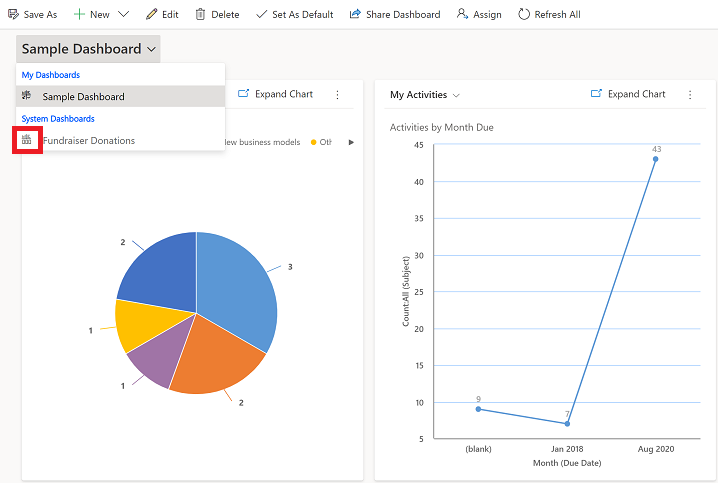

# Use interactive dashboards and charts

Use interactive dashboards to see workload information and take action. The charts on a interactive dashboard serves as a simple filtering source. You can select different data points on a chart to filter data based on the filter criteria. 

Interactive dashboards are system dashboards that only an admin can create. To learn more on how to create and configure interactive dashboards, see [Create and configure model-driven app interactive experience dashboards](https://docs.microsoft.com/powerapps/maker/model-driven-apps/configure-interactive-experience-dashboards).

The interactive dashboards come in two forms: multi-stream and single-stream. In addition, multi-stream dashboards can be home page or entity-specific dashboards. The multi-stream dashboards display data in real time over multiple data streams. 

> [!div class="mx-imgBorder"]
>  

The single-stream dashboards display real-time data over one stream based on an entity view. The tiles are positioned on the right side of the dashboards and are always shown.

> [!div class="mx-imgBorder"]
>  

 
 ## Work with interactive dashboard
 
 Use the visual filter option to drill down in to the data on the charts.
 
1. To view an interactive dashbaord, in the list of dashbards find the one that has the interactive icon  next the dashboard name.

  > [!div class="mx-imgBorder"]
  > 
  
2. On the command bar, select **Show visual Filter**. 

  > [!div class="mx-imgBorder"]
  > 
  
3. Select a drill down option.

  > [!div class="mx-imgBorder"]
  > 
  
4. Select an area one of the chart or graph to apply a filter. 

  > [!div class="mx-imgBorder"]
  > 
  
5. To clear filter, select the **X** next to the filter or to clear all filters, select **Clear All**.

  > [!div class="mx-imgBorder"]
  > 
