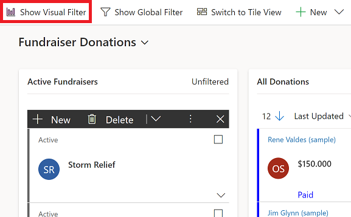
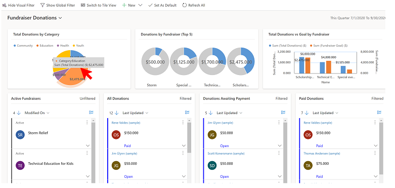

# Use interactive dashboards and charts

Use interactive dashboards to see workload information and take action. The charts on a interactive dashboard serves as a simple filtering source. You can select data point on a chart, and it will filter the data on the dashboard based on the filter criteria. 

To learn more on how to create and configure interactive dashboards, see [Create and configure model-driven app interactive experience dashboards](https://docs.microsoft.com/powerapps/maker/model-driven-apps/configure-interactive-experience-dashboards).

> [!div class="mx-imgBorder"]
>  
 
 ## Work with interactive dashboard
 Use the visual filter option to see visual filters for work streasm below. 
 
1. To view an interactive dashbaord, in the list of dashbards find the one that has the interactive icon  next the dashboard name.

  > [!div class="mx-imgBorder"]
  > 
  
2. On the command bar, select **Show visual Filter**. 

  > [!div class="mx-imgBorder"]
  > 
  
3. Select an area one of the chart or graphs to apply a filter. 

  > [!div class="mx-imgBorder"]
  > 
