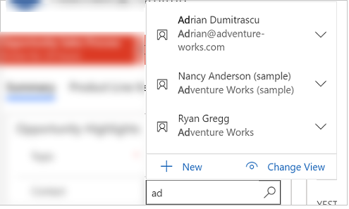
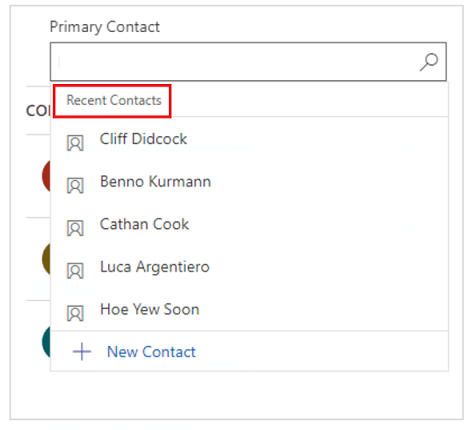
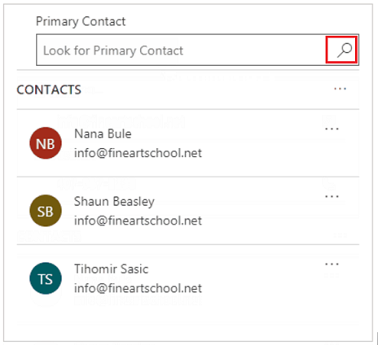
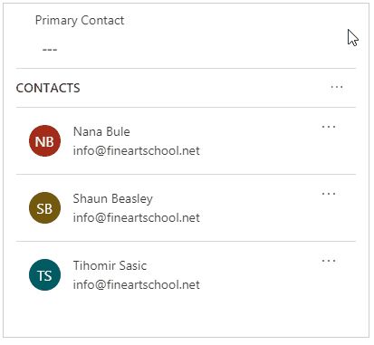
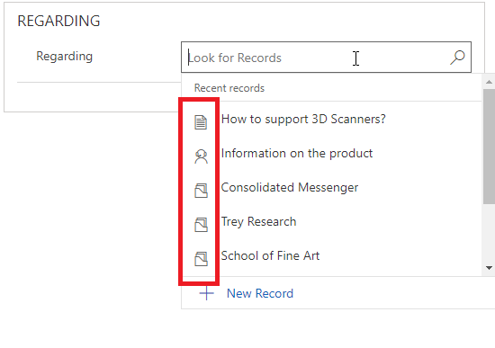

#  Use the lookup field on a record

Lookup helps you to choose records from a related entity. When you select a related entity and enter search criteria, such as a name or email address, lookup automatically begins to resolve the partial text and displays any matching records. If no records are displayed after you have typed the full text of your search criteria, a message is displayed specifying that there are no records.

For example, you might search for the name **Adrian Dumitrascu**. When you type **ad**, possible matching records are automatically populated and displayed.

  > [!div class="mx-imgBorder"]
  > 
  
>[!NOTE] 
>An administrator can define the criteria that lookup uses for resolving partial search text.

Also, you can create a new record by selecting the **New** button. You must have sufficient permissions to view the **New** button and create a record. When you select the lookup field, the five most recently used records are displayed along with five favorite records. Which records are displayed depends on your view history and the favorites you’ve pinned. 

For example, if you have only three records in your history, lookup will display those three,
along with seven of your favorite records. If you have not pinned any favorites, only the most recently viewed records will be displayed.

## Types of lookups

Lookups are classified into the following: 

- **Simple lookup:** Select a single record in a field from a single entity. 

- **PartyList-type fields:** Use to select multiple records from multiple entities in a lookup. Use partylist-type fields to select multiple records. This allows you to add each record by performing a new search, multiple times. Every time you select a record, you will be able to perform a new search for another record.
  
- **Regarding-type fields:** Use to select a single record from multiple entities in a lookup. 

## Browse in a lookup field

To search a lookup, select the textbox and type your search criteria. If recent records are enabled for your lookup, your recent records will be displayed when you select the textbox.

  > [!div class="mx-imgBorder"]
  >   

## Search in a lookup field

To browse a lookup, select the lookup icon (magnifying glass). A full list of items will be shown in the dropdown.

  > [!div class="mx-imgBorder"]
  >   
 

When you select the lookup icon (magnifying glass) or the text box, it shows the same list of most recently used records.

  > [!div class="mx-imgBorder"]
  >   
  
The list of records shows an image to help distinguish between record types.

  > [!div class="mx-imgBorder"]
  >   
  
  
When results span multiple record types, you can see how many types of records there are and select them from the list.

  > [!div class="mx-imgBorder"]
  >   
