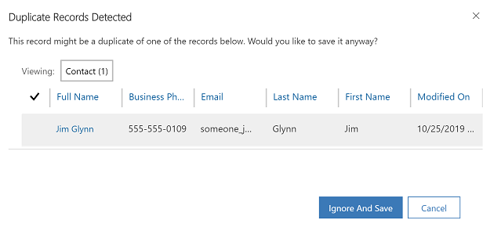
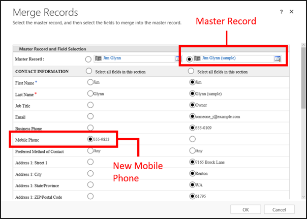

# Merge duplicate records 

Duplicate records can creep into your data when you or others enter data manually or import data in bulk. Common Data Service helps you address potential duplicates by providing duplicate detection for active records such as, accounts and contacts. When you merge a record any related or child records will also be merged. Your administrator may also set up duplicate detection rules for other situations.  
  
For example, let's say you enter a contact record, Jim Glynn,  along with a mobile phone number.  The duplicate detection rule discovers that you already have a similar record, and displays this dialog box.  
  
 > [!div class="mx-imgBorder"] 
 >   
  
 You're not sure if this is a new record (one that happens to have the  same name as an existing contact) or a duplicate, so you select **Ignore And Save**.  
  
 Next, you go to the **All Contacts** list and see that now you have two records with the same name. After reviewing the records,  you  determine that they're duplicates that need to be merged.  
 
 > [!div class="mx-imgBorder"] 
 >   
 
Common Data Service includes duplicate detection rules for accounts and contacts. These rules are automatically turned on, so you don’t have to do anything to set up duplicate detection for these record types.  
  
> [!NOTE]
>  If available on your system, you may also be able to check for duplicates of other record types, in addition to contacts and accounts. Check with your system administrator. [Find your administrator or support person](find-admin.md)  
  
## Merge duplicate records  
  
1. Select the duplicate records, and then select **Merge**.  
  
   > [!div class="mx-imgBorder"] 
   >   
  
2. In the **Merge Records** dialog box, select the master record (the one you want to keep), and then select any fields in the new record that you want to merge into the master record. Data in these fields may override the existing data in the master record. Select **OK**.  
  
     
   > [!div class="mx-imgBorder"] 
   >   
  
> [!NOTE]
>  There are a few situations when duplicates may be found:  
> 
> - When a record is created or updated.  
>   - When  you're using Dynamics 365 for Outlook and you go from offline to online.  
>   - When you import data using the Import Data wizard.  
> 
>   Duplicates aren't detected when you merge records, save an activity as completed, or change the status of a record, such as activating or reactivating a record.  
