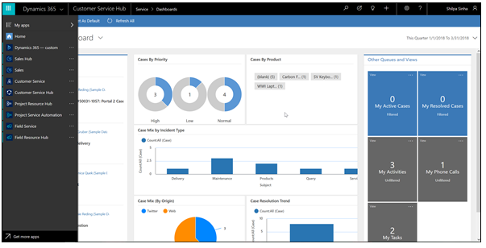
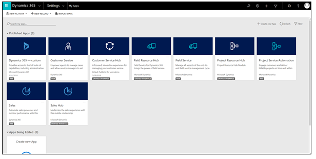
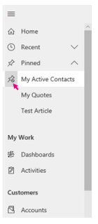

#  Basic navigation in a Model-driven app 

Use the nav bar to get to your work area, create a new record, search, or do other tasks in a Model-driven app.

## Accessing Unified Interface apps on browsers

You can access the installed Unified Interface and web apps from multiple interfaces. On browsers you can see all the apps both Unified Interface and web:

1. In [https://home.dynamics.com](https://home.dynamics.com)

2. In app navigatoin

3. In My Apps page under Settings

## Navigation

1. Sitemap is expanded and persists by default.
2. The sub area that you are currently in is highlighted to indicate where in the app.
3. **Recent** and **Pinned** items are at top for easy access. 
4. Use the Area switcher to switch between Apps.
5. There are unique colors for icons on the command bar to show differentiation between commands.
  
### Get back to recent records, items, or view
You probably work with the same records all the time. For example, you may access the same contact or account on a regular basis. Or you may work with the same lists (views) of data over and over. You can quickly get back to recently used records or views from the Site Map. You can also pin records and views to make them easier to find. 
  
1. From the **Site Map**, click **Recent**.
  
2. Under **Recent**, choose the record, item, or view you want to go back to. 

#### Pin records, items, or view

1. From the **Site Map**, click **Recent** to expand the list of recently accessed items.
2. Select the pin icon next to the item in the recent list, and it will be added to the pinned list.

#### Unpin records, items, or view

1. From the **Site Map**, click **Pinned** to expand the list of pinned items.
2. Select the unpin icon next to the item, and it will drop off from the list.  

#### Record set navigation 
Navigate through multiple records with pre-set views and queries. The record-focused navigation improves productivity by allowing users to jump from record to record in the list and easily navigate back without losing their working list.

