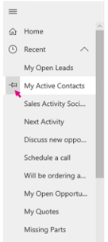
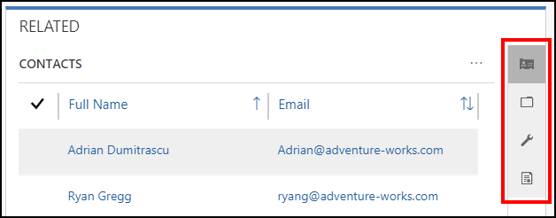
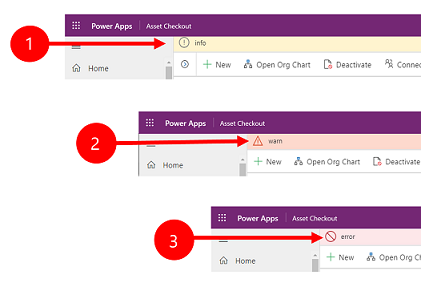

#  Basic navigation in a model-driven app 

Use the navigation bar to get to your work area, create a new record, search, or do other tasks in a model-driven app.

> [!div class="mx-imgBorder"]
> 

1. The site map is expanded and persists by default.
2. The sub area that you are currently in is highlighted to indicate where you are in the app.
3. **Recent** and **Pinned** items are at the top for easy access. 
4. Use the Area switcher to switch between apps.
5. Icons have unique colors on the command bar to show differentiation between commands.
  
## Get back to recent records, items, or view
You probably work with the same records most of the time. For example, you might access the same contact or account on a regular basis. Or you might work with the same lists (views) of data over and over. You can quickly get back to recently used records or views from the site map. You can also pin records and views to make them easier to find. 
  
1. From the **Site Map**, select **Recent**.
  
2. Under **Recent**, choose the record, item, or view you want to go back to. 

## Pin records, items, or view

1. From the **Site Map**, select **Recent** to expand the list of recently accessed items.
2. Select the pin icon next to the item in the recent list, and it will be added to the pinned list.

   > [!div class="mx-imgBorder"]
   > 

## Unpin records, items, or view

1. From the **Site Map**, select **Pinned** to expand the list of pinned items.
2. Select the unpin icon next to the item, and it will drop off the list.  

   > [!div class="mx-imgBorder"]
   > 

## Record set navigation 
Navigate through multiple records with preset views and queries. The record-focused navigation improves productivity by allowing users to jump from record to record in the list and easily navigate back without losing their working list.

> [!div class="mx-imgBorder"]
> 

## Reference panel
The reference panel is a great way to get work done without moving away from the screen you’re on. You can look up other related things, such as cases or opportunities for an account, within the context of the record you’re viewing without navigating to other screen.

> [!div class="mx-imgBorder"]
> 

 Watch this video to learn more about the Reference Panel:

<iframe src="https://www.microsoft.com/en-us/videoplayer/embed/d8224c3f-6e20-4b8e-9d0d-b0f5602c7708" frameborder="0" allowfullscreen=""></iframe>

## Notifications 

There are three types of notifications that are shown on a form: Informational, Warning and Error. Notifications are always available at the top of the form, just above the header.

When you select the error notification, it will take you to the field on the form where the error occurred.

If there is only one notification you will see a single line.

If there is more than one notification, you will see the number of notifications. Select the chevron, to view each message.

## Grids

Grids in Unified Interface have been improved to increase the amount of data that can be seen on your screen. Grids also have improved filtering options which include remembering your last filter and sorts order. For a detailed list of improvements see this blog post, [Enhanced functionality in Unified Interface grids](https://powerapps.microsoft.com/en-us/blog/enhanced-functionality-in-unified-interface-grids).

