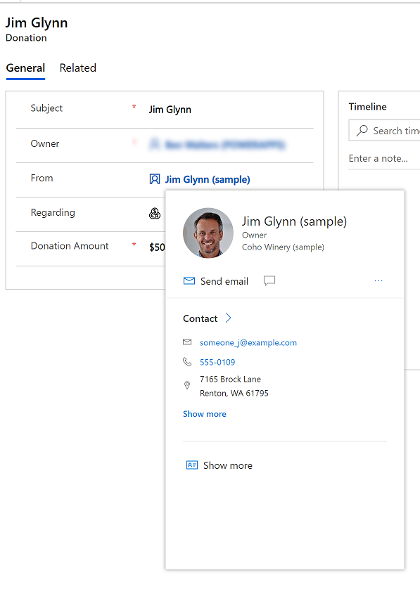
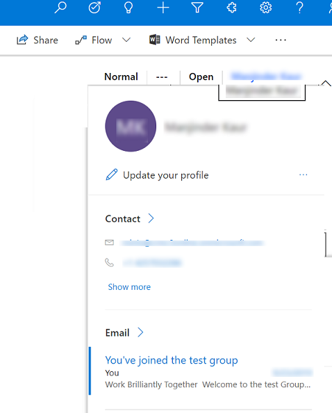

# View the profile card for a contact or user

Use the profile card to get quick information about a contact or user. When you select a contact or user field in Dynamics 365 apps (such as Dynamics 365 Sales and Dynamics 365 Customer Service), you can find information related to them on their profile card. For more information about profile cards, see [Profile cards in Office 365](https://support.office.com/article/Profile-cards-in-Office-365-e80f931f-5fc4-4a59-ba6e-c1e35a85b501).

> [!NOTE]
>  - Profile card is available for the  **Contact** and **User** entity. For information, see [Enable the profile card (for admins)](https://docs.microsoft.com/dynamics365/customer-engagement/admin/enable-profile-card).
>  - The profile card in Common Data Service is not displayed if multi-factor authentication is turned on for Office Delve service in Azure Active Directory.

## View a contact's profile

1.	Go to **Activities**.
2.	Select an existing activity or create a new one.
3.	Hover over the **Call To** field when it has a contact record. 

You can view details of the contact inline which includes the contact picture, name, title and account.

4. To view more details, select **Show more** to expand the contact's profile.
 
    > [!div class="mx-imgBorder"] 
    > 
   
 ## View a user's profile
 
1.	Go to **Accounts**.
2.	Select an account record.
3.	Hover over the owner field when it has a user record. You can view the details of the user inline.
4.  To view more details like emails and shared files with the user, select **Show more** to expand the contact's profile.
 
    > [!div class="mx-imgBorder"] 
    > 

 ## FAQs
 
### Where can I see profile cards in Dynamics 365?
Profile cards can be seen on contact and user records. You can only view them when they are in a lookup.

### Where is information shown in the profile card coming from?
The information shown on the contact profile card is fetched from Common Data Service (and not Microsoft Exchange). This means the contact details are coming from Dynamics 365.

The information shown on the user profile card is fetched from Office 365 (Azure Active Directory). For more information, see [Profile cards in Office 365 (admin section)](https://support.office.com/article/Profile-cards-in-Office-365-e80f931f-5fc4-4a59-ba6e-c1e35a85b501).

### How can I customize the fields shown on the profile card?
Currently, the list of fields displayed on the profile card are not open for customization.

### Why is the **Start chat** option on the profile card disabled (greyed out)?
The **Start chat** and the **Send Email** options on the profile card will open your default instant message and email apps. The **Start chat** option is enabled if the person you are trying to contact in the same Azure Active Directory environment as you or is a federated contact.

  
