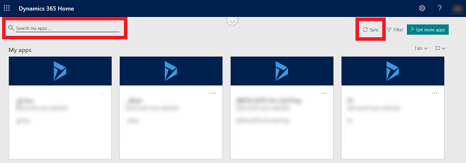
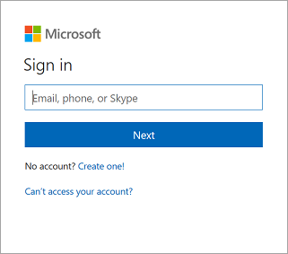
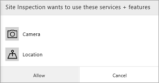

# Run an app in a web browser
When you create an app, or someone shares an app with you, you can run that app on Windows, iOS, Android, or in a web browser. In this topic, you'll learn how to run a canvas or model-driven app in a web browser from the [Dynamics 365 Home page](https://home.dynamics.com).

To follow this quickstart, you need:
- A Power Apps license. This is available with a Power Apps plan, such as the [Power Apps Plan 2 trial](https://docs.microsoft.com/powerapps/maker/signup-for-powerapps), or any of the [Microsoft Office 365](https://signup.microsoft.com/Signup?OfferId=467eab54-127b-42d3-b046-3844b860bebf&dl=O365_BUSINESS_PREMIUM&ali=1) or [Dynamics 365](https://dynamics.microsoft.com/pricing/) plans that include PowerApps. 
- Access to an app that you built or that someone else built and shared with you.
- Access to a supported web browser and operating system.
   - For canvas apps, see: [System requirements, limits, and configuration values](../maker/canvas-apps/limits-and-config.md)
   - For model-driven apps, see: [Supported web browsers and mobile devices](https://docs.microsoft.com/dynamics365/customer-engagement/admin/supported-web-browsers-and-mobile-devices)

## Sign in to Dynamics 365
Sign in to Dynamics 365 at [https://home.dynamics.com](https://home.dynamics.com).

## Find an app on the Home page
The Home page may show several types of business apps, but you can find a specific app by typing part of its name in the search box. You can also filter the list to show only apps created by a specific source, such as PowerApps. To do this, select **Filter** and then select the source.

If you've recently installed the app, it might not immediately appear in the list of apps. Select **Sync** to show all your apps. This process may take up to a minute.

## Run an app from a URL
You can save an app's URL as a bookmark in your browser and run it by selecting the bookmark, or you can send a URL as a link through email. If someone else created an app and shared it with you in an email, you can run the app by selecting the link in the email. When running an app using a URL, you may be prompted to sign in using your Azure Active Directory credentials.

## Connect to data
If an app requires a connection to a data source or permission to use the device's capabilities (such as the camera or location services), you must give consent before you can use the app. Typically, you're prompted only the first time.

## Close an app
To close an app, sign out of the Dynamics 365 Home page, or open another app.

## Next steps
In this topic, you learned how to run a canvas or model-driven app in a web browser. To learn how to:
- run a canvas app on a mobile device, see [Run a canvas app on a mobile device](run-app-client.md)
- run a model-driven app on a mobile device, see [Run a model-driven app on a mobile device](run-app-client-model-driven.md)
- use a model-driven app, see [Use model-driven apps](use-model-driven-apps.md)

