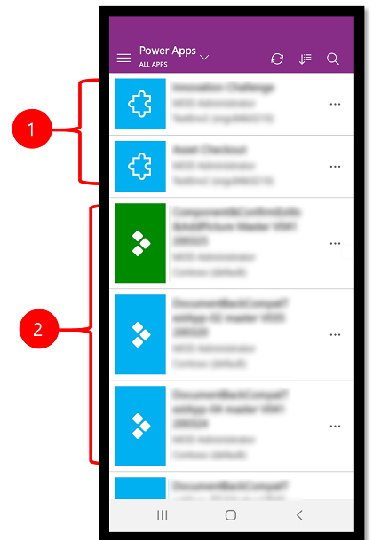
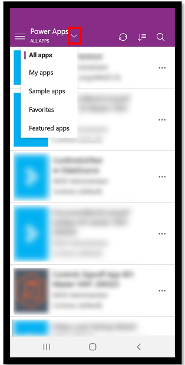
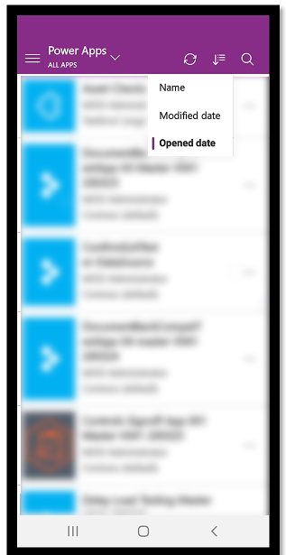
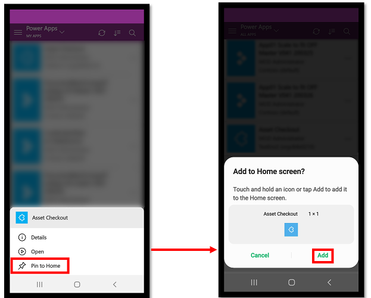
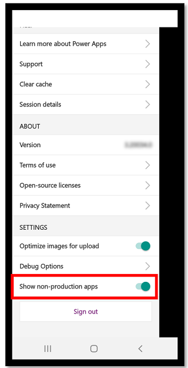

# Run canvas and model-driven apps on a mobile device

This is an early-access feature. You can opt in early to enable these features in your environment. This will allow you to test these features and then adopt them across your environments. For information on how to enable these features, see [Opt in to 2020 release wave 1 updates](https://docs.microsoft.com/power-platform/admin/opt-in-early-access-updates).

When you create an app, or someone shares an app with you, you can run that app on iOS and Android device using the Power Apps mobile app. The mobile app is not supported on Windows devices. In this topic, you'll learn how to get started and run a canvas app and a model-driven app on your mobile device. 

For detailed instructions on how to use model-driven app running on the Power Apps mobile app, see [User Guide for model-driven apps running on the Power Apps mobile app](use-custom-model-driven-app-on-mobile.md).

> [!IMPORTANT]
> Model-driven apps for sales, customer service, and field service don't run in the Power Apps mobile app. Instead, you use the Dynamics 365 for phones and tablets app. For more information, see [User Guide for Dynamics 365 for phones and tablets](https://docs.microsoft.com/dynamics365/mobile-app/dynamics-365-phones-tablets-users-guide).

Legend:

1. **Model-driven apps**
2. **Canvas apps**

To follow this procedure, if you're not signed up for Power Apps, [sign up for free](https://make.powerapps.com/signup?redirect=marketing&email=) before you begin, and then download Power Apps from the [App Store](https://itunes.apple.com/app/powerapps/id1047318566?mt=8) or [Google Play](https://play.google.com/store/apps/details?id=com.microsoft.msapps) onto an iPhone, iPad, or Android device running a [supported operating system](../maker/canvas-apps/limits-and-config.md). Also, make sure you have access to an app that you created or that someone else created and shared with you.

## Open Power Apps and sign in
Open Power Apps on your mobile device and sign in using your Azure Active Directory credentials.

If you have the Microsoft Authenticator app installed on your mobile device, simply enter your username when prompted, and then approve the notification sent to your device.

## Find the app
To make it easier to find the app, open the **Power Apps** menu, and then select a filter. 

Only the **My apps** and **All apps** filters apply to model-driven apps. For early-access, **My apps** filters shows **All apps** for model-driven apps.

The following filters are available:

* **All apps** : Displays all canvas and model-driven apps to which you have access, including apps you created and apps that others shared with you.

* **My apps**: Displays both canvas and model-driven apps that you've run at least once.

* **Sample apps** (only for canvas apps): Displays sample canvas apps from Microsoft that showcase real application scenarios with fictitious data to help you explore design possibilities.

* **Favorites** (only for canvas apps): Displays canvas apps that you've marked by selecting the ellipsis (...) on the app tile, and then select **Favorite**. To remove an app from this list, select the ellipsis (...) on the app tile, and then tap **Unfavorite**.

    

* **Featured apps** (only for canvas apps): Displays canvas apps that your admin as marked as featured apps.

### Sort apps

After you filter your apps, you can sort the filtered list by the date the apps were most recently opened or modified, or alphabetically by name. These preferences are retained when you close and reopen apps. You can sort both canvas and model-driven apps.

### Search apps

If you know the name of the app you want to run, you can select the search icon at the top, and then type part of its name in the search box. You can search for both canvas and model-driven apps.

If you filtered your apps, it will search the filtered list.

### Refresh the list of apps

Select the refresh icon  to refresh the list of apps. This will refresh both the canvas and model-driven app list. 

## Run an app
To run an app on a mobile device, select the app tile. If someone else created an app and shared it with you in an email, you can run the app by selecting the link in the email.

If this is the first time you're using the Power Apps mobile app, a screen shows the swipe gestures.

### Gesture to close the app:

### Gestures to pinch and zoom:

### Give consent
If an app requires a connection to a data source or permission to use the device's capabilities (such as the camera or location services), you must give consent before you can use the app. Typically, you're prompted only the first time.

## Pin an app to the home screen
You can pin both canvas and model-driven apps to the home screen of your device for quick access. Select the ellipsis (...) on the app tile, select **Pin to Home**, and then follow the instructions that appear.

## See non production apps

By default, only production model-driven apps are shown in the list of apps. 

To see model-driven apps from non production environments, select the setting menu  and then set the **Show non production apps** toggle to on, and then follow the instructions that appear.

## Close an app
To close an app, use your finger to swipe from the left edge of the app to the right. On Android devices, you can also press the Back button and then confirm that you intended to close the app.

## Next steps
In this topic, you learned how to install and run a canvas and model-driven apps on your mobile device. Next, see the user guide for detailed instructions on how to use model-driven apps running on the Power Apps mobile app. 
> [!div class="nextstepaction"]
> [User Guide for model-driven apps running on the Power Apps mobile app](use-custom-model-driven-app-on-mobile.md)
