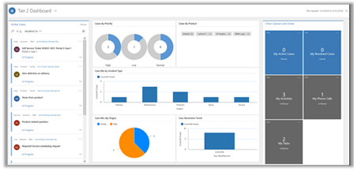
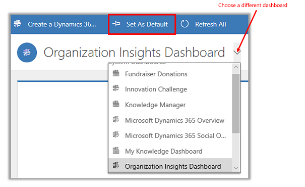
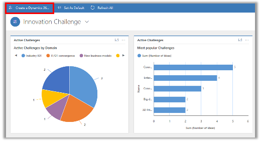
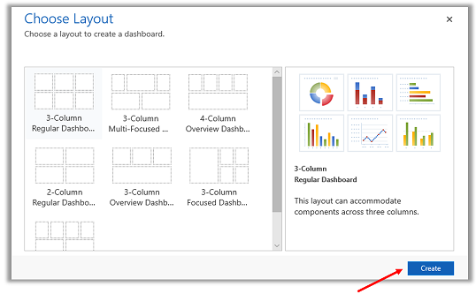
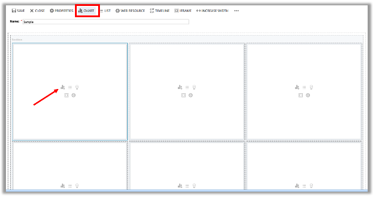

# Track your progress with dashboards and charts

Dashboards take a collection of app data and provide insights to show key performance indicators (KPI) and other important data in easy-to-read interactive charts and graphs. Dashboards are available for all record types.

 

-  To see a different dashboard layout, click the down arrow next to the name of the dashboard, and then select the layout you want.
-  To choose a default dashboard, display the dashboard you want, and then click **Set as Default** at the top of the screen.

 

## Create a new dashboard

1. To create a new dashboard, click **Create a Dynamics 365 Dashboard**. 

   
   
2. Choose a dashboard layout and click **Create**.  

 
 
3. Type in a name for the dashbaord. 
4. Add what you want to each area of your dashboard. For example, let's add a chart. 

 
 
 5. Select the **Record Type** for the chart.
 6. Select a **View** that the data in the chart will display.
 7. Choose the chart and then click **Add**.
 8. Continue adding compontents to the dashboard and when are done click **Save**. 
 
 The dashboard that you created will appear in the drop-down of available dashboards.

## Use charts 

Charts provide you a quick view of how you’re tracking to your goals. They’re also interactive, so you can click or tap an area of a chart to get more info.

-   Hover your mouse over the chart to see a tooltip that provides quick info about that area of the chart.

-   Click on the area of a chart to see a grid view with more details about the data in the chart.

-   To expand a chart, click the **Expand Chart**   button.

-   To view records in chart or refresh the chart, click  and then choose an  action: **Refresh** or **View Records**.
            
       
       

**Change the chart view**
 
Changing the chart view shows you a different breakdown of your data, such as opportunities opened within a specific time period. You can change a chart view by selecting the View selector on the Grid page.

For example, choose "All Opportunities", then select a different view, both chart and grid will get refreshed.

