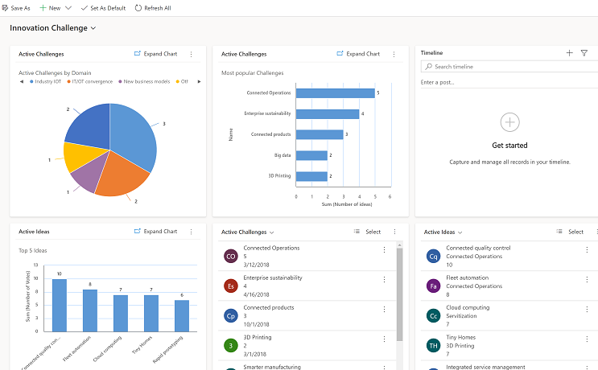
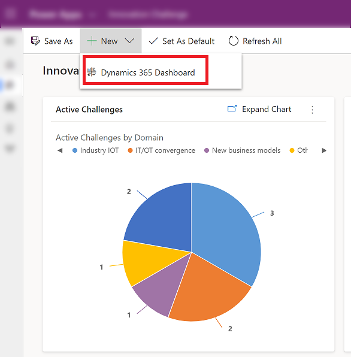
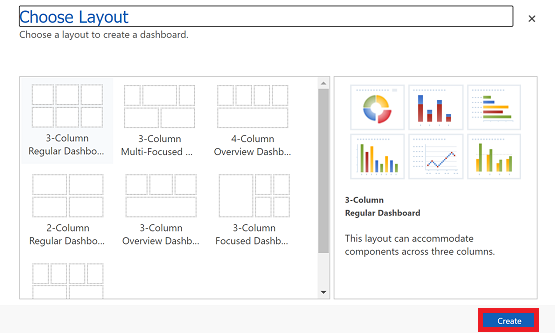
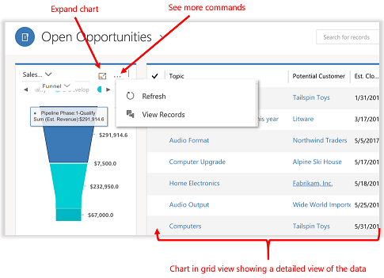

# Track your progress with dashboards and charts

Dashboards provide interactive charts and graphs that display important app data which gives you a 360 degree view of your business. Dashboards help you to understand key performance indicators (KPI) in real-time. A dashboard is made up of a collection of easy-to-read charts that provide visual representation of filtered app data.

Dashboards are available for all record types. 

> [!div class="mx-imgBorder"]
>  

## Create a dashbaord and add charts

1. On the left under **My Work** select the **Dashboard** work area and then on the command bar select **New** > **Dynamics 365 Dashboard**. 

   > [!div class="mx-imgBorder"]
   > 
   
2. Choose a layout and then select **Create**. This is how your dashboard displays the charts, graphics, and numbers. 

   > [!div class="mx-imgBorder"]
   > 
 
3. Type in a name for the dashboard. 

   > [!div class="mx-imgBorder"]
   > 
   
   
4. Add what you want to each area of your dashboard. For example, let's add a chart. 

   > [!div class="mx-imgBorder"]
   > 
 
5. On the **Add Componet** dialog box, select your options. 
 
      |  |  |
      | --- | --- |
      | **Record Type** |Select a record.  |
      | **View** |Select a view for the record.  |
      | **Chart** |Select the type of chart that you want use. |

    > [!div class="mx-imgBorder"]
    > 

 
6. When you're done adding each compoent, select **Add**.
 

7. Continue adding components to the dashboard. You can add up to six components.   
 
   > [!div class="mx-imgBorder"]
   > 
 
8. When you are done, on the command bar select **Save**. 
 
9. The dashboard that you created will appear in the drop-down menu under **My Dashbaords**.

   > [!div class="mx-imgBorder"]
   > 

## Use charts 

Charts provide you with a quick view of how you’re tracking to your goals. They’re also interactive, so you can select different areas of a chart to get more info. Charts are aviable on the dashboard page, grid and associated home page, and on edit form page. 

### Charts on dashboard page

When you add a chart on a dashboard page, you can configure view selector and view title or chart selector and chart title.

-   Hover your mouse over the chart to see a tooltip that provides quick information about that area of the chart.
-   Click on the area of a chart to see a grid view with more details about the data in the chart.
-   To expand a chart, select the **Expand Chart**   button.
-   To view records in the chart or refresh the chart, select  and then choose an  action: **Refresh** or **View Records**.
     
     > [!div class="mx-imgBorder"]
     >   
       

**Change the chart view**
 
Changing the chart view shows you a different breakdown of your data, such as opportunities opened within a specific time period. You can change a chart view by selecting the View selector on the Grid page.

For example, choose "All Opportunities," then select a different view, and both chart and grid will get refreshed.

> [!div class="mx-imgBorder"]
> 

## Known issues  
In the chart designer, adding a order by on certain calculated fields are not supported and will cause an error.  The calculated fields causing this are using another calculated fields, a related entity field, or a local field on the entity.

