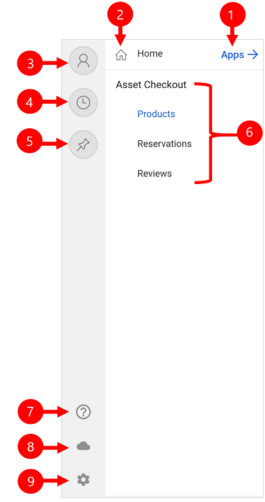
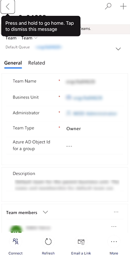
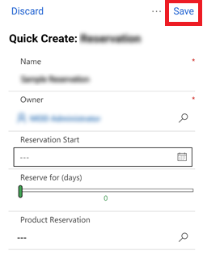
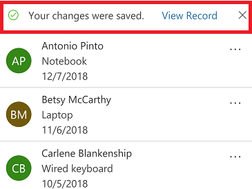
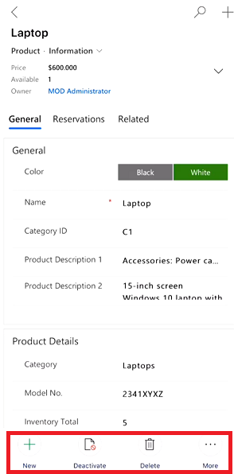
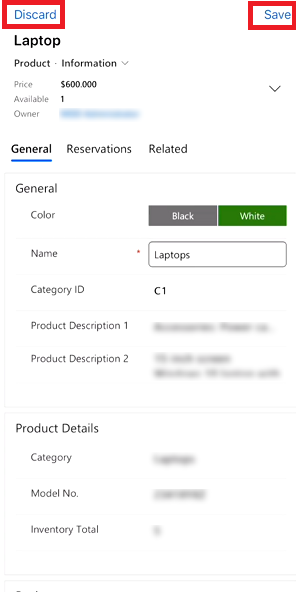

# Use a custom model-driven app on a mobile device

Use the Power Apps mobile app to run your custom model-driven apps on your phone.

## Home screen 

It's easy to get around in the Power Apps mobile app. The following illustration shows the primary navigation elements on the Home screen. 

Legend:

1. **Site map**: Open the menu move between apps, get to your favorite and recently used records, access settings and more.
2. **Search**: Search for app records in Common Data Service.
3. **Quick Create**: Create a new record and quickly enter almost any type of information into the system.
4. **Select**: Select multiple records from the current view.
5. **Sort**: Sort records.
6. **Search**: Search for app records in Common Data Service.
7. **More**: Access more commands.

### Site map screen

From the Home sceen, select the site map  to accces entites, favorite or most-used records, other apps, and settings.

Legend

1. **App selector**: Open this menu to move between apps.
2. **Home screen**: Select this to go back to the Home screen.
3. **Profile**: Go to the Profile sceen to sign out or reconfigure the app. 
4. **Recent records**: View a list of records you were recently using. 
5. **Pinned recrods**: Vew and open your favorite (pinned) records. 
6. **Entity navigator**: This area lists the entity available in the app.
7. **Help**: Access help content for more information on how to use the Power Apps mobile app.
8. **Offline Status**: Work with your data in offline mode even when you don't have internet access. For more information, see [Work offline on your mobile device](https://docs.microsoft.com/dynamics365/mobile-app/work-in-offline-mode).
9. **Settings**: Access settings.

### Pin favorite records

The **Pinned** and **Recent** provides quick access to your records that you have recently used or pinned to favorites. 
Use the **Recent** records list to pin favorite records.  

1. From the site map  select, **Recent** .

2. On the **Recent** records screen, select the push-pin icon next to a record to add it to your favorites (pinned records).

3. To view the newly pinned records, select  > 

> [!div class="mx-imgBorder"]
> .

#### Unpinn a record

 1.  From the site map  select, **Pinned** .

 2. Select the remove-pin icon  next to a record to remove it from favorites (pinned records).
 
 > [!div class="mx-imgBorder"]
> .
 

### Go back to Home

- To get back to the Home screen when you are in a record, select .
- At any point, press and hold  to go back to the Home sceen. 

> [!div class="mx-imgBorder"]
> .

## Add a record quickly

1. From the Home screen, select .
2. Fill in the fields, and then select **Save**.

> [!div class="mx-imgBorder"]
> .

> [!NOTE]
> -  To save and open the recrod that you  created, select  and then select **Save and Open**.
> - To save and create another record, select  and then select **Save and Create new**.

3. Once the record is created, you can view the new record. 

> [!div class="mx-imgBorder"]
> .

## View commands for a record

1. From the Home screeen select a record to open it.
2. Commands that you can perform on the record are at the bottom of the screen. Select **More** to access more commands.

> [!div class="mx-imgBorder"]
> .

## Edit a record

1. From the Home screeen select a record that you want to edit.
2. When you are done editing the record, select **Save**. To cancel your changes, select **Discard**.

> [!div class="mx-imgBorder"]
> .

