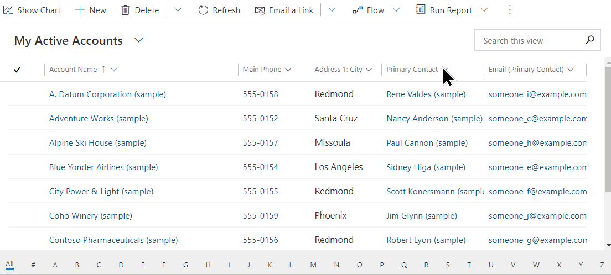
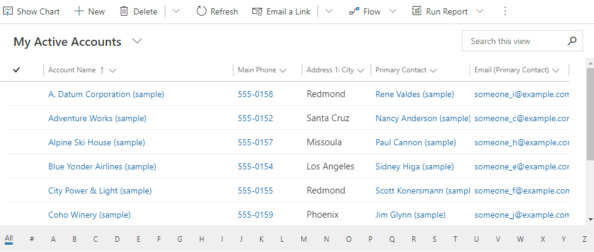
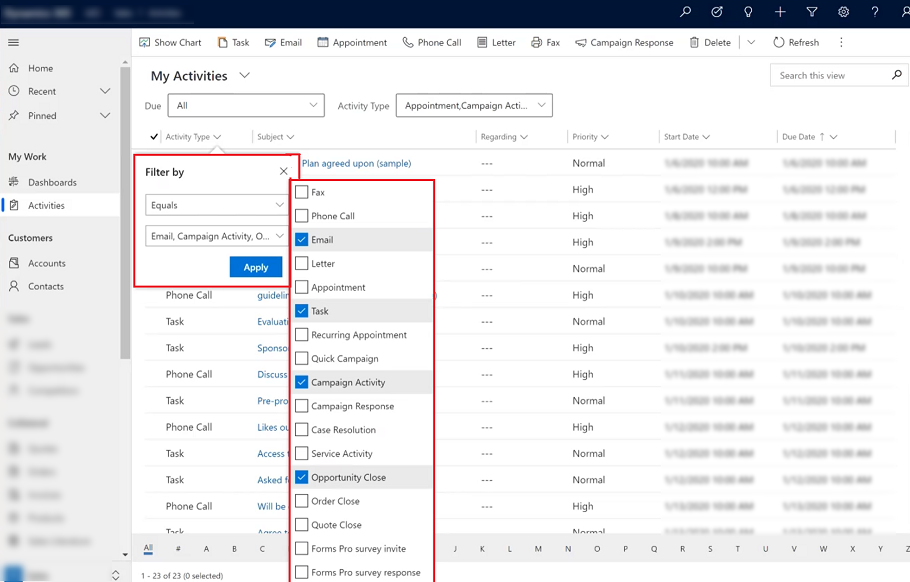

# Filter data on grids 

Grids in Unified Interface have been improved to increase the amount of data that can be seen on your screen. Grids also have improved filtering options which include remembering your last filter and sorts order. 

When grids area retrieving data, you will see a loading indicator letting you know the system is working on retrieving data.

When you filter data on a grid the page remembers the filter, sort, and the page state when you navigate away and then come back to the page. This includes quick find, column filtering, page number, and more. The navigation outside the page opens with the initial state.

   > [!div class="mx-imgBorder"]
   > 

The jump bar uses the first sorted field. If no sort change has been made, the jump bar uses the primary field. 

   > [!div class="mx-imgBorder"]
   > 
   

The you can filter the **Activity Type** field and select multiple filtering type. Also, related entity fields like owner, status, and reason can be filtered.

   > [!div class="mx-imgBorder"]
   > 
   
When you select the hierarchy icon, it will navigate to the hierarchy form.

   > [!div class="mx-imgBorder"]
   > 
   
You can also open primary field and lookup fields in new tab or window.

   > [!div class="mx-imgBorder"]
   > 

# Filter on a grid

On a grid such as Accounts or Contacts you can filter the data
