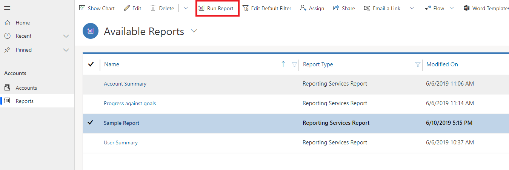
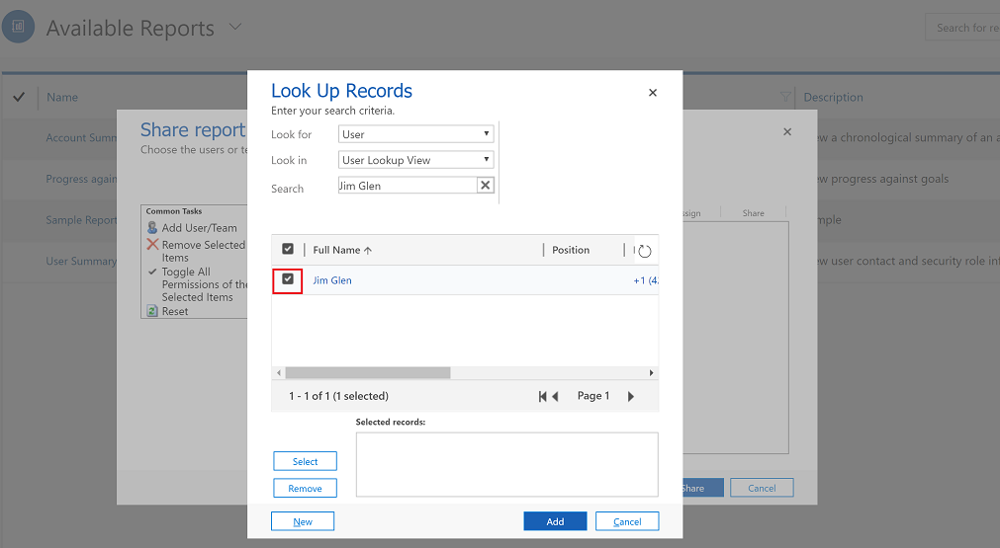
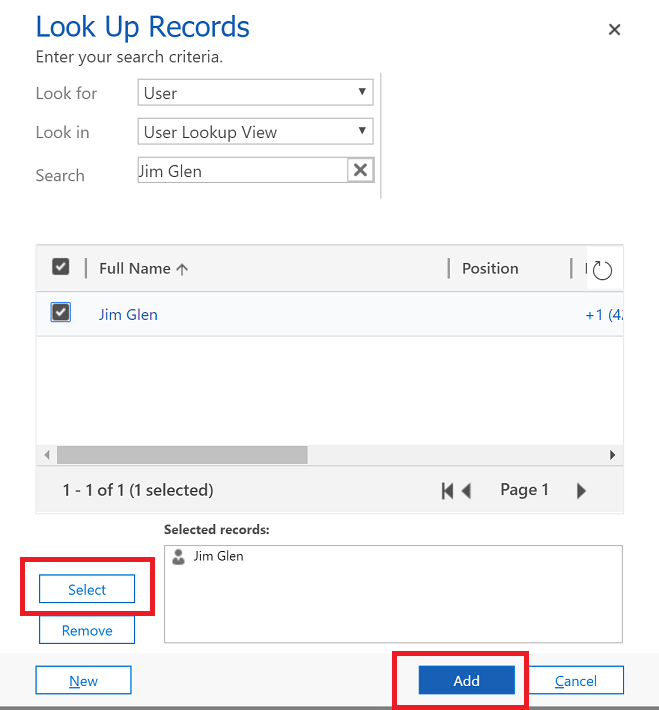
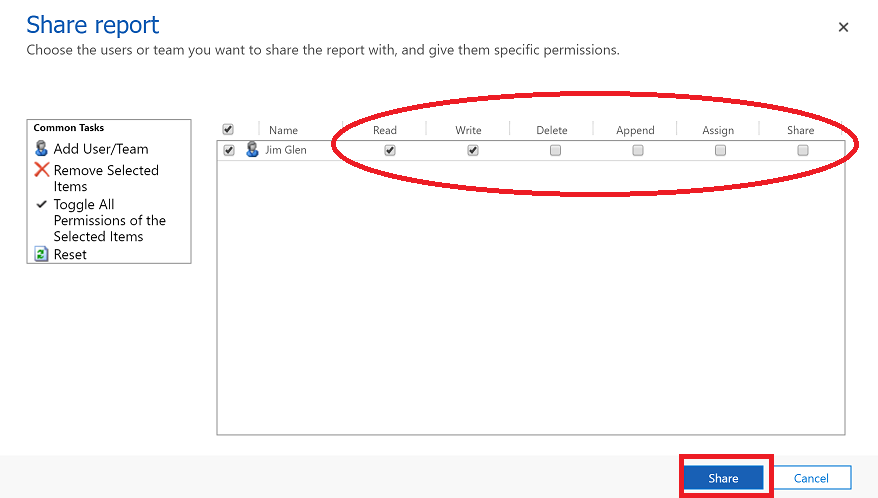
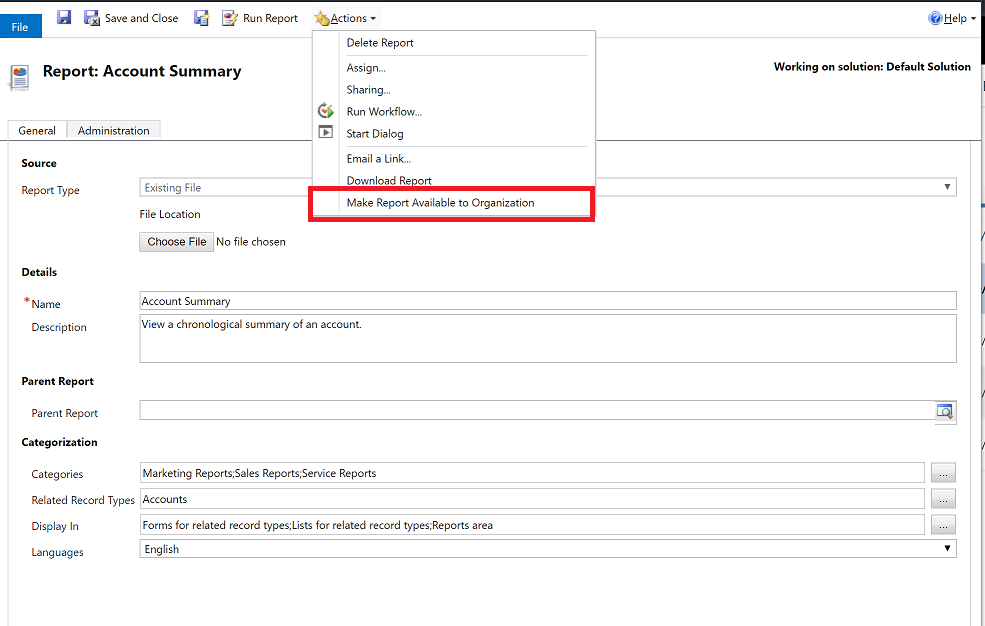

# Work with reports

[!INCLUDE[cc-applies-to-update-9-0-0](../includes/cc_applies_to_update_9_0_0.md)]

Reports help you manage your progress towards your business goals by helping you see how you’re doing. You can also track trends - which can give you an advantage over your competitors.  

For more information on organizing and creating reports, see: [Customize and organize reports](https://docs.microsoft.com/powerapps/maker/model-driven-apps/add-reporting-to-app).
  
## Run a report  
  
1. From the site map,  Go to **Reports**.  
2. Choose the report you want > **Run Report**.  
  
   > [!NOTE]
   >  In **Report Viewer** dialog box, you can leave the search criteria as is, or change it as needed.  
   
   > [!div class="mx-imgBorder"]
   > 
 
  
## Share a report with other users or teams    

1. From the site map, go to **Reports**.  
2. In the list of reports, select the report you want to share.  
3. On the command bar, select **Share**.

   > [!div class="mx-imgBorder"]
   > 
  
4. On the **Share Report** dialog box, select **Add User/Team**.    
5. In the **Look Up Records** dialog box, find the users or team record that you want to share the report with, and select the check box next to the record.

   > [!div class="mx-imgBorder"]
   > 

6. Choose **Select** to add the user or team record to the **Selected records** box and then select **Add**.

   > [!div class="mx-imgBorder"]
   > 
  
7. In the **Share Report** dialog box, select the type of share access that you want. The available permissions are: Read, Write, Delete, Append, Assign, or Share. This will add the user or team record to the **Selected records** box.

   > [!div class="mx-imgBorder"]
   > 
  

## Share a report with your organization  
 If the report would be useful for all users, make it available to the organization.  

1. From the site map, go to **Reports**. 
2. In the list of reports, select the report you want to share.  
3. On the command bar, select select **Edit**.  
4. On the **Actions** menu, select **Make Report Available to Organization**.  
  
   > [!div class="mx-imgBorder"]
   > 

## Download a report

1. From the site map, go to **Reports**. 
2. In the list of reports, select the report you want to share.  
3. On the command bar, select select **Edit**.  
4. On the **Actions** menu, select **Download Report**.  
The RDL file for the report contains tags that specify whether the report is a fetch-based report or an SQL-based report.
5. Open the report once the download is complete.

### See Also

[Create a report using the Report Wizard](create-report-with-wizard.md)

[Add a existing report](add-existing-report.md)

[Edit report filter](edit-report-filter.md)

[ Troubleshoot problems with data not displaying in a report ](troubleshoot-reports.md)

